みなさま、こんにちは。Configuration Manager サポート チームです。本日は、 Microsoft Configuration Manager (ConfigMgr) において、リモート配布ポイントへ コンテンツ を配布出来ないときの トラブルシューティング についてご案内致します。配布ポイントに対して コンテンツ が配布出来ないとき、以下の項目をまずご確認くださいますようお願い致します。

# 配布ポイントへのコンテンツを配布する処理について

サイト サーバー から コンテンツ を配布する際に、リモート配布ポイントとの通信が必要ですが、その際に使われる プロトコル は RPC と SMB です。この二つが使われていることを意識していると トラブルシューティング がやりやすくなります。また、これらの プロトコル を扱う際の権限は、既定の設定だと サイトサーバー の コンピューター アカウント 権限が使われます。

- 利用される プロトコル
  - RPC
  - SMB
- プロトコル で使われる アカウント
  - (既定の場合) サイト サーバー の コンピューター アカウント

# コンテンツ 転送の流れ

サイト サーバーから コンテンツ を リモート配布ポイント へ配布する際の コンテンツ の流れは以下の通りです。各 フォルダ に コンテンツ を格納するための十分な容量が必要です。

## アプリケーション、パッケージ、オペレーティングシステムイメージ、アップグレードイメージ、ブートイメージ

ソース 共有 フォルダ -> サイト サーバー の SCCMContentLib フォルダ -> リモート 配布ポイントの SCCMContentLib フォルダ

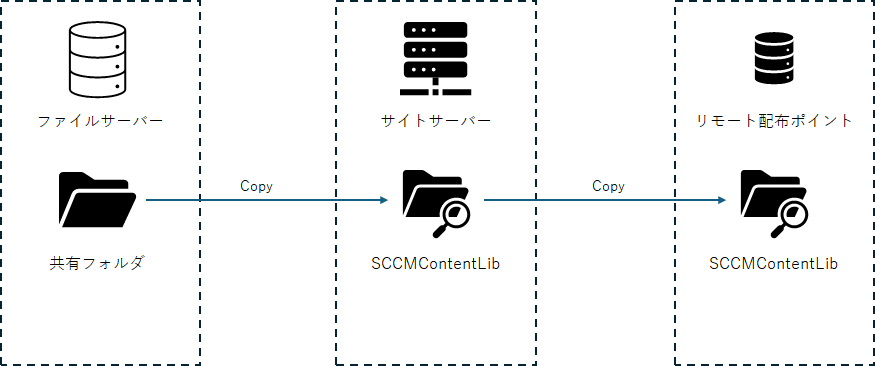

## 更新プログラム　（自動展開規則でのダウンロードも含む)

OS の TEMP フォルダ -> ソース 共有 フォルダ -> サイト サーバーの SCCMContentLib フォルダ ->　リモート 配布ポイント の SCCMContentLib フォルダ

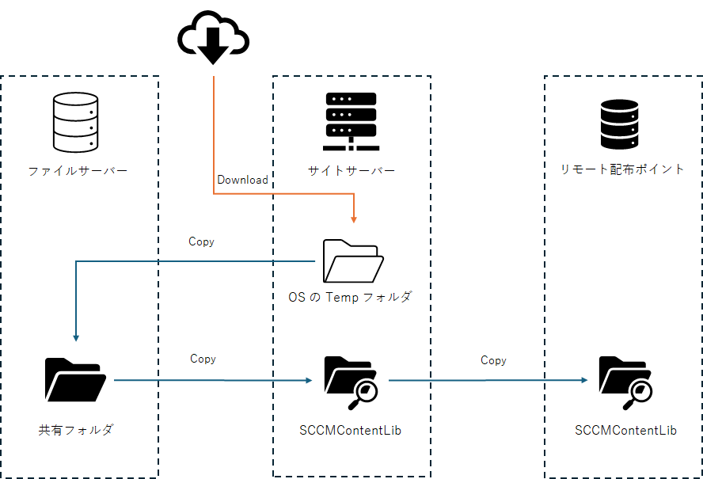

# エラーが出力されるログ

コンテンツ 転送時に エラー が出力されるログは以下の通りです。プライマリサイトサーバーの [ConfigMgrのインストールフォルダ]\Logs\ フォルダを確認ください。

- distmgr.log
- PkgXferMgr.log
- PatchDownloader.log

# チェック リスト

上記を含め、確認すべき点は以下の通りです。

- 名前解決可否
- 通信 ポート の開放状況
- 格納 フォルダ の容量
- SMB の利用可否
- RPC の利用可否
- アクセス権限
- 時刻同期
- プライマリサイトサーバー、リモート配布ポイントの更新プログラム適用状況
- WMI の動作確認
  
## 名前解決可否

サイト サーバーにて nslookup コマンド を使って リモート配布ポイント を名前解決できるか確認ください。

## 通信 ポート の開放状況

サイトサーバー と リモート配布ポイント の通信ポート は以下の図の通りです。経路上正しく開放設定がなされているかご確認ください。確認には弊社 PortQry 等をご利用いただくのが良いかと存じます。

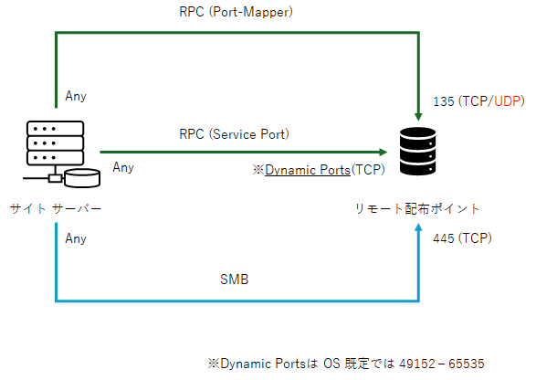

PortQryUI - User Interface for the PortQry Command Line Port Scanner  
https://www.microsoft.com/en-us/download/details.aspx?id=24009 

## 格納 フォルダの容量

格納 フォルダ が含まれる フォルダ 容量に十分な空き容量があるか確認ください。

確認すべき ドライブ は以下の通りです。
- OS ドライブ (更新 プログラム の場合)
- ソース 共有 フォルダ のドライブ
- サイト サーバー の SCCMContentLib フォルダ の ドライブ
- リモート 配布ポイントの SCCMContentLib フォルダ の ドライブ

## SMB の利用可否

Powershell で　Get-SmbShare コマンドレットを使って サイト サーバー 及び リモート配布ポイントの 共有 フォルダ設定をご確認ください。

- サイト サーバー: ソース共有フォルダが共有できているか
- リモート 配布ポイント 以下の共有フォルダが設定されているか
  - ADMIN$
  - SCCMContentLib$
  - SMS_DP$
  - SMSPKG<ドライブ名>$
  - SMSSIG$

## RPC の利用可否

RPC を利用出来る状況か確認ください。

### DCOM の設定確認

1. [ファイル名を指定して実行] より [dcomcnfg] を開きます。
2. [コンソール ルート] - [コンポーネント サービス] - [コンピューター] - [マイ コンピューター] を右クリックして [プロパティ] を開きます。
3. [このコンピューター上で分散 COM を有効にする] にチェックが入っていることを確認します。  
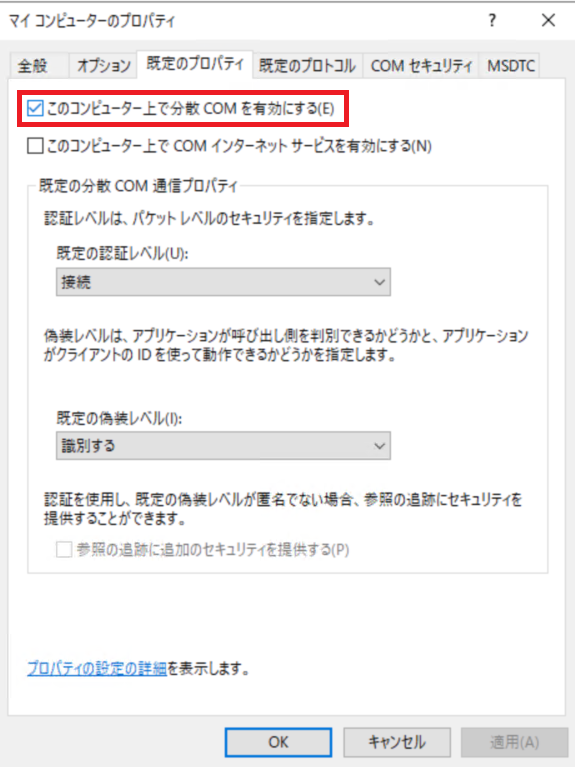
  
### RPC 関連サービスの動作確認

1. [ファイル名を指定して実行] より [services.msc] を開きます。
2. 以下の サービス の状態が [実行中] かつ スタートアップの種類が[自動]　であることを確認します。

  - DCOM Server Process Launcher
  - Remote Procedure Call (RPC)
  - RPC Endpoint Mapper

## アクセス権限

デフォルト　である　サイト サーバー　の コンピューターアカウント に 各種 アクセス 権限があることを確認します。

### サイト システム アクセス に使われる アカウント の確認

1. [ConfigMgr コンソール] - [監視] - [管理] - [概要] - [サイトの構成] - [サーバー と サイト システム の役割] を開きます。
2. リモート 配布ポイント の動作する サイト システム を選択します。
3. 画面下部の [サイト システム] を選択し、[プロパティ] を開きます。
4. [全般] タブ にて、サイト システムのインストール アカウント に、[サイト サーバーのコンピューター アカウントを使用してこのサイト システムをインストールする] にチェックが入っていることを確認します。  
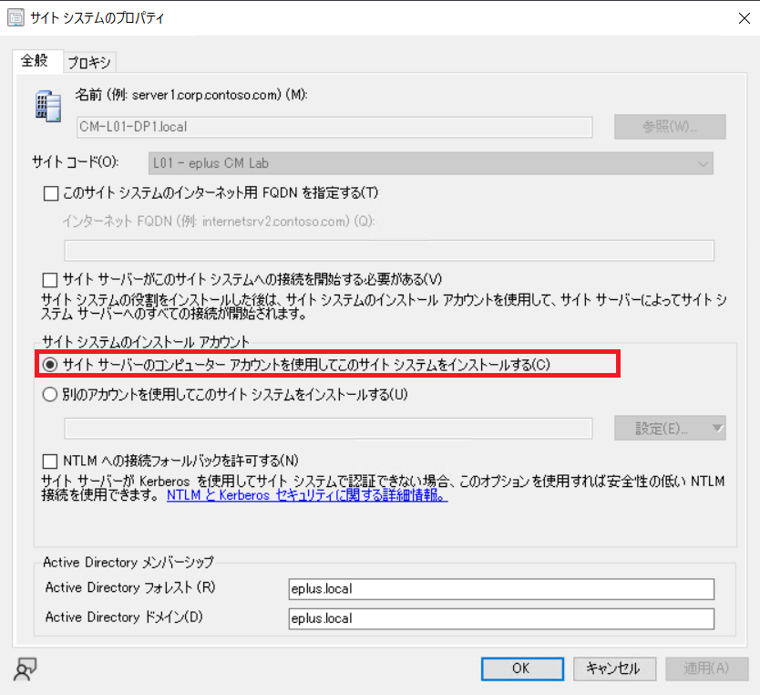

### ソース共有フォルダ の アクセス 権限の確認

ソース共有フォルダ に サイト サーバー の　コンピューター　アカウントの読み込み権限があるか確認してください。

1. エクスプローラー でソース共有フォルダの プロパティ を開きます。
2. [共有]タブを開き、[詳細な共有] を開きます。  
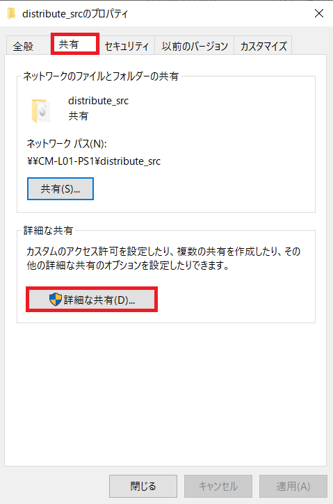
3. [アクセス許可] を開き、サイト サーバー のコンピューター アカウントのアクセス権限を確認します。ユーザーグループが指定されている場合は、そのユーザーグループにサイト サーバーのコンピューター アカウントが所属しているか確認してください。
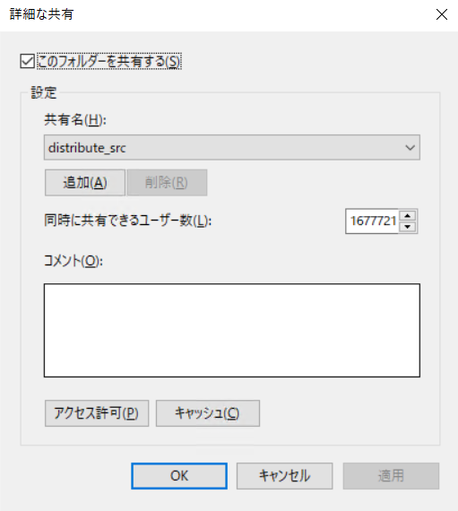

### サイト サーバーの SCCMContentLib フォルダの アクセス 権限の確認

上記と同様に サイト サーバー の SCCMContentLib フォルダに対して　コンピューター アカウント に読み書き権限があるか確認してください。

### リモート配布ポイント の SCCMContentLib フォルダの アクセス 権限の確認

上記と同様に リモート配布ポイント の SCCMContentLib フォルダに対して　サイト サーバー の コンピューター アカウント に読み書き権限があるか確認してください。

### リモート配布ポイント の WMI のアクセス権限の確認

リモート配布ポイント に対して サイト サーバー のコンピューター アカウント　がアクセス権限を持っているか確認します。

1. リモート配布ポイント に ログイン します。
2. [ファイル名を指定して実行] より [ wmimgmt.msc ] を開きます。
3. [WMI コントロール (ローカル)] を右クリックして [プロパティ] を開きます。  
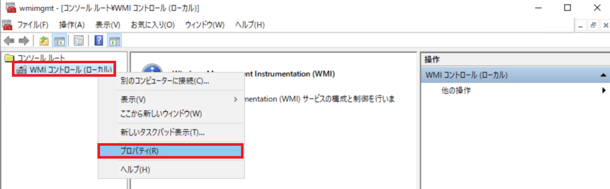
4. [セキュリティ] タブを開き、[Root] が選択されている状態で [セキュリティ] を開きます。
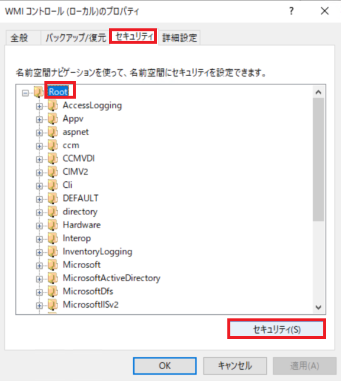
5. サイト サーバー のコンピューター アカウントのアクセス権限を確認します。ユーザーグループが指定されている場合は、そのユーザーグループにサイト サーバーのコンピューター アカウントが所属しているか確認してください。

## 時刻同期

プライマリサイトサーバー と リモート配布ポイント で時刻ズレがあると RPC 通信に失敗します。時刻ズレが発生していないか確認してください。また、両 サーバー にて NTP サービス が正しく動作していることを確認してください。

## プライマリサイトサーバー、リモート配布ポイントの更新プログラム適用状況

DCOM 脆弱性 (CVE-2021-26414) に対応するため、DCOM　認証レベルが強化されるようになっています。

[IT管理者向け] DCOM の脆弱性 (CVE-2021-26414) に対応するためのガイダンス  
https://msrc.microsoft.com/blog/2021/06/20210609_dcomenrocement/

プライマリサイトサイトサーバー および リモート配布ポイント に 2023 年 3 月以降の OS 累積品質更新プログラムが適用されていることを確認してください。

## WMI の動作確認

WMI が正しく動作しているか確認するため、以下を確認ください。

### リモート配布ポイント での動作確認

1. リモート 配布ポイントに管理者権限でログインします。
2.  PSExec ツールを以下 サイト より ダウンロード します。  
https://learn.microsoft.com/ja-jp/sysinternals/downloads/psexec
3. ダウンロード 後、解凍し適当な フォルダ に配置します。
4. コマンド プロンプト を管理者権限で開き、カレント フォルダ を PSExec ツール を置いた フォルダ に移動します。
5. 以下のコマンドを実行します。  
   ```
   PSExec64.exe -i -s -d cmd
   ```

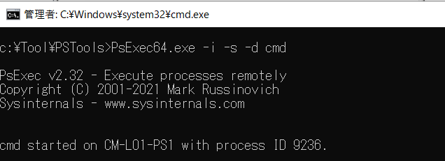  

  ※ EULA のダイアログが開いた場合は OK をクリックし、再度上記 コマンド を実行してください。  

6. コマンドプロンプト のウィンドウが新たに開きます。
7. 以下のコマンドを実行し、コマンドプロンプト の実行権限が nt authority\system となっていることを確認ください。
  ```
  whoami
  ```
8. 新たに開いた コマンドプロンプト で 以下を実行します。
   ```
   wbemtest
   ```
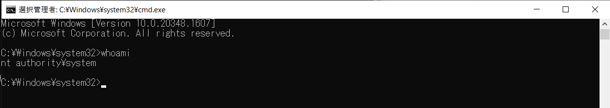  
9. [Windows Management Instrumentation テスト]が開きます。 [接続]をクリックします。  
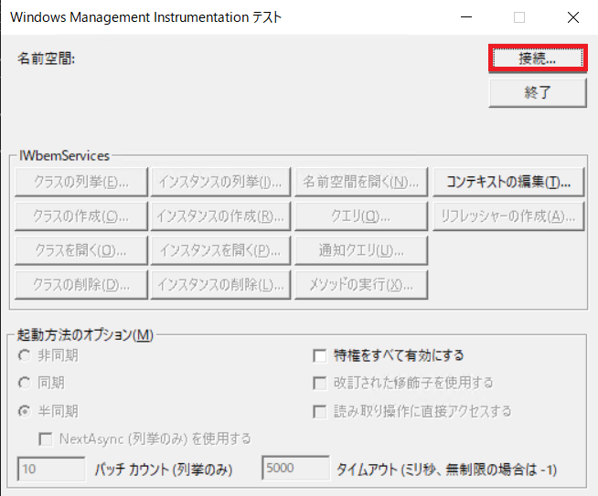 
10. [名前空間] に [root\SCCMDP] と入力し、[接続]をクリックします。  
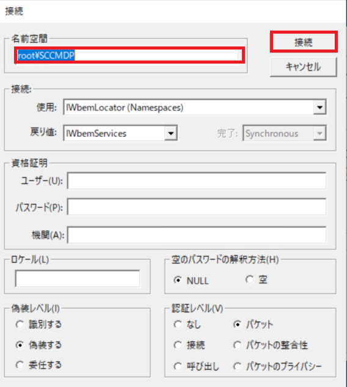  
11. 以下のように名前空間の箇所に [root\SCCMDP] とエラー無く表示されれば OK です。  
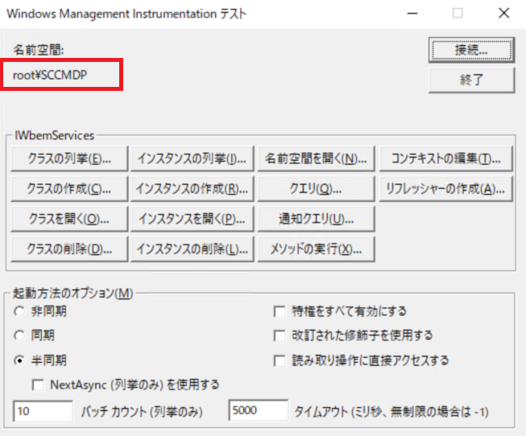  

### プライマリ サイト サーバー での動作確認

1. プライマリ サイト サーバー に管理者権限でログインします。
2.  PSExec ツールを以下 サイト より ダウンロード します。  
https://learn.microsoft.com/ja-jp/sysinternals/downloads/psexec
3. ダウンロード 後、解凍し適当な フォルダ に配置します。
4. コマンド プロンプト を管理者権限で開き、カレント フォルダ を PSExec ツール を置いた フォルダ に移動します。
5. 以下のコマンドを実行します。  
   ```
   PSExec64.exe -i -s -d cmd
   ```

  

  ※ EULA のダイアログが開いた場合は OK をクリックし、再度上記 コマンド を実行してください。  

6. コマンドプロンプト のウィンドウが新たに開きます。
7. 以下のコマンドを実行し、コマンドプロンプト の実行権限が nt authority\system となっていることを確認ください。
  ```
  whoami
  ```
8. 新たに開いた コマンドプロンプト で 以下を実行します。
   ```
   wbemtest
   ```
  
9. [Windows Management Instrumentation テスト]が開きます。 [接続]をクリックします。  
  
10. [名前空間] に [\\[配布ポイントのFQDN]\root\SCCMDP] と入力し、[接続]をクリックします。  
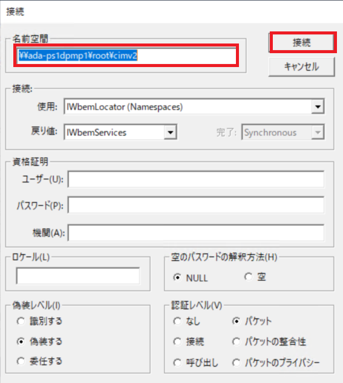  
11. 以下のように名前空間の箇所に [\\[配布ポイントのFQDN]\root\SCCMDP] とエラー無く表示されれば OK です。  
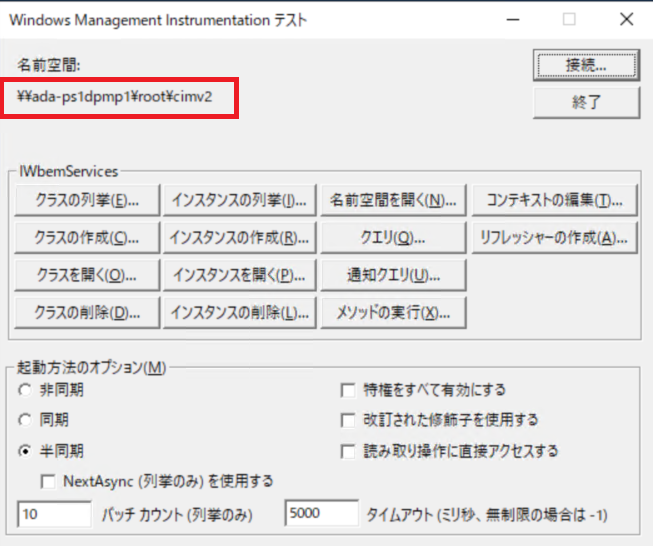  

