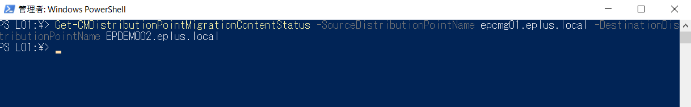

みなさま、こんにちは。Configuration Manager サポート チームです。本日は、 Microsoft Configuration Manager (ConfigMgr) において、suffix が cloudapp.net である、クラウド サービス(クラシック) ベースのクラウド管理ゲートウェイ (CMG) を仮想マシンスケールセット （VMSS) の CMG に移行する方法についてご案内させて頂きます。

# はじめに

以前も下記記事でご案内させて頂いている通り、クライアントからアクセスする際に使われる URL (サービス名) が 展開名と同じ、 [ホスト名].cloudapp.net の CMG については VMSS の CMG への変換が利用できません。それは、VMSS への変換に伴い、展開名の URL の形式が [ホスト名].[リージョン名].cloudapp.azure.com に変わりますが、その変更をクライアント側に伝える手段が無いためです。DNS サーバーに CNAME レコードにより、お客様独自の サービス名を、[ホスト名].cloudapp.net の エイリアスとして登録されていたお客様であれば、CNAME レコードのエイリアスを変更するだけで対処が出来るのですが、それが使えないため、 VMSS 版 CMG への変換をご提供していません。

仮想マシン スケールセットのクラウド管理ゲートウェイについて  
https://jpmem.github.io/blog/mecm/20211212_01/  

そのため、サービス名を [ホスト名].cloudapp.net として設定した CMG をお使いのお客様は、VMSS 版 CMG への移行に当たって、変換ではなく、CMG の再構築を実施頂く必要がございます。

なお、上記記事でもご案内の通り、 MECM CB 2203 以降、クラウドサービス (クラシック) 版の CMG のデプロイは利用できなくなっております。 MECM CB 2203 へアップグレードする際の前提条件チェックでも警告されますが、アップグレード後も構築済みのクラウドサービス (クラシック)のご利用は可能なものの、一度でも削除すると、再デプロイできなくなるため、出来る限り早く VMSS 版の CMG への移行を推奨しております。

## VMSS 版 CMG への移行にあたっての課題

上記でも触れたとおり、VMSS 版 CMG の利用により クライアントが CMG に繋がる際に利用する FQDN が変わるため、その変更をクライアントに伝える手段が必要となります。インターネットとイントラネット ( VPN 接続を含む)を行き来するようなご利用をされている端末であれば、イントラネットに接続した際に 新しい URL をクライアントに伝えることが出来ますが、インターネット経由でしか繋げないクライアントの場合、新しい URL が分からないため、二度と ConfgMgr へ接続出来なくなるといった課題が生じます。

また、新規構築した VMSS 版の CMG では、もちろん、移行前の CMG で配布していたコンテンツが引き継がれていないため、移行前の CMG で配布していた コンテンツ を アップロード する必要が出てきます。ConfigMgr CB 2211 以降では、[Start-CMDistributionPointMigration コマンドレット](https://learn.microsoft.com/ja-jp/mem/configmgr/core/servers/deploy/configure/deploy-and-manage-content#start-cmdistributionpointmigration) が利用可能になりました。本記事ではこちらの コマンドレット を利用しますが、ConfigMgr CB 2207 以前の環境では利用出来ないので、旧 CMG の プロパティ から配布コンテンツ の リスト をスクリーンショット等で採取しておき、 手動で1つ1つ プライマリ サイト サーバー から配布する必要がございます。

## 上記課題に対する対策

上記、二つの課題に対応するため、以下の対策を実施します。

1. クラウド サービス(クラシック)版と VMSS 版 CMG を、VMSS 版 CMG の URL がクライアントに伝わるまで、並行稼働する。クライアントに伝わったかどうかはスクリプト機能を使って収集する。電源断等でスクリプトが伝わったかどうか不明なクライアントに対しては手動で設定変更させる。
2. Start-CMDistributionMigration コマンドレットを使う。

### 必要なコスト

上記対応策では、二つの CMG を並行稼働させるため、並行稼働期間中、クラウド管理ゲートウェイのコストが約 2 倍となります。また、それぞれの CMG からの通信を中継するため、クラウド管理ゲートウェイ接続ポイント (CMG-CP) が動作するサーバーを追加で用意する必要がございます。（2 個の CMG からの通信を 1 つの CMG-CP では中継できません。それぞれの CMG 用の CMG-CP を用意する必要がございます)

### 実施手順

1. VMSS 版 CMG とその通信を中継する CMG-CP を作成します。以下でご案内している手順をご参考にしていただければと存じます。  
クラウド管理ゲートウェイ (CMG) の構築手順例  
https://jpmem.github.io/blog/mecm/20220501_01/  

2. [ConfigMgrコンソール] - 画面左上の下▼ボタンをクリック - [Windows PowerShell で接続する]をクリックします。


3. Start-CMDistributionMigration コマンドレットで以下を実行します。

```ps1
Start-CMDistributionPointMigration -SourceDistributionPointName [旧クラウド管理ゲートウェイのFQDN] -DestinationDistributionPointName [新クラウド管理ゲートウェイのFQDN]
```

4. 実行後、以下を実行し複製状況を確認します。
```ps1
Get-CMDistributionPointMigrationContentStatus -SourceDistributionPointName [旧クラウド管理ゲートウェイのFQDN] -DestinationDistributionPointName [新クラウド管理ゲートウェイのFQDN]
```

実行中は以下のように進行状態が表示されます。


実行が完了すると何も表示されなくなります。



5. スクリプト機能を使って、以下のスクリプトにより新規に作成した VMSS 版 CMG の情報がクライアント側に伝わっているかを定期的に確認します。以下のスクリプトを実行すると、クライアントに伝わっている CMG の FQDN が ;(セミコロン) を区切り文字として取得可能です。

```ps1
$RegPath = "HKLM:\SOFTWARE\Microsoft\CCM\"
$RegKey  = "CMGFQDNs"

$cmgfqdns = Get-ItemPropertyValue $RegPath -Name $RegKey

if($null -ne $cmgfqdns){
    Write-Host $cmgfqdns
}else{
    Write-Host "No CMG"
}
```

スクリプト機能のご紹介  
https://jpmem.github.io/blog/mecm/20211025_01/  


6. クライアント側に十分に VMSS 版 CMG の情報が伝わったら、クラウド サービス(クラシック)側の CMG を削除します。
   
7. 電源断等で FQDN 情報が伝わらなかったクライアントに対しては別途、イントラ内管理ポイントに接続させるか、ccmsetup による ConfigMgr クライアント再インストールで対応します。ccmsetup で VMSS 版 CMG の FQDN を設定するには、 CCMHOSTNAME オプションを使用します。以下、コマンドの例です。

```
ccmsetup.exe /NoCRLCheck /mp:[CMGのFQDN ]SMSMP=[イントラの管理ポイント] CCMHOSTNAME=[CMGのFQDN] SMSSITECODE=[サイトコード]
```

