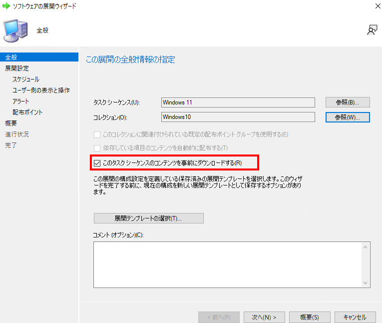
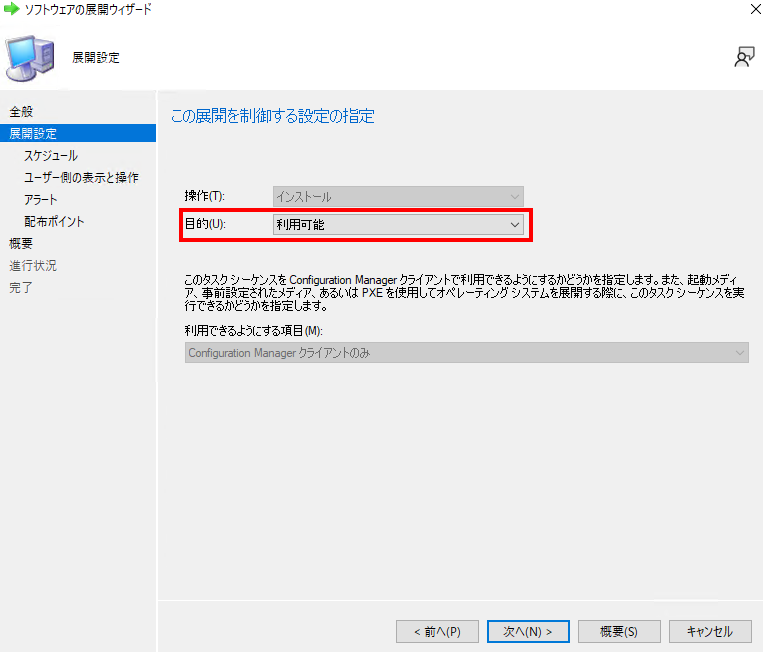
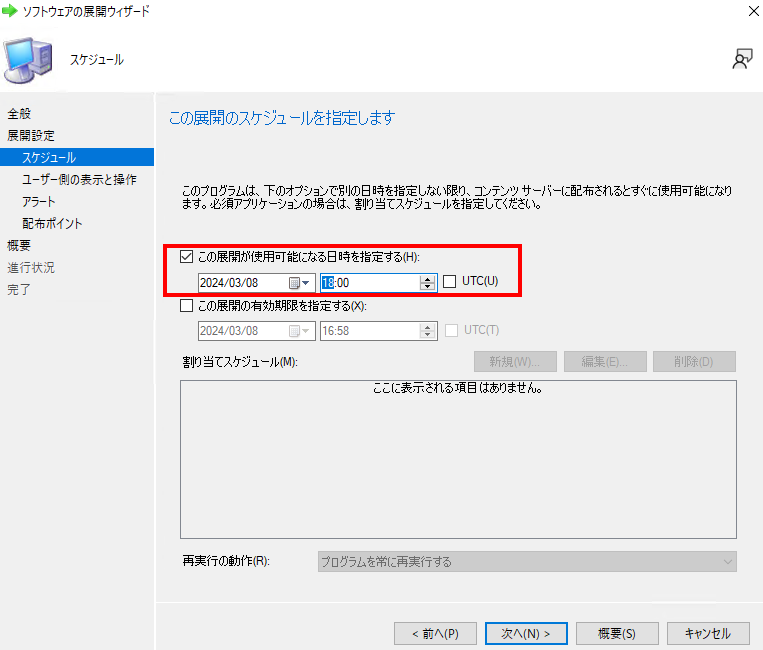
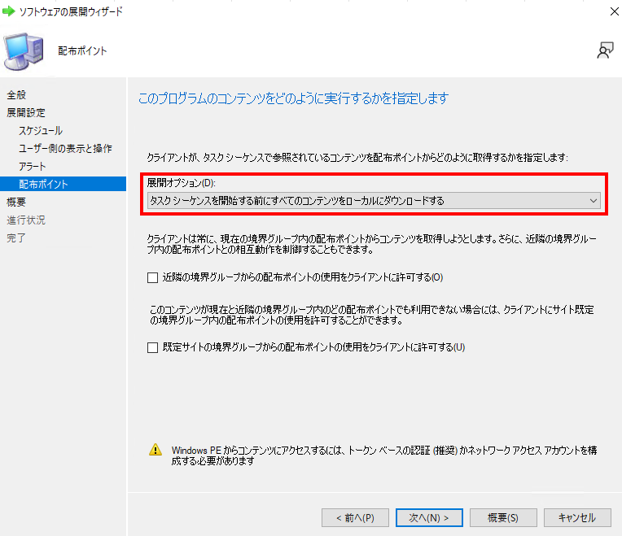
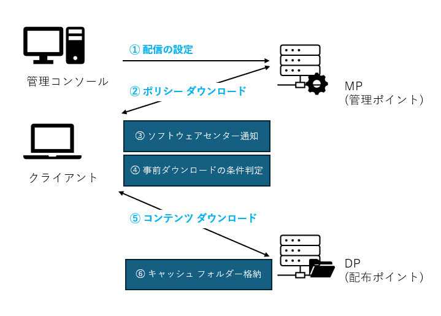
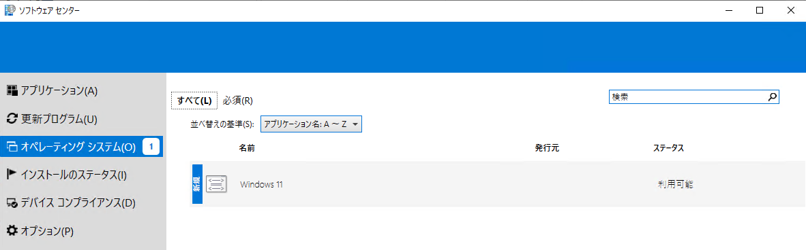
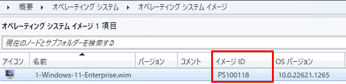
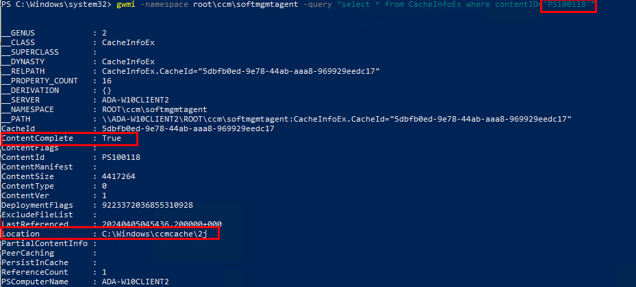
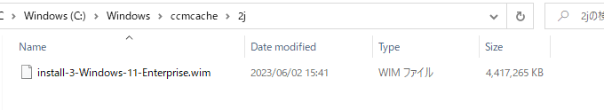

みなさん、こんにちは。Configuration Manager チームです。
この投稿では、Configuration Manager を利用してオペレーティング システムを展開する時にお役立ていただける、タスクシーケンスのコンテンツを事前にダウンロードするオプションをご紹介します。

オペレーティング システムの展開に利用されるコンテンツのファイル サイズは比較的大きい傾向があります。タスクシーケンスの展開の種類を "利用可能" として展開をすると、ユーザーがソフトウェア センターから [インストール] ボタンをクリックすることでコンテンツのダウンロードが開始されますが、ファイル サイズが大きい場合はダウンロードおよびインストール完了までに時間を要し、ユーザーが待機する時間が長くかかってしまうと思うことはありませんか？

今回ご紹介する "事前ダウンロード" のオプションを利用すると、指定した言語とアーキテクチャに一致するコンテンツが事前にクライアントのキャッシュ フォルダーにダウンロードされます。ユーザーがソフトウェア センターから [インストール] ボタンをクリックすると、既にキャッシュされたコンテンツを使用してインストール処理から開始することができるため、ユーザーが処理を待機する時間が短くなるメリットがあります。ぜひご検討の上、活用ください。

# 利用要件
コンテンツの事前ダウンロードは、タスクシーケンスを利用して以下のコンテンツを配信する時に利用ができます。

- OS アップグレード パッケージ (*1)
- OS イメージ
- ドライバー パッケージ
- パッケージ

*1 OS アップグレード パッケージにソフトウェア更新プログラムによる機能更新プログラムを選択しているときは、事前ダウンロードが有効になりません。ISO メディアを使用したアップグレード パッケージを使用している場合に、事前ダウンロードが有効になります。詳細については、以下の公開情報もあわせて確認してください。

公開情報 : タスク シーケンスの事前キャッシュ コンテンツを構成する  
https://learn.microsoft.com/ja-jp/mem/configmgr/osd/deploy-use/configure-precache-content  
~~~~~
注意  
バージョン 2103 以降、 アップグレード OS タスク シーケンス ステップで機能更新プログラムを使用する場合、 このタスク シーケンスのコンテンツを事前にダウンロードするオプションは機能更新プログラムには適用されません。
~~~~~

# 事前準備
OS イメージや OS アップグレード パッケージなど複数の言語やアーキテクチャを含むコンテンツに対し、クライアントの条件に一致する設定とします。

## OS アップグレード パッケージ
Configuration Manager コンソールで [ソフトウェア ライブラリ] - [概要] - [オペレーティング システム] - [オペレーティング システム アップグレード パッケージ] に移動し、OS アップグレード パッケージのプロパティを開きます。
[データソース] タブから言語とアーキテクチャを指定します。

## OS イメージ
Configuration Manager コンソールで [ソフトウェア ライブラリ] - [概要] - [オペレーティング システム] - [オペレーティング システム イメージ] に移動し、OS イメージのプロパティを開きます。
[データソース] タブから言語とアーキテクチャを指定します。

## ドライバー パッケージ
Configuration Manager コンソールで [ソフトウェア ライブラリ] - [概要] - [オペレーティング システム] - [ドライバー パッケージ] に移動し、ドライバー パッケージのプロパティを開きます。
[全般] タブからモデルを指定します。

ここで評価されるモデル名は、クライアントの WMI クラス Win32_ComputerSystemProduct の Name に格納されている名前です。確認する場合はクライアント上で PowerShell コマンド `Get-WmiObject -query "select * from win32_computersystemproduct"` を実行し、Name の値を確認します。タスクシーケンスの実行中は `select * from win32_computersystemproduct where name like "%指定したモデル名%"` というように評価が行われますので、指定したモデル名を含むことで条件に一致するとみなされます。

## パッケージ
Configuration Manager コンソールで [ソフトウェア ライブラリ] - [概要] - [アプリケーション管理] - [パッケージ] に移動し、パッケージのプロパティを開きます。[全般] タブから言語とアーキテクチャを指定します。

# 事前ダウンロードの利用手順
事前に作成したタスクシーケンスを "事前ダウンロード" を有効としてデバイス コレクションに展開します。

1. Configuration Manager コンソールで、[ソフトウェア ライブラリ] - [概要] - [オペレーティング システム] - [タスク シーケンス] の順に展開します。
2. 展開するタスクシーケンスを選択し、[ホーム]  メニュー内の [展開] ボタンをクリックします。
3. "ソフトウェアの展開ウィザード"  が起動します。
4. [全般] ページでコレクションを指定し、"このタスク シーケンスのコンテンツを事前にダウンロードする" にチェックを付け、[次へ] をクリックします。

5. [展開設定] ページで目的は "利用可能" を選択し、[次へ] をクリックします。

6. [スケジュール] ページでは、"この展開が使用可能になる日時を指定する" にチェックを付け、任意の日時を指定し、[次へ] をクリックします。クライアントはこの日時が過ぎたことを検知すると、コンテンツの事前ダウンロードを開始します。

7. [ユーザー側の表示と操作]  ページは任意の設定に指定して、[次へ] をクリックします。
8. [アラート]  ページは任意の設定に指定して、[次へ] をクリックします。

9. [配布ポイント] ページの展開オプションの設定は、ユーザーが事前ダウンロードを完了する前にタスクシーケンスを実行した場合に参照されます。事前にすべてのコンテンツをダウンロードしておくため、こちらの展開オプションも "タスクシーケンスを開始する前にすべてのコンテンツをローカルにダウンロードする" を選択しておきます。 近隣や、既定の境界グループ内の配布ポイントの使用については任意で設定をおこない、[次へ] をクリックします。

10. [概要] ページで設定内容を確認し、[次へ] をクリックします。
11. [完了]  ページが表示されたら [閉じる] をクリックします。

# クライアントでの動作を確認する
クライアント側で事前ダウンロードがおこなわれる処理の大まかなイメージです。
<<<<<<< HEAD

=======

>>>>>>> 8345bcf68 (OSD 事前ダウンロードのブログ記事作成)

① 管理者が管理コンソールから配信の設定をおこないます。  
② クライアントは、クライアント ポリシーのポーリング間隔 (既定で 60 分 ＋ ランダム遅延最大 60 分) にて自動でポリシーの取得をおこなっています。(*2)

*2 既定値は [クライアント設定] > [クライアント ポリシー] の "クライアント ポリシーのポーリング間隔" 箇所で設定されています。間隔を待たず、直ちにポリシーの取得をおこないたい場合は、コントロール パネルから Configuration Manager を起動し [操作] タブ上の [コンピューター ポリシーの取得および評価サイクル] を直ちに実行してください。

③ ポリシーを取得したタイミングで、ソフトウェア センターにタスクシーケンスが表示されます。

④ タスクシーケンスに紐づくコンテンツに対して、Configuration Manager クライアント (execmgr) が「事前準備」で設定した条件に該当するか評価をおこないます。

⑤ ④ 条件に該当したコンテンツは、「事前ダウンロードの利用手順」の手順 6 で指定した使用可能になる日時が過ぎてからダウンロードを開始します。

上記の動作上、ユーザーが ③ のソフトウェア センターに表示された直後に [インストール] ボタンをクリックすると、④、⑤ の事前ダウンロードの処理が完了する前にダウンロードおよびインストール処理がおこなわれる可能性があることにご留意ください。この時、「事前ダウンロードの利用手順」の手順 9 で設定した展開オプションに従ってダウンロードがおこなわれます。

⑥ ダウンロードされたコンテンツはキャッシュ フォルダーに格納されます。

**[Tips]** ユーザー側で事前ダウンロードが完了したことを確認するためには、コンテンツごとの確認となりますが、クライアント上のキャッシュ フォルダーの状態から確認が可能です。まず、Configuration Manager コンソールから事前ダウンロードを有効にしたコンテンツ ID を確認します。

<<<<<<< HEAD
例: OS イメージ  
=======
例: OS イメージ
>>>>>>> 8345bcf68 (OSD 事前ダウンロードのブログ記事作成)

次にクライアント上で PowerShell コマンド `gwmi -namespace root\ccm\softmgmtagent -query "select * from CacheInfoEx where contentID='コンテンツID'"` のように実行します。

ContentComplete が True となっていればダウンロードは完了しています。実際に Location に指定されているキャッシュ フォルダーを確認すると以下のようにコンテンツが配置されていることを確認することができます。

参考情報 : タスク シーケンスの事前キャッシュ コンテンツを構成する
https://learn.microsoft.com/ja-jp/mem/configmgr/osd/deploy-use/configure-precache-content