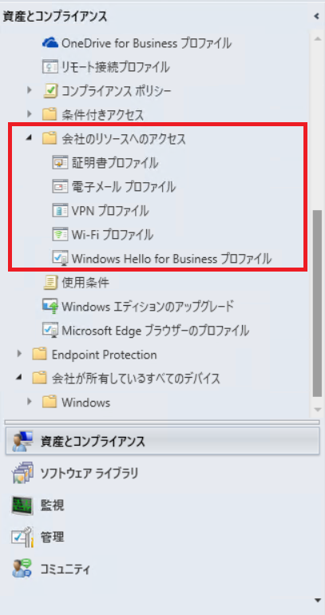

# ConfigMgr CB 2403 で追加された アップグレード前提条件

みなさま、こんにちは。 Configuration Manager (ConfigMgr) サポートチームでございます。本日は、ConfigMgr CB 2403 で追加された 更新時の前提条件についてご案内致します。

## Windows Server 2012 / 2012 R2 のサポート終了

Windows Server 2012 / 2012 R2 のサポート終了に伴い、 ConfigMgr CB 2403 へのアップデートの際に、同 OS 環境下では ConfigMgr CB 2403 へのアップグレードがブロックされます。
現在サポートされている Windows Server へアップグレードしてご利用されるようお願い致します。

なお、上記は ConfigMgr CB 2309 以前で 2024/5/13 現在で Windows Server 2012 / 2012 R2 がサポートされることを意味しておりませんのでご注意ください。上記にかかわらず、既に Windows Server 2012 / 2012 R2 の ConfigMgr での利用はサポートされておりません。  
ESU もサポート外に含まれますのでご留意ください。

## クライアント - サーバー 間の HTTP 通信の削除

クライアント - サーバー 間の HTTP 通信がサポートされなくなります。拡張 HTTP もしくは HTTPS 通信への通信形態の変更を実施ください。よりセキュリティの高い通信を利用されたい場合は HTTPS をご検討ください。 拡張 HTTP の方が手順少なく対応できます。なお、AD スキーマを拡張されていない環境にて、
サイトサーバー設定にて通信設定を 「HTTPS のみ」に変更するとクライアント - サーバー 間の通信が出来なくなる場合がございますので、ご注意ください。  
  
拡張 HTTP の設定確認については下記でご案内しております。
  
Configuration Managerにおける拡張 HTTP の確認方法  
https://jpmem.github.io/blog/mecm/20220122_01/  

## クラウドサービス(クラシック) ベースのクラウド管理ゲートウェイのブロック

クラウドサービス (クラシック) ベースのクラウド管理ゲートウェイの利用は COnifigMgr CB 2403 移行サポートされないため、削除する必要がございます。仮想マシンスケールセットへの移行を実施ください。下記にて仮想マシンスケールセットへの移行についてご案内しております。  

仮想マシン スケールセットのクラウド管理ゲートウェイについて  
https://jpmem.github.io/blog/mecm/20211212_01/  
  

suffix が cloudapp.net な CMG の仮想マシンスケールセットへの移行について  
https://jpmem.github.io/blog/mecm/20230816_01/

## 共同管理でのリソースアクセスポリシー ワークロードのブロック

ConfigMgr でのリソースアクセスポリシー配布機能の削除にともない、共同管理構成を設定されている場合、リソースアクセスポリシーのワークロードを Intune に寄せる必要がございますのでご留意ください。なお、ConfigMgrでのリソースアクセスポリシーの利用有無は以下からご確認可能です。  
  
[ConfigMgrコンソール] – [資産とコンプライアンス] – [ 概要] – [コンプライアンス設定]- [会社のリソースへのアクセス] 

     

## その他

ConfigMgr CB 2309 以降へのアップグレードは SQL ODBC Driver 18 以降のインストールが必要ですのでご留意ください。  
  
Configuration Manager Current Branch 2309 にて変更となった Microsoft ODBC Driver for SQL Server の要件のご紹介  
https://jpmem.github.io/blog/mecm/20240110_01/
  
また、ConfigMgr CB 2403 において、共同管理を有効化されていて Intune 側の Endpoint Protection をご利用されているお客様について、現状利用できない不具合がございます。詳しくは下記をご確認くださいませ。  
  
2309 ロールアップ KB25858444 適用済み、または 2403 共同管理クライアントで Endpoint Protection ワークロードを Intune に設定した場合に影響を受ける不具合について  
https://jpmem.github.io/blog/mecm/20240510_01/