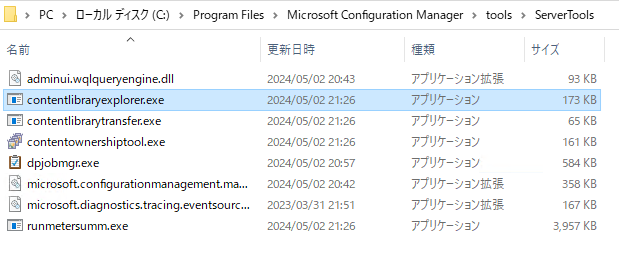
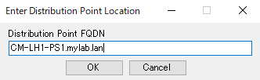
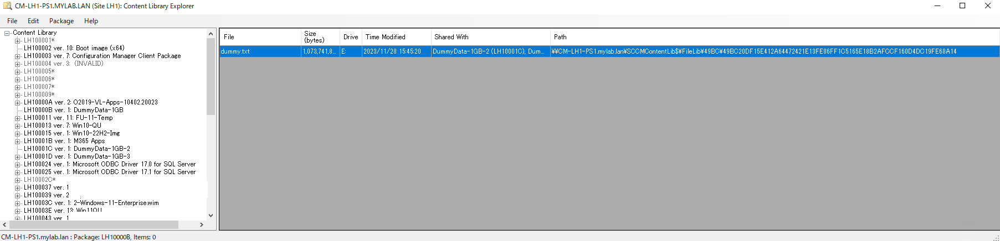

# Content Library Explorer を使って配布ポイントに格納されているコンテンツを確認する
みなさま、こんにちは。 Configuration Manager サポート チームです。  
本日は、Configuration Mager (ConfigMgr) の配布ポイントに格納されているコンテンツを確認するために有用な Content Library Explorer のご利用方法をご案内させていただきます。

# 利用するパターン
- クライアントにアプリケーションや更新プログラムを配布する際、配布ポイントにコンテンツが存在しない旨エラーが出た場合、配布ポイント上のコンテンツを検証したり、ファイル破損が発生したりしていないか確認する。

# 使い方
1. サイト サーバー にアクセスします。
2. [ConfigMgr インストールフォルダ]\tools\ServerTools\contentlibraryexplorer.exe を開きます。  
 
3. [Enter Distribution Point Location] とダイアログが表示されるので、配布ポイントの FQDN を入力し、[OK] をクリックします。  
　
4. 該当の配布ポイントに配布されているコンテンツの一覧が表示されます。
   　
5. 左ペインから調査したいパッケージを選択すると、右ペインに該当のパッケージに含まれるファイルの一覧が表示されます。各列の意味は以下の通りです。
   - File: ファイル名
   - Size: ファイルサイズ (byte)
   - Time Modified: 最新変更日付
   - Shared With: 別のパッケージでも該当ファイルを共有している場合、共有しているパッケージの名前が表示されます。
   - Path: 配布ポイントのファイルシステム上のファイルパスが表示されます。
     - ここで、実際のファイル名は 該当ファイルの SHA-1 ハッシュです。この点に着目すると、ソース共有フォルダのファイルを PowerShell の Get-FileHash で取得したハッシュと、このファイルパスのハッシュが一致するかどうかで、コンテンツ ファイル を正しく配布出来ているかどうかを確認出来たりします。

# 参考
[Content Library Explorer](https://learn.microsoft.com/ja-jp/mem/configmgr/core/support/content-library-explorer)