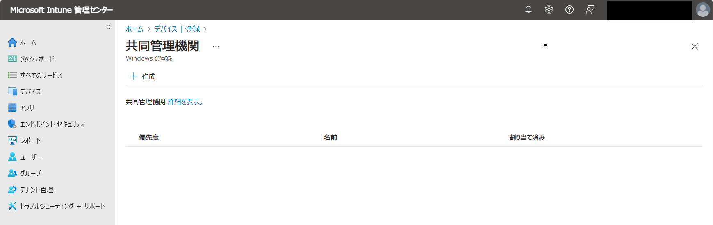
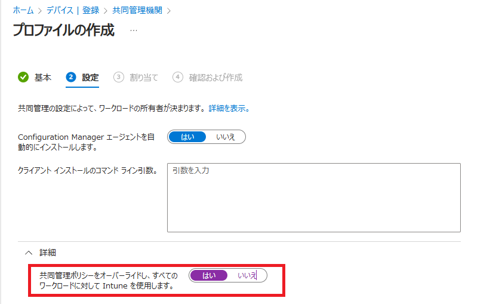

# AutoPilot を使って キッティングした Windows 11 端末に対して共同管理ポリシーが適用されない問題
みなさま、こんにちは。Configuration Manager サポート チームです。  
本日は、AutoPilot を使って キッティング した Win 11 端末に対して共同管理ポリシーが正しく適用できない場合の対処策についてご案内致します。

# 現象
- 共同管理構成ポリシー で ワークロード を Configuration Manager 側に寄せているにもかかわらず、 全ての ワークロード が Intune 側に寄っている状態の挙動を示します。

# 事象発生条件
- AutoPilot を使って キッティングする
- Windows 11 端末
- [Intune 管理センター] - [デバイス] - [デバイスのオンボーディング] - [登録] - [Windows] - [登録オプション] - [共同管理の設定] にてプロファイルが作成されていない  
   

  もしくは、上記画面で設定されているプロファイルにて「共同管理ポリシーをオーバーライドし、すべてのワークロードに対して Intune　を使用します] が「はい」の状態でプロファイルが端末に適用されている。  
  

# 事象発生の確認方法
- [ファイル名を指定して実行] - [C:\Windows\CCM\SMSCFGRC.cpl] を開き、全般タブを開いた際に「共同管理機能」の値が以下のように 「2147479807」 を示します。
- C:\Windows\CCM\CoManagementHandler.log に以下のように出力されます。
  ```
  Workloads are explicitly set by Intune Co-Management Profile so not using ConfigMgr set workloads. Current value from set from Intune is 2147479807
  ```
- 管理機関を示すレジストリ値が 以下にて Intune に設定されています。
  ```
  [HKLM\SOFTWARE\Microsoft\DeviceManageabilityCSP\Provider\MS DM Server]
  Key: ConfigInfo
  Value: 1
  ```
  Value が 1 のとき Intune, Value が 2 のとき Configuration Manager を示します。

# 事象の解消方法
- 事象が既に発生してしまっている端末については、以下のレジストリの値を変更し、CCMExec サービスを再起動することで事象が解消され、ワークロードの設定が Configuration Manager で設定したものに設定されます。
  
  ```
  [HKLM\SOFTWARE\Microsoft\DeviceManageabilityCSP\Provider\MS DM Server]
  Key: ConfigInfo
  Value: 2
  ```

  - [ファイル名を指定して実行] - [C:\Windows\CCM\SMSCFGRC.cpl] を開き、全般タブを開いた際に「共同管理機能」の値が 「2147479807」 以外の値を示すようになります。

- これからキッティングする端末にて事象が発生しないようにするためには、プロファイルにて「共同管理ポリシーをオーバーライドし、すべてのワークロードに対して Intune　を使用します] を「いいえ」にして端末に割り当ててください。

# 参考
[Autopilot に登録する方法 - 制限事項](https://learn.microsoft.com/ja-jp/mem/configmgr/comanage/autopilot-enrollment#limitations)

