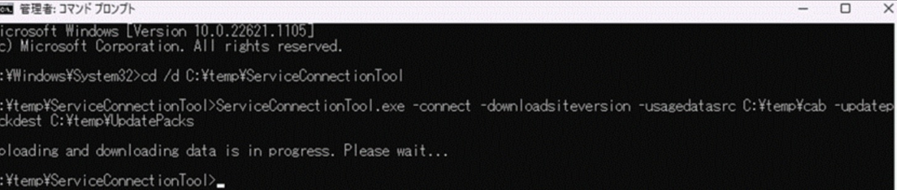

# Configration Manager のアップグレードをオフラインで行う場合の注意点について  

みなさま、こんにちは。 Configuration Manager サポート チームです。  
本日は、Configuration Manger (ConfigMgr) のアップグレードをオフラインで行う場合の注意点についてご案内させていただきます。  
ConfigMgr のアップグレードでは、サービス接続ポイントというサイトサービスの役割を使用しますが、この役割にはオンラインとオフラインの 2 つのモードが存在します。  

- オンライン モード　・・・サービス接続ポイントは自動的に Microsoft クラウド サービスに接続し、該当する更新プログラムをダウンロードします。  
- オフライン モード　・・・サービス接続ポイントは Microsoft クラウド サービスに接続しません。 利用可能な更新プログラムをダウンロードしてインポートするには、 サービス接続ツールを使用します。  

サービス接続ポイントがオフライン モードの場合は、インターネットに接続したコンピューターでサービス接続ツール "ServiceConnectionTool.exe" を実行し、ConfigMgr の更新プログラムをダウンロードします。  
その後、取得した更新プログラムを サイトサーバーにインポートし、アップグレードを行う流れになります。  
サービス接続ツールの詳しい使い方につきましては、公開情報よりご確認いただきたく割愛させていただきますが、更新プログラムをダウンロードする場合、以下のようなコマンドをコマンド プロンプトから実行します。  

参考  
Title : Configuration Manager のサービス接続ツールを使用する  
URL : https://learn.microsoft.com/ja-jp/mem/configmgr/core/servers/manage/use-the-service-connection-tool  

更新プログラムをダウンロードする場合のコマンド例  
```
ServiceConnectionTool.exe -connect -downloadsiteversion -usagedatasrv C:\temp\cab -updatepackdest C:\temp\UpdatePacks  
```

ダウンロードは主に 2 ステップに分かれており、ServiceConnectionTool.exe と ServiceConnectionTool.exe から呼び出された setupdl.exe によって行われます。  
すべてのダウンロードが完了すると、以下のように呼び出し元に戻ってくる流れとなっており、通信断など予期せぬトラブルが発生した場合、コマンド プロンプト上でエラーが表示されますが、ファイルのダウンロード結果についてはコマンド プロンプト上で表示されません。  

  

このため、何も表示せずに呼び出し元に戻る状態の確認のみでは、ダウンロードがすべて成功したことを判断できず、ダウンロードが成功したかどうかはログを確認する必要があります。  
一部ファイルのダウンロードが失敗した状態でサイトサーバーにインポートするとアップグレードに失敗する要因となるため、そのような事態を回避するためにも、ダウンロード完了後は、サービス接続ツールのログ ファイルからダウンロード結果をご確認いただくことをお勧めいたします。  

確認方法  
サービス接続ツールによる更新プログラムダウンロードのログは以下 2 つのファイルに記録されます。  

- ServiceConnectionTool.log  
　サービス接続ツールと同じ場所に作成されます。  
　マニフェストや更新プログラムの実体のダウンロードに関するログが記録されます。  
- ConfigMgrSetup.log    
　システム ドライブ直下に存在します。  
　言語パックや SQL のインストールモジュールのダウンロードに関するログが記録されます。  

上記それぞれのファイルを開き、ファイルのダウンロードに失敗していないか確認をします。  

- ServiceConnectionTool.log について  
「ERROR:Failed to download redist for」という文字列が含まれていないことを確認します。  

- 成功の出力例  
```  
2024-11-19 11:53:40 INFO:downloading redist  
2024-11-19 12:20:42 INFO:Successfully download redist for 5B8886C7-F967-4F8A-92AA-009E28368853  
```  

- エラーの出力例  
```  
2024-11-19 11:06:30 INFO:downloading redist  
2024-11-19 11:10:18 ERROR:Failed to download redist for 5B8886C7-F967-4F8A-92AA-009E28368853  
```  

- ConfigMgrSetup.logについて  
「ERROR: Download() failed」という文字列が含まれていないことを確認します。  
また、ダウンロードしたファイル群から Redist フォルダを開き、0KB のファイルが存在しないことを確認します。  

- エラーの出力例  
```  
ERROR: Download() failed with 0x80072EE2  
```  

上記ログにダウンロード失敗のログが記録されている、または Redist フォルダ配下に 0KB のファイルが存在する場合は、ダウンロードに失敗していますので、ダウンロードしたファイル群は使用せず、再ダウンロードをお試しください。  
なお、アップグレードに伴いご確認いただきたいことや注意事項は、公開情報にてチェックリストとしてご案内しておりますのでこちらも併せて参考にしてください。  
特に、予期せぬトラブルに備え、アップグレード前のバックアップいただくことをお勧めいたします。  

参考  
Title : 更新プログラム 2409 をインストールするためのチェックリスト  
URL : https://learn.microsoft.com/ja-jp/mem/configmgr/core/servers/manage/checklist-for-installing-update-2409  