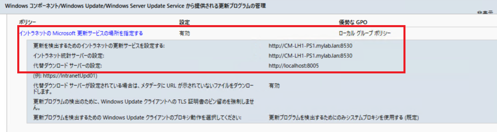

# ConfigMgr クライアントでのOS 更新失敗を防ぐ！よくある原因と解決策

みなさま、こんにちは。Configuration Manager サポート チームです。  
本日は、Configuration Manger (ConfigMgr) を介して OS の更新プログラム適用実施が失敗する際のよくある原因と解決策をご案内いたします。
（WSUS　や Intune, Windows Update, Windows Update for Business (WUfB) については除きます)

以下、まず、症状についてご案内した後、考えられる原因の判断の方法、および解決策をご案内いたします。

以下にあたらない場合は、弊社サポートまでお問い合わせいただければと存じます。

# 症状

### 利用可能展開にしているのに更新プログラムがソフトウェア センターに表示されない

「利用可能」で展開しているのに更新プログラムがソフトウェア センターに表示されない場合、以下のような原因が考えられます。

- 管理ポイントと通信できずに展開ポリシーを受け取れていない
- 展開ポリシーに紐づくコレクションにデバイスが所属していない
- ソフトウェア更新ポイントと通信できずに更新プログラムの検出が失敗している

### ソフトウェア センター でダウンロードが失敗する

ソフトウェア センターで対象の更新プログラムのインストールを開始した際に、ダウンロードが失敗する場合、以下のような原因が考えられます。

- クライアントの所属する境界グループに配布ポイントが紐づいていない
- 配布ポイントにコンテンツが配布されていない。
- クライアントのccmcacheフォルダー領域の空き容量が不足している。

### ソフトウェア センター でインストールに失敗する

ソフトウェア センターでダウンロード成功後、インストールに失敗する場合、以下のような原因が考えられます。

- 更新プログラムの最長実行時間よりも更新プログラムの適用に時間がかかり、途中でキャンセルされた


### 必須展開にしているのに更新プログラムがいつまでも適用されない

「必須」で展開しているのに更新プログラムが適用されない場合、以下のような原因が考えられます。

- 管理ポイントと通信できずに展開ポリシーを受け取れていない
- 展開ポリシーに紐づくコレクションにデバイスが所属していない
- ソフトウェア更新ポイントと通信できずに更新プログラムの検出が失敗している
- クライアントの所属する境界グループに配布ポイントが紐づいていない
- 配布ポイントにコンテンツが配布されていない。
- クライアントのccmcacheフォルダー領域の空き容量が不足している。
- 更新プログラムの最長実行時間よりも更新プログラムの適用に時間がかかり、途中でキャンセルされた
- 更新プログラムの最長実行時間が、メンテナンス期間の間に収まっていない。

# 原因

## 管理ポイントと通信できずに展開ポリシーを受け取れていない

管理ポイントとConfigMgr クライアントの通信が出来ていない場合がございます。クライアントにて以下を実施し、管理ポイントと疎通が取れるかご確認ください。(拡張 HTTP 通信設定の場合のみ)

```powershell
Invoke-WebRequest -Uri "http://<管理ポイントの FQDN>/sms_mp/.sms_aut?mplist" -UseBasicParsing
```
正常にアクセスできる場合、StatusCode : 200 となります。
それ以外の値が返却される場合、管理ポイントと通信できていない可能性がございますので確認ください。

ログから確認する場合は、クライアントの C:\Windows\CCM\Logs\CcmMessaging.log を確認すると良いかと存じます。直近に以下のようなログが出力されていれば、通信が失敗している可能性が高いです。

```
[CCMHTTP] ERROR: URL=[管理ポイントのURL], Port=[port番号], Options=1248, Code=0, Text=[エラーシンボル]
[CCMHTTP] ERROR INFO: StatusCode=[HTTPステータスコード] StatusText=[HTTPエラーステータステキスト]
```

上記エラーシンボルにて凡そのエラー理由はわかります。よくあるエラーシンボルは以下です。

-  CCM_E_BAD_HTTP_STATUS_CODE: HTTPステータスコードが4xxおよび5xx。続くHTTPステータスコードで内容を確認。
-  CCM_E_NO_CLIENT_PKI_CERT: HTTPS通信環境でクライアント証明書が見つからない。
-  ERROR_WINHTTP_NAME_NOT_RESOLVED: 対象の管理ポイントをDNSサーバー経由で名前解決できない。
-  ERROR_WINHTTP_TIMEOUT: 対象の管理ポイントとの通信がタイムアウトしている。

## 展開ポリシーに紐づくコレクションにデバイスが所属していない

コレクションにデバイスが所属しておらず、展開ポリシーを受け取れていない場合があります。クライアント観点では、以下を実施することでデバイスコレクション経由の展開ポリシーをダウンロード出来ているか確認できますのでお試しください。

```powershell 
Get-WmiObject -Namespace "root\CCM\Policy\Machine\ActualConfig" -ClassName CCM_UpdateCIAssignment | Select-Object AssignmentID,  AssignmentName | Sort-Object -Property AssignmentName | Format-Table 
```

## ソフトウェア更新ポイントと通信できずに更新プログラムの検出が失敗している

デバイスがソフトウェア更新ポイントと通信できずに更新プログラムの検出が失敗している場合がございます。クライアントにて以下を実施し、ソフトウェア更新ポイントと疎通が取れるかご確認ください。(HTTP 通信設定の場合のみ)

```powershell
Invoke-WebRequest -Uri "http://<ソフトウェア更新ポイントの FQDN>:8530/ClientWebService/client.asmx" -UseBasicParsing
```
正常にアクセスできる場合、StatusCode : 200 となります。
それ以外の値が返却される場合、管理ポイントと通信できていない可能性がございますので確認ください。

また、ソフトウェア更新ポイントとアクセスする際には、通常、WinHTTP Proxyが利用されます。ご利用のNW 経路上、該当の Proxy は利用できるのか確認いただき、利用できない場合は、Proxy をバイパスするよう設定ください。

WinHTTP Proxy の設定は、コマンド プロンプトを開き、以下のコマンドを実行して確認できます。

```bat
netsh winhttp show proxy
```

このほか、ソフトウェア更新ポイントがクライアントの所属する境界グループに紐づいていない、もしくは所属するドメインのグループ ポリシーで上書きされている場合がございます。こちらの確認は、コマンドプロンプトで、以下を実行して出力されるグループ ポリシーの評価結果をご確認ください。

```bat
gpresult /H gpresult.html
```

出力された gpresult.html にて [設定] - [ポリシー] - [管理用テンプレート] - [Windows コンポーネント/Windows Update/(Windows Server Update Service から提供される更新プログラムの管理)]のポリシー [イントラネットの Microsoft 更新サービスの場所を指定する] の[優勢なGPO]が　[ローカル セキュリティ ポリシー]であり、かつ、以下の項目が以下の設定であるのが正しい設定です。

- 更新を検出するためのイントラネットの更新サービスを指定する: ソフトウェア更新ポイントの FQDN
- イントラネット統計サーバーの設定: ソフトウェア更新ポイントの FQDN
- 代替ダウンロード サーバーの設定: http://localhost:8005

 

上記の修復は [ConfigMgrコンソール] - [管理] - [階層の構成] - [境界グループ] より設定を見直しください。
IP サブネット境界設定が誤っている場合などもございます。

IP サブネット境界設定の考え方  
https://jpmem.github.io/blog/mecm/20220414_01/


この他、「ソフトウェア更新ポイントとの通信がタイムアウトする」場合がございます。この事象は、 C:\Windows\CCM\WUAHandler.log の以下のようなログの出力で確認できます。

```
OnSearchComplete - Failed to end search job. Error = 0x80072ee2
Scan failed with error = 0x80072ee2.
```

0x80072ee2:	WININET_E_TIMEOUT

また、「ソフトウェア更新ポイントとの通信が 503 エラーで返答される」場合もございます。この事象も、C:\Windows\CCM\WUAHandler.log の以下のようなログの出力で確認できます。

```
OnSearchComplete - Failed to end search job. Error = 0x80244022.
Scan failed with error = 0x80244022. 
```

0x80244022: WU_E_PT_HTTP_STATUS_SERVICE_UNAVAIL / Same as HTTP status 503 - the service is temporarily overloaded.

これらの原因は、ソフトウェア更新ポイントとして利用している WSUS のメンテナンスが適切に行われていない場合が極めて多いので、以下でご案内のメンテナンスを実施ください。

WSUS メンテナンスガイド新版  
https://jpmem.github.io/blog/wsus/2022-05-09_01/


この他、実際にクライアントで更新プログラムの検出が成功しているかどうかは、以下のPowershellスクリプトを実行することでも確認できます。

```powershell
Get-WmiObject -Namespace "root\CCM\SoftwareUpdates\UpdatesStore" -ClassName CCM_UpdateStatus | Select-Object UniqueId,Title,Status | Format-Table
```

適用させたい更新プログラムの Status が Missing になっているかを確認ください。該当の更新プログラムが見つからない場合、ソフトウェア更新ポイント上で該当の更新プログラムの承認状態が「未承認」でないか、そもそもソフトウェア更新ポイントと通信できていないか、もしくは、WUfB 関連のポリシー/レジストリが有効になっているために デュアル スキャン 状態になっている可能性がございます。

## クライアントの所属する境界グループに配布ポイントが紐づいていない
## 配布ポイントにコンテンツが配布されていない。

クライアントの所属する境界グループに配布ポイントが紐づいていない、または紐づいていたとしても配布ポイントにコンテンツが割り当たっていないために、該当の更新プログラム コンテンツのダウンロード元が見つからない場合がございます。この場合、C:\Windows\CCM\Logs\ContentTransferManager.log に以下のようなログが出力されます。

```
CCTMJob::UpdateLocations - Received empty location update for CTM Job {XXXXXXXX-XXXX-XXXX-XXXX-XXXXXXXXXXXX}
CTM job {XXXXXXXX-XXXX-XXXX-XXXX-XXXXXXXXXXXX} suspended   
```

ソフトウェア センターからインストールする際に、以下のようなエラーが表示される場合も該当します。  


0x87d00607: "Content not found"


上記、修復には ConfigMgr コンソールより、該当の配布ポイントに対象の更新プログラムを含む展開パッケージが配布されているかをご確認ください。

確認すべき項目は、以下です。
- 境界グループ設定の見直し  
  [ConfigMgrコンソール] - [管理] - [階層の構成] - [境界グループ] より設定を見直しください。  
  IP サブネット境界設定が誤っている場合などもございます。

  IP サブネット境界設定の考え方  
  https://jpmem.github.io/blog/mecm/20220414_01/

- 展開パッケージ配布状況の確認
  [ConfigMgrコンソール] - [監視] - [概要] - [配布ステータス] - [コンテンツのステータス]

## クライアントの ccmcache フォルダー領域の空き容量が不足している。

配信の最適化であれ、PeerCache や BranchCache を利用されている環境であれ、必ず C:\Windows\CCMCache にダウンロードしたコンテンツはキャッシュされる仕組みとなっております。機能更新プログラムは数 GB になることも多くあることから、上記キャッシュ領域が不足することもございますので、
容量を確保するようお願いいたします。 

最大キャッシュサイズの設定は,  以下で設定可能です。(MB) と (ディスクの割合) の二つの設定がございますが、計算した結果小さいほうが採用されます。また 100 GB　以上は現状設定不可となっています。  

[ConfigMgrコンソール] - [管理] - [概要] - [クライアント設定] - ご利用のクライアント設定を選択 - [プロパティ] - [クライアント キャッシュの設定]-[最大キャッシュ サイズ]


この他、クライアントのキャッシュをクリアしたい場合は以下の記事をご参照ください。  

ccmcache フォルダー配下のキャッシュ クリア方法  
https://jpmem.github.io/blog/mecm/20220511_01/


## 更新プログラムの最長実行時間よりも更新プログラムの適用に時間がかかり、途中でキャンセルされた

ConfigMgr の更新プログラムの展開は、適用中の意図しない トラブルを防ぐため、最長実行時間が設定されており、これを超えた場合、更新プログラムの適用処理が途中で キャンセル される動きとなっております。

上記は、C:\Windows\SoftwareDistribution\ReportingEvents.log に出力される以下のようなログ文字列があることでも判断可能です。

```
(1) [AGENT_INSTALLING_STARTED]	xxx	{XXXXXXXX-XXXX-XXXX-XXXX-XXXXXXXXXXXX}	xxx	x	CcmExec	Success	Content Install	Installation Started: Windows has started installing the following update: [更新プログラムタイトル]	........
(2) [AGENT_INSTALLING_FAILED]	xxx	{XXXXXXXX-XXXX-XXXX-XXXX-XXXXXXXXXXXX}	100	800704c7	CcmExec	Failure	Content Install	Installation Failure: Windows failed to install the following update with error 0x800704c7: [更新プログラムタイトル]	.......
```
- (1)と(2) それぞれの文字列に CCMExec による実行ログであることが記載されている。
- (1) と(2) の時間が最長実行時間以上
- (2) のエラーが　0x800704c: E_CANCELLED

お客様の環境によっては、上記実行時間を超えても更新プログラムの適用が終わらない場合があるかと存じますので、最長実行時間の設定を見直されると良いかと存じます。

- 更新プログラム全体の設定確認
[ConfigMgr コンソール] - [サイトの構成] - [サイト] - ご利用のサイトの選択 - [サイト] - ご利用のサイトを選択 - [サイト コンポーネントの構成] - [ソフトウェアの更新ポイント]  - [最長実行時間] タブ  


- 更新プログラム単体の設定確認

  - 更新プログラムの場合
    [ConfigMgrコンソール]-[ソフトウェアライブラリ]-[概要]-[ソフトウェア更新プログラム]-[すべてのソフトウェア更新プログラム]-該当の更新プログラムを選択-[プロパティ]-[最長実行時間]タブ

  - 機能更新プログラムの場合
    [ConfigMgrコンソール]-[ソフトウェアライブラリ]-[概要]-[Windows Servicing]-[すべてのWindows機能更新プログラム]-該当の更新プログラムを選択-[プロパティ]-[最長実行時間]タブ

    

## 更新プログラムの最長実行時間が、メンテナンス期間の間に収まっていない。

お客様がメンテナンス期間を設定されている場合、設定されているメンテナンス期間の期間が最長実行時間より長いものが一つもない場合、更新プログラムの適用がキックされることはございませんので予め、ご認識ください。

メンテナンス期間は、以下で設定されています。

[ConfigMgrコンソール] - [資産とコンプライアンス] - [概要] - [デバイス コレクション] - デバイスの所属するコレクションを選択 - [プロパティ] - [メンテナンス期間] タブ

