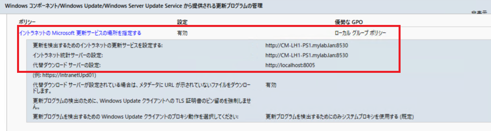

# ConfigMgr クライアントの OS 更新失敗を防ぐ - よくある原因と解決策 (1)

こんにちは。Configuration Manager サポート チームです。

本記事では、Configuration Manager (ConfigMgr) を使用した OS 更新プログラムの適用が失敗する際のよくある原因と解決策をご紹介します。

※本記事では、WSUS、Intune、Windows Update、Windows Update for Business (WUfB) に関する内容は対象外です。

各症状ごとに詳細な記事を公開しています。記載内容と一致しない事象を確認された場合、弊社サポートまでお問い合わせください。

## 症状

以下のような問題が発生することがあります。

1. **利用可能展開にしているのに、更新プログラムがソフトウェア センターに表示されない**
2. **ソフトウェア センターでダウンロードが失敗する**
3. **ソフトウェア センターでインストールに失敗する**
4. **必須展開にしているのに、更新プログラムが適用されない**

本記事では、症状 1 の「利用可能展開にしているのに更新プログラムがソフトウェア センターに表示されない」問題について解説します。

## 利用可能展開にしているのに、更新プログラムがソフトウェア センターに表示されない

以下のような原因が考えられます。

- 管理ポイントと通信できず、展開ポリシーを取得できていない
- 展開ポリシーに紐づくコレクションにデバイスが所属していない
- ソフトウェア更新ポイントと通信できず、更新プログラムの検出が失敗している

### 管理ポイントと通信できず、展開ポリシーを取得できていない

管理ポイントと ConfigMgr クライアントの通信ができていない可能性があります。以下の PowerShell コマンドを実行し、管理ポイントと疎通できるか確認してください (拡張 HTTP 通信設定の場合のみ)。

```powershell
Invoke-WebRequest -Uri "http://<管理ポイントの FQDN>/sms_mp/.sms_aut?mplist" -UseBasicParsing
```

正常な場合、`StatusCode : 200` が返ります。それ以外の場合、通信エラーの可能性があります。

ログから確認する場合は、クライアントの ``C:\Windows\CCM\Logs\CcmMessaging.log`` を確認すると良いかと存じます。直近に以下のようなログが出力されていれば、通信が失敗している可能性が高いです。

```
[CCMHTTP] ERROR: URL=[管理ポイントの URL], Port=[port 番号], Options=1248, Code=0, Text=[エラー シンボル]
[CCMHTTP] ERROR INFO: StatusCode=[HTTP ステータス コード] StatusText=[HTTP エラー ステータス テキスト]
```

よくあるエラー シンボル の例:

- `CCM_E_BAD_HTTP_STATUS_CODE`: HTTP ステータスコード 4xx または 5xx (サーバー側のエラー)
- `CCM_E_NO_CLIENT_PKI_CERT`: HTTPS 環境でクライアント証明書が見つからない
- `ERROR_WINHTTP_NAME_NOT_RESOLVED`: DNS で管理ポイントを解決できない
- `ERROR_WINHTTP_TIMEOUT`: 管理ポイントとの通信がタイムアウト

## 展開ポリシーに紐づくコレクションにデバイスが所属していない

デバイスがコレクションに所属していないと、展開ポリシーを取得できません。以下の PowerShell コマンドを実行し、展開ポリシーを取得できているか確認してください。

```powershell 
Get-WmiObject -Namespace "root\CCM\Policy\Machine\ActualConfig" -ClassName CCM_UpdateCIAssignment | Select-Object AssignmentID,  AssignmentName | Sort-Object -Property AssignmentName | Format-Table 
```

## ソフトウェア更新ポイントと通信できずに更新プログラムの検出が失敗している

デバイスがソフトウェア更新ポイントと通信できていない場合、更新プログラムの検出が失敗します。以下のコマンドを実行し、通信状況を確認してください (HTTP 通信設定の場合のみ)。

```powershell
Invoke-WebRequest -Uri "http://<ソフトウェア更新ポイントの FQDN>:8530/ClientWebService/client.asmx" -UseBasicParsing
```
`StatusCode : 200` 以外が返る場合、通信エラーの可能性があります。

また、ソフトウェア更新ポイントとアクセスする際には、通常、WinHTTP Proxyが利用されます。ご利用の NW 経路上、該当の Proxy は利用できるのか確認いただき、利用できない場合は、Proxy をバイパスするよう設定ください。

WinHTTP Proxy の設定は、コマンド プロンプトを開き、以下のコマンドを実行して確認できます。

```bat
netsh winhttp show proxy
```

このほか、ソフトウェア更新ポイントがクライアントの所属する境界グループに紐づいていない、もしくは所属するドメインのグループ ポリシーで上書きされている場合がございます。こちらの確認は、コマンド プロンプトで、以下を実行して出力されるグループ ポリシーの評価結果をご確認ください。

```bat
gpresult /H gpresult.html
```

出力された gpresult.html にて [設定] - [ポリシー] - [管理用テンプレート] - [Windows コンポーネント/Windows Update/(Windows Server Update Service から提供される更新プログラムの管理)]のポリシー [イントラネットの Microsoft 更新サービスの場所を指定する] の[優勢なGPO]が　[ローカル セキュリティ ポリシー]であり、かつ、以下の項目が以下の設定であるのが正しい設定です。

- 更新を検出するためのイントラネットの更新サービスを指定する: ソフトウェア更新ポイントの FQDN
- イントラネット統計サーバーの設定: ソフトウェア更新ポイントの FQDN
- 代替ダウンロード サーバーの設定: http://localhost:8005

 

上記の修復は [ConfigMgrコンソール] - [管理] - [階層の構成] - [境界グループ] より設定を見直しください。
IP サブネット境界設定が誤っている場合などもございます。

IP サブネット境界設定の考え方  
https://jpmem.github.io/blog/mecm/20220414_01/


この他、「ソフトウェア更新ポイントとの通信がタイムアウトする」場合がございます。この事象は、 C:\Windows\CCM\WUAHandler.log の以下のようなログの出力で確認できます。

```
OnSearchComplete - Failed to end search job. Error = 0x80072ee2
Scan failed with error = 0x80072ee2.
```

0x80072ee2:	WININET_E_TIMEOUT

また、「ソフトウェア更新ポイントとの通信が 503 エラーで返答される」場合もございます。この事象も、C:\Windows\CCM\WUAHandler.log の以下のようなログの出力で確認できます。

```
OnSearchComplete - Failed to end search job. Error = 0x80244022.
Scan failed with error = 0x80244022. 
```

0x80244022: WU_E_PT_HTTP_STATUS_SERVICE_UNAVAIL / Same as HTTP status 503 - the service is temporarily overloaded.

これらの原因は、ソフトウェア更新ポイントとして利用している WSUS のメンテナンスが適切に行われていない場合が極めて多いので、以下でご案内のメンテナンスを実施ください。

WSUS メンテナンスガイド新版  
https://jpmem.github.io/blog/wsus/2022-05-09_01/


この他、実際にクライアントで更新プログラムの検出が成功しているかどうかは、以下の Powershell スクリプトを実行することでも確認できます。

```powershell
Get-WmiObject -Namespace "root\CCM\SoftwareUpdates\UpdatesStore" -ClassName CCM_UpdateStatus | Select-Object UniqueId,Title,Status | Format-Table
```

適用させたい更新プログラムの Status が Missing になっているかを確認ください。該当の更新プログラムが見つからない場合、ソフトウェア更新ポイント上で該当の更新プログラムの承認状態が「未承認」でないか、そもそもソフトウェア更新ポイントと通信できていないか、もしくは、WUfB 関連のポリシー / レジストリが有効になっているためにデュアル スキャン状態になっている可能性がございます。