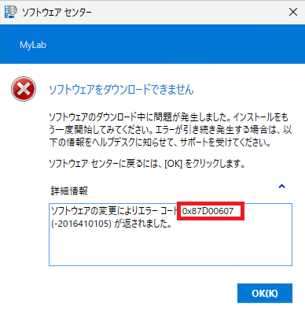
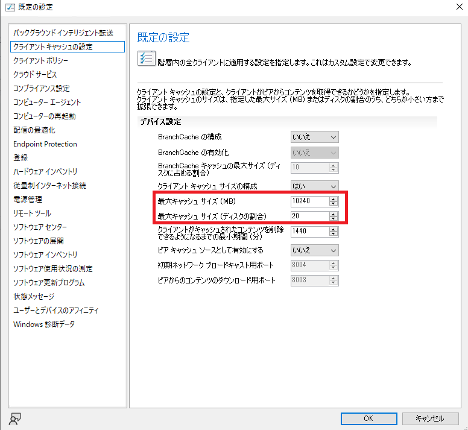

# ConfigMgr クライアントでのOS 更新失敗を防ぐ - よくある原因と解決策 (2)

こんにちは。Configuration Manager サポート チームです。

本記事では、Configuration Manager (ConfigMgr) を使用した OS 更新プログラムの適用が失敗する際のよくある原因と解決策をご紹介します。

※本記事では、WSUS、Intune、Windows Update、Windows Update for Business (WUfB) に関する内容は対象外です。

各症状ごとに詳細な記事を公開しています。記載内容と一致しない事象を確認された場合、弊社サポートまでお問い合わせください。

## 症状

以下のような問題が発生することがあります。

1. **利用可能展開にしているのに、更新プログラムがソフトウェア センターに表示されない**
2. **ソフトウェア センターでダウンロードが失敗する**
3. **ソフトウェア センターでインストールに失敗する**
4. **必須展開にしているのに、更新プログラムが適用されない**

本記事では、症状 2 の「ソフトウェア センターでダウンロードが失敗する」問題について解説します。

## ソフトウェア センター でダウンロードが失敗する

ソフトウェア センターで対象の更新プログラムのインストールを開始した際に、ダウンロードが失敗する場合、以下のような原因が考えられます。

- クライアントの所属する境界グループに配布ポイントが紐づいていない
- 配布ポイントにコンテンツが配布されていない。
- クライアントの ccmcache フォルダー領域の空き容量が不足している。

### クライアントの所属する境界グループに配布ポイントが紐づいていない
### 配布ポイントにコンテンツが配布されていない。

クライアントの所属する境界グループに配布ポイントが紐づいていない、または紐づいていたとしても配布ポイントにコンテンツが割り当たっていないために、該当の更新プログラム コンテンツのダウンロード元が見つからない場合がございます。この場合、`C:\Windows\CCM\Logs\ContentTransferManager.log` に以下のようなログが出力されます。

```
CCTMJob::UpdateLocations - Received empty location update for CTM Job {XXXXXXXX-XXXX-XXXX-XXXX-XXXXXXXXXXXX}
CTM job {XXXXXXXX-XXXX-XXXX-XXXX-XXXXXXXXXXXX} suspended   
```

ソフトウェア センターからインストールする際に、以下のようなエラーが表示される場合も該当します。  



0x87d00607: "Content not found"


上記、修復には ConfigMgr コンソールより、該当の配布ポイントに対象の更新プログラムを含む展開パッケージが配布されているかをご確認ください。

確認すべき項目は、以下です。
- 境界グループ設定の見直し  
  [ConfigMgr コンソール] - [管理] - [階層の構成] - [境界グループ] より設定を見直しください。  
  IP サブネット境界設定が誤っている場合などもございます。

  IP サブネット境界設定の考え方  
  https://jpmem.github.io/blog/mecm/20220414_01/

- 展開パッケージ配布状況の確認
  [ConfigMgr コンソール] - [監視] - [概要] - [配布ステータス] - [コンテンツのステータス]

### クライアントの ccmcache フォルダー領域の空き容量が不足している。

配信の最適化であれ、PeerCache や BranchCache を利用されている環境であれ、必ず ``C:\Windows\CCMCache`` にダウンロードしたコンテンツはキャッシュされる仕組みとなっております。機能更新プログラムは数 GB になることも多くあることから、上記キャッシュ領域が不足することもございますので、
容量を確保するようお願いいたします。 

最大キャッシュ サイズの設定は,  以下で設定可能です。(MB) と (ディスクの割合) の二つの設定がございますが、計算した結果小さいほうが採用されます。また 100 GB　以上は現状設定不可となっています。  

[ConfigMgr コンソール] - [管理] - [概要] - [クライアント設定] - ご利用のクライアント設定を選択 - [プロパティ] - [クライアント キャッシュの設定]-[最大キャッシュ サイズ]



この他、クライアントのキャッシュをクリアしたい場合は以下の記事をご参照ください。  

ccmcache フォルダー配下のキャッシュ クリア方法  
https://jpmem.github.io/blog/mecm/20220511_01/


