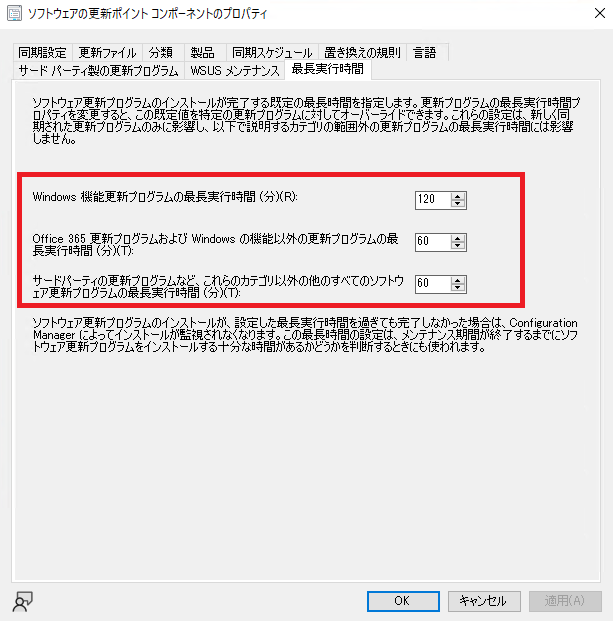
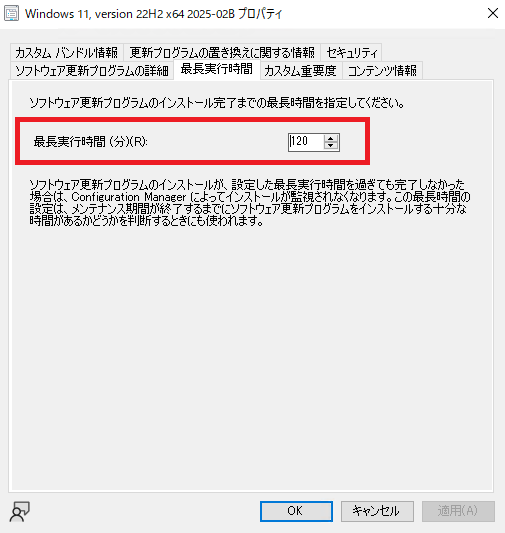

# ConfigMgr クライアントでの OS 更新失敗を防ぐ - よくある原因と解決策 (3)

こんにちは。Configuration Manager サポート チームです。

本記事では、Configuration Manager (ConfigMgr) を使用した OS 更新プログラムの適用が失敗する際のよくある原因と解決策をご紹介します。

※本記事では、WSUS、Intune、Windows Update、Windows Update for Business (WUfB) に関する内容は対象外です。

各症状ごとに詳細な記事を公開しています。記載内容と一致しない事象を確認された場合、弊社サポートまでお問い合わせください。

## 症状

以下のような問題が発生することがあります。

1. 利用可能展開にしているのに、更新プログラムがソフトウェア センターに表示されない
2. ソフトウェア センターでダウンロードが失敗する
3. **ソフトウェア センターでインストールに失敗する**
4. 必須展開にしているのに、更新プログラムが適用されない

本記事では、症状 3 の **「ソフトウェア センターでインストールに失敗する」** 問題について解説します。

## ソフトウェア センター でインストールに失敗する

ソフトウェア センターでダウンロード成功後、インストールに失敗する場合、以下のような原因が考えられます。

- 更新プログラムの最長実行時間よりも更新プログラムの適用に時間がかかり、途中でキャンセルされた

### 更新プログラムの最長実行時間よりも更新プログラムの適用に時間がかかり、途中でキャンセルされた

ConfigMgr の更新プログラムの展開は、適用中の意図しない トラブルを防ぐため、最長実行時間が設定されており、これを超えた場合、更新プログラムの適用処理が途中で キャンセル される動きとなっております。

上記は、``C:\Windows\SoftwareDistribution\ReportingEvents.log`` に出力される以下のようなログ文字列があることでも判断可能です。

```
(1) [AGENT_INSTALLING_STARTED]	xxx	{XXXXXXXX-XXXX-XXXX-XXXX-XXXXXXXXXXXX}	xxx	x	CcmExec	Success	Content Install	Installation Started: Windows has started installing the following update: [更新プログラム タイトル]	........
(2) [AGENT_INSTALLING_FAILED]	xxx	{XXXXXXXX-XXXX-XXXX-XXXX-XXXXXXXXXXXX}	100	800704c7	CcmExec	Failure	Content Install	Installation Failure: Windows failed to install the following update with error 0x800704c7: [更新プログラム タイトル]	.......
```
- (1) と (2) それぞれの文字列に CCMExec による実行ログであることが記載されている。
- (1) と (2) の時間が最長実行時間以上
- (2) のエラーが 0x800704c: E_CANCELLED

お客様の環境によっては、上記実行時間を超えても更新プログラムの適用が終わらない場合があるかと存じますので、最長実行時間の設定を見直されると良いかと存じます。

- 更新プログラム全体の設定確認
[ConfigMgr コンソール] - [サイトの構成] - [サイト] - ご利用のサイトの選択 - [サイト] - ご利用のサイトを選択 - [サイト コンポーネントの構成] - [ソフトウェアの更新ポイント]  - [最長実行時間] タブ  



- 更新プログラム単体の設定確認

  - 更新プログラムの場合
    [ConfigMgr コンソール] - [ソフトウェア ライブラリ] - [概要] - [ソフトウェア更新プログラム] - [すべてのソフトウェア更新プログラム] - 該当の更新プログラムを選択 - [プロパティ] - [最長実行時間]タブ

  - 機能更新プログラムの場合
    [ConfigMgr コンソール] - [ソフトウェア ライブラリ] - [概要] - [Windows Servicing] - [すべての Windows 機能更新プログラム]-該当の更新プログラムを選択 - [プロパティ] - [最長実行時間]タブ

    
