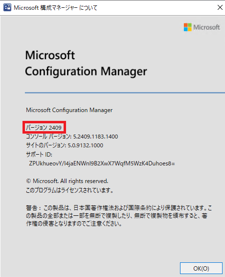
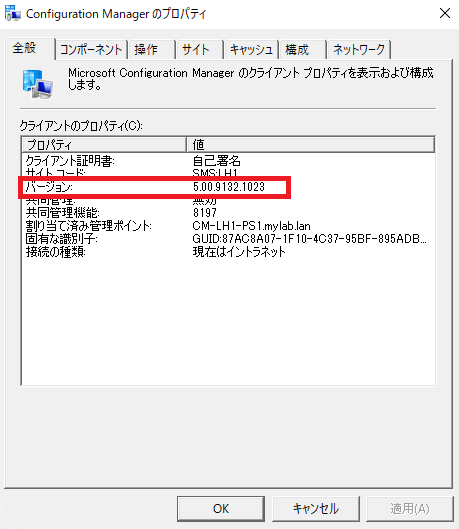
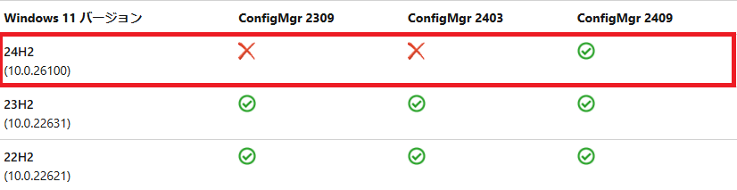

# ConfigMgr サポート バージョン FAQ

こんにちは。Configuration Manager サポート チームです。

本記事では、Configuration Manager (ConfigMgr) のサポート バージョンについてよくあるご質問と回答をご案内いたします。こちらに記載のないご質問に関しては弊社サポートまでお問い合わせください。

# よくあるご質問の一覧

1. ConfigMgr のバージョンを確認するには？
2. ConfigMgr がサポート期限を迎えた場合、どうなりますか？
3. ConfigMgr クライアントでサポートされる バージョンは？
4. ConfigMgr クライアントのバージョンが、サイト サーバーやサイト システムのバージョンより古い場合、どうなりますか？
5. ConfigMgr クライアントやサーバーの動作する OS がサポート期限切れを迎えた場合、どうなりますか？
6. 新しい機能更新プログラムがリリースされた OS に対して ConfigMgr のサポートはどうなりますか？
7. サポート期限切れを迎えたが、ESU が適用された OS は ConfigMgr はサーバーでサポートされますか？
8. サポート期限切れを迎えたが、ESU が適用された OS は ConfigMgr はクライアントでサポートされますか？
9. ConfigMgr はすべてのサポートされるバージョンで不具合は修正されますか?

## 1. ConfigMgr のバージョンを確認するには？

サーバー側は、ConfigMgr コンソールより以下の画面でご確認ください。  
- [ConfigMgr コンソール] - 左上 ▼ ボタン - [Configuration Manager のバージョン情報]

   

クライアント側は、ConfigMgr コントロール パネル アプレット より、以下の箇所でご確認ください。

- [コントロール パネル] - [システムとセキュリティ] - [Configuration Manager] - [全般]タブ

   

## 2. ConfigMgr がサポート期限を迎えた場合、どうなりますか？

サーバーおよびクライアントはそのまま動作しますが、弊社サポート チームに対してお問い合わせされた場合、ご対応いたしかねます。サポート チームでは、サポートされているバージョンへのアップグレードの支援のみご対応させていただきます。アップグレードが完了した後、通常のお問い合わせ対応を再開させていただきます。

## 3. ConfigMgr クライアントでサポートされる バージョンは？

サーバーでサポートされるバージョンに準じます。現在のサポート バージョンは下記をご参照ください。  

Configuration ManagerのUpdatesとサービス - サポートされるバージョン  
https://learn.microsoft.com/ja-jp/intune/configmgr/core/servers/manage/updates#supported-versions

## 4. ConfigMgr クライアントのバージョンが、サイト サーバーやサイト システムのバージョンより古い場合、どうなりますか？

サポートされるバージョンであれば弊社サポートは提供されます。
新しいほうのバージョンで提供される新機能のうち、サーバーとクライアントが連携する必要がある機能は提供されません。

## 5. ConfigMgr クライアントやサーバーの動作する OS がサポート期限切れを迎えた場合、どうなりますか？

サーバーおよびクライアントはそのまま動作しますが、弊社サポート チームに対してお問い合わせされた場合、ご対応いたしかねます。サポート チームでは、サポートされているバージョンへの OS アップグレードの支援のみご対応させていただきます。アップグレードが完了した後、通常のお問い合わせ対応を再開させていただきます。

## 6.新しい機能更新プログラムがリリースされた OS に対して ConfigMgr のサポートはどうなりますか？

対象の機能更新プログラムのバージョンに合わせて、対応する ConfigMgr のバージョンもアップグレードが必要となります。

クライアントの機能更新プログラムごとの、ConfigMgr の対応バージョンについては下記をご参照ください。

- Configuration ManagerでのWindows 11のサポート  
https://learn.microsoft.com/ja-jp/intune/configmgr/core/plan-design/configs/support-for-windows-11#windows-11-versions
- Configuration ManagerでのWindows 10のサポート  
https://learn.microsoft.com/ja-jp/intune/configmgr/core/plan-design/configs/support-for-windows-10

例えば、下記表からわかる通り、2025年4月現在、Windows 11 24H2 のサポートは ConfigMgr CB 2409 からとなります。

## 7. サポート期限切れを迎えたが、ESU が適用された OS は ConfigMgr サーバーでサポートされますか？

サポートされません。通常の期限切れを迎えた OS と同様の扱い、つまりサポートされる OS へのアップグレードのご支援のみ対応させていただきます。アップグレードが完了した後、通常のお問い合わせ対応を再開させていただきます。

## 8. サポート期限切れを迎えたが、ESU が適用された OS は ConfigMgr クライアントでサポートされますか？

ConfigMgr 最新ブランチにおいて、セキュリティ更新プログラムの配布機能のみがサポートされます。また、クライアント OS をサポートされる OS へのアップグレードもされます。それ以外の機能 (パッケージ、アプリケーション配布など)はサポート外となります。

つまり、 ESU 環境のクライアントに対するセキュリティ更新プログラムの配布機能だけでも利用されたい場合は、ConfigMgr を常に最新のブランチにアップグレードする必要がございますので、予めご理解賜りますようお願いいたします。

ESU については以下の公開情報をご参照ください。

- Configuration Manager でサポートされる、クライアントとデバイスの OS のバージョン  - 拡張セキュリティ更新プログラムと Configuration Manager  
https://learn.microsoft.com/ja-jp/intune/configmgr/core/plan-design/configs/supported-operating-systems-for-clients-and-devices#bkmk_ESU

## 9. ConfigMgr はすべてのサポートされるバージョンで不具合が修正されますか?

ConfigMgr は現在、「セキュリティと重要な Updates サービスフェーズとなっており、重要な更新プログラムは最新の Current Branch のバージョンのみ提供されます。セキュリティ更新プログラムは Current Branch でサポートされているすべてのバージョンに提供されます。
ここで、「重要な更新プログラム」とはセキュリティに関連しない重要な不具合を修正するプログラムのこととなります。

例えば、 2025/9/8 現在、最新の Current Branch バージョンは ConfigMgr CB 2503 (5.00.9135) 、サポートされているバージョンは CB 2503, CB 2409 (5.00.9132), CB 2403 (5.00.9128)です。
セキュリティ更新プログラムはサポートされている CB 2503, 2409, 2403 すべてに提供されますが、
それ以外の更新プログラムは CB 2503 のみで提供されます。

そのため、例えば 2403, 2409、2503 で発見された重要な不具合があったとしても、修正のための更新プログラムが提供されるのは 2503 のみとなります。
また、2409 で確認されたが、2503 で再現できない重要な不具合については、修正更新プログラムは提供されませんので、予めご承知おきください。

- 現在のブランチ バージョンConfiguration Managerサポート
https://learn.microsoft.com/ja-jp/intune/configmgr/core/servers/manage/current-branch-versions-supported

# 改訂履歴
2025-10-06: ESUの対応について修正
2025-04-08: 初版