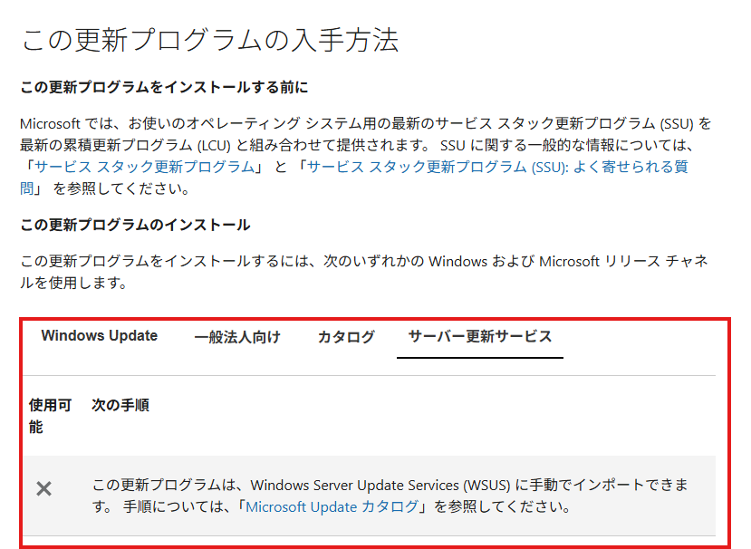
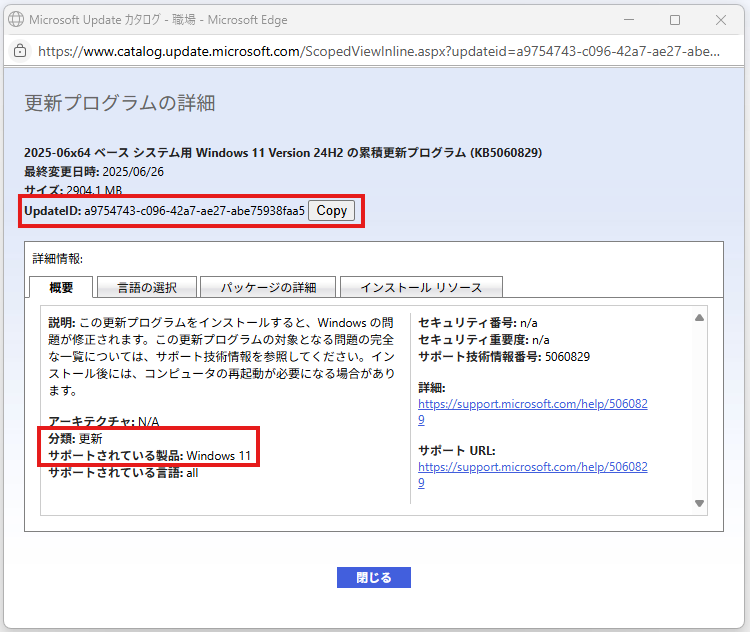
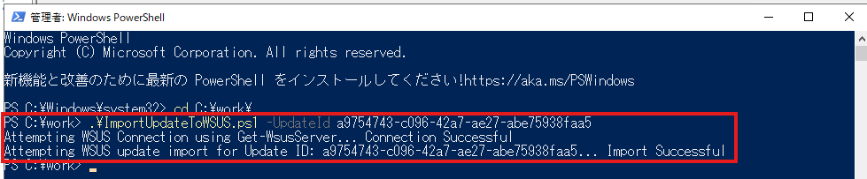
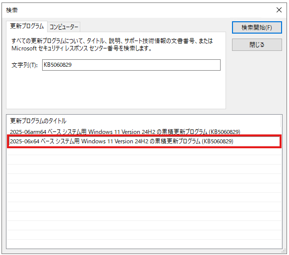
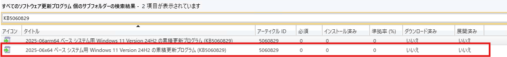

# 通常では同期されない Windows OS 更新プログラムの同期方法

みなさま、こんにちは。Configuration Manager サポート チームです。  
今回は、Configuration Manager (ConfigMgr) のソフトウェアの更新ポイントに通常では同期されないソフトウェア更新プログラムの同期方法についてご紹介いたします。  

## ソフトウェア更新プログラムのリリースの種類

ソフトウェア更新プログラムについては、主に以下のリリースの種類があります。


1. 毎月のセキュリティ更新プログラム リリース
1. オプションのセキュリティ以外のプレビュー リリース
1. 帯域外 (OOB) リリース


ConfigMgr においては、原則上記の 「毎月のセキュリティ更新プログラム リリース」 のソフトウェア更新プログラムが同期対象となっているため、既定の状態だと 「オプションのセキュリティ以外のプレビュー リリース」 や「帯域外 (OOB) リリース」 を ConfigMgr から配信することは」できません。  
本ブログ記事では同期対象となっていない Windows OS 更新プログラムの同期方法をご紹介いたします。

## ConfigMgr が同期対象かどうかの確認方法

対象の更新プログラムのページを確認いただくことで、ConfigMgrで使用可能かどうか (同期対象か) 確認することができます。
後述に手順をご案内いたしますので、こちらを参考にご確認いただけますと幸いでございます。  

### 確認手順
今回の例では KB5060829 を対象にご案内いたします。  

[2025 年 6 月 26 日 — KB5060829 (OS ビルド 26100.4484) プレビュー](https://support.microsoft.com/ja-jp/topic/2025-%E5%B9%B4-6-%E6%9C%88-26-%E6%97%A5-kb5060829-os-%E3%83%93%E3%83%AB%E3%83%89-26100-4484-%E3%83%97%E3%83%AC%E3%83%93%E3%83%A5%E3%83%BC-e31ba7c2-ff65-4863-a462-a66e30840b1a)  


1. 配信したい更新プログラムのサポート技術情報の記事を Microsoft Edge 等のブラウザでアクセスします。  
[2025 年 6 月 26 日 — KB5060829 (OS ビルド 26100.4484) プレビュー](https://support.microsoft.com/ja-jp/topic/2025-%E5%B9%B4-6-%E6%9C%88-26-%E6%97%A5-kb5060829-os-%E3%83%93%E3%83%AB%E3%83%89-26100-4484-%E3%83%97%E3%83%AC%E3%83%93%E3%83%A5%E3%83%BC-e31ba7c2-ff65-4863-a462-a66e30840b1a)  
<br>

1. サポート技術情報の記事の [この更新プログラムの入手方法] の "サーバー更新サービス" を確認し、使用可能かどうか確認します。  
**※ 使用不可のソフトウェア更新プログラムを ConfigMgr で配信したい場合は後述の手順をお試しください。**  <br>
// 画面サンプル


## 同期されない Windows OS 更新プログラムの同期方法

[ConfigMgr が同期対象かどうかの確認方法](#configmgr-が同期対象かどうかの確認方法) にて "サーバー更新サービス" が使用不可となっている更新プログラムを ConfigMgr に同期する手順をご紹介いたします。  

大まかな流れといたしましては、以下弊社ブログ記事の手順にて、Microsoft Update カタログから該当の更新プログラムをインポートいただくことで、ConfigMgr に同期することができ、ソフトウェア更新プログラムの展開機能を利用して配信することができます。

[Microsoft Update カタログから更新プログラムをインポートする手順が変更されました](https://jpmem.github.io/blog/wsus/2023-07-27_01/)

**本手順では KB5060829 を例にしてご説明いたしますので、適宜読み替えてご対応くださいますようお願いいたします。**

### 事前準備

#### 1. ImportUpdateToWSUS.ps1 の作成

以下の公開情報に記載されているスクリプトの中身をコピーし、ファイル名を “ImportUpdateToWSUS.ps1” として、 
最上位サイトのソフトウェアの更新ポイント サーバーの任意のパス (C:\work など) へ保存します。

[Import updates into WSUS using PowerShell](https://learn.microsoft.com/en-us/windows-server/administration/windows-server-update-services/manage/wsus-and-the-catalog-site?branch=pr-4097#powershell-script-to-import-updates-into-wsus)

#### 2. ソフトウェア更新プログラムの 製品、分類 および Update Id の確認

更新プログラムをインポートするためには該当の更新プログラムの Update Id が必要でございます。
以下に Update Id を確認する手順をご案内いたしますので、ご確認くださいませ。

1. Microsoft Edge 等のブラウザで Microsoft Update カタログ サイトへアクセスします。  
[Microsoft®Update カタログ](https://catalog.update.microsoft.com/Home.aspx)  
<br>
1. WSUS にインポートするソフトウェア更新プログラムを検索します。
1. 対象の更新プログラムをクリックします。
1. 開いたソフトウェア更新プログラムの詳細ページで 製品、分類 および Update Id を控えます。 <br>
// 画面サンプル



### 同期手順

1. 最上位サイトのソフトウェアの更新ポイント サーバーに管理者権限を保有しているユーザー アカウントでログインします。
2. PowerShell を管理者権限で起動します。
3. 以下コマンドを実行し、”Import Successful” と出力されたことを確認します。


```powershell
cd <事前準備 1 で作成した ImportUpdateToWSUS.ps1 を格納したパス>
.\ImportUpdateToWSUS.ps1 -UpdateId <事前準備 2 で控えた Update Id>
```

// 実行画面サンプル


4. WSUS コンソールを起動し、インポートした該当の更新プログラムが表示されていることを確認します。

// 画面サンプル



5. 続いて、最上位サイトの Configuration Manager コンソールを起動します。
6. [管理] - [概要] - [サイトの構成] - [サイト] の順に展開します。
7. 上メニューにある [サイト コンポーネントの構成] を選択し、 [ソフトウェアの更新ポイント] をクリックします。
8. ソフトウェアの更新ポイントのプロパティ ウィザードの [製品] タブと [分類] タブを確認し、事前準備 2 で控えた製品と分類にチェックが入っていることを確認します。
<br>
9. 続いて、[ソフトウェア ライブラリ] – [概要] – [ソフトウェア更新プログラム] – [すべてのソフトウェア更新プログラム] の順に展開します。
10. 上メニューにある [ソフトウェア更新プログラムの同期] をクリックします。

11. ソフトウェア更新プログラムの同期が完了するまで待機します。  
※ [監視] – [概要] – [ソフトウェアの更新ポイントの同期ステータス] より同期のステータスが確認できます。

12. [ソフトウェア ライブラリ] – [概要] – [ソフトウェア更新プログラム] – [すべてのソフトウェア更新プログラム] の順に展開し、該当の更新プログラムが表示されていることを確認します。

// 画面サンプル


### 補足情報
該当のソフトウェア更新プログラムのインポート時にエラーとなる場合は、以下の公開情報に該当していることが考えられます。
このため、インポート実施時にエラーとなる場合は、こちらの公開情報にございます対処をご実施のうえ、再度更新プログラム カタログのインポートをお試しください。

[WSUS and the Microsoft Update Catalog - Troubleshooting](https://learn.microsoft.com/en-us/windows-server/administration/windows-server-update-services/manage/wsus-and-the-catalog-site?branch=pr-4097#troubleshooting)
