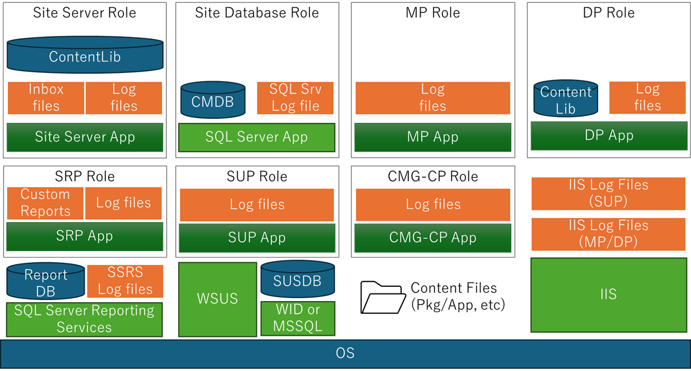
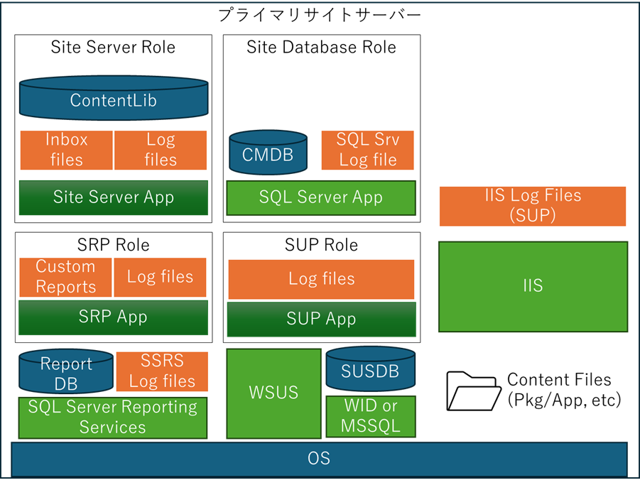
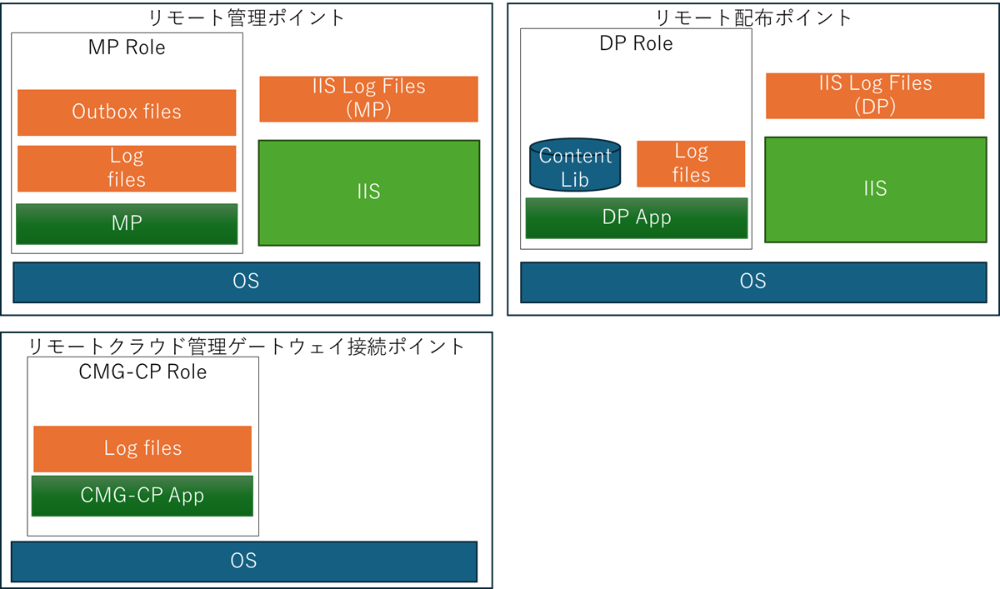
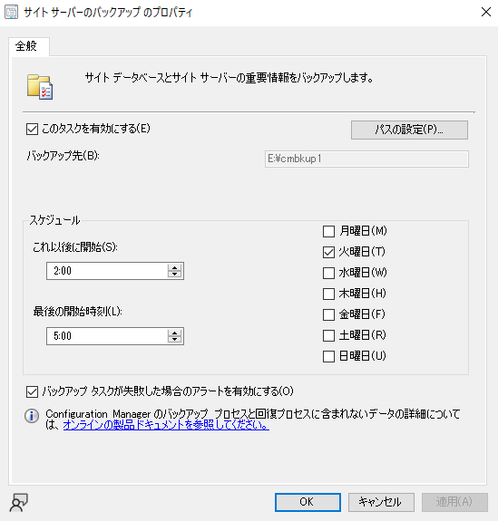
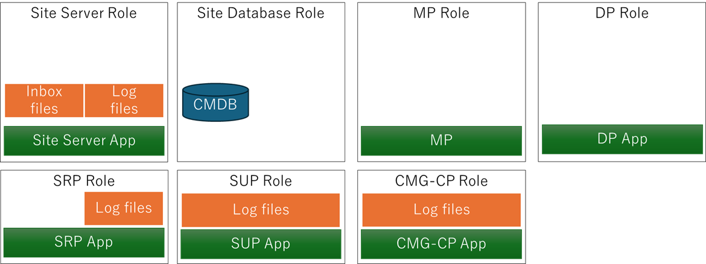
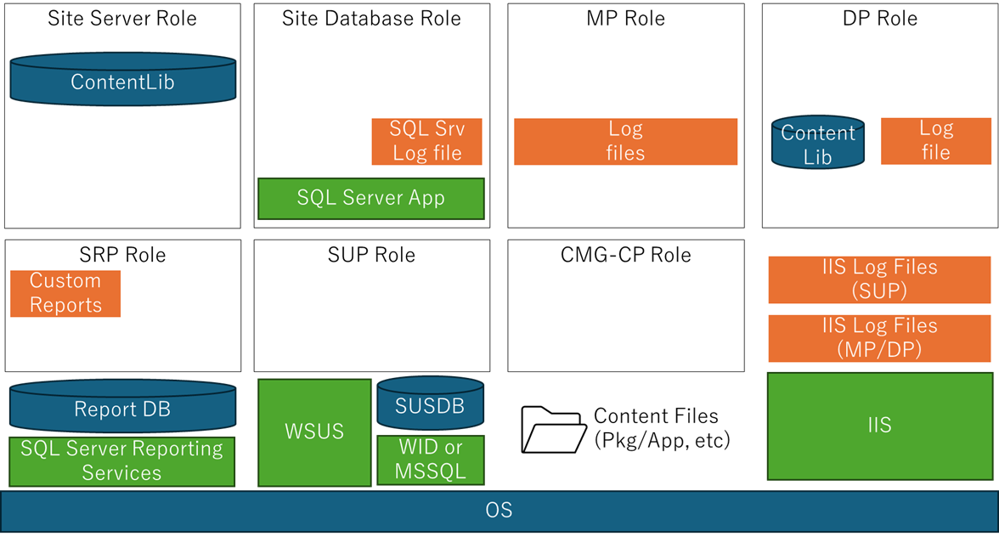
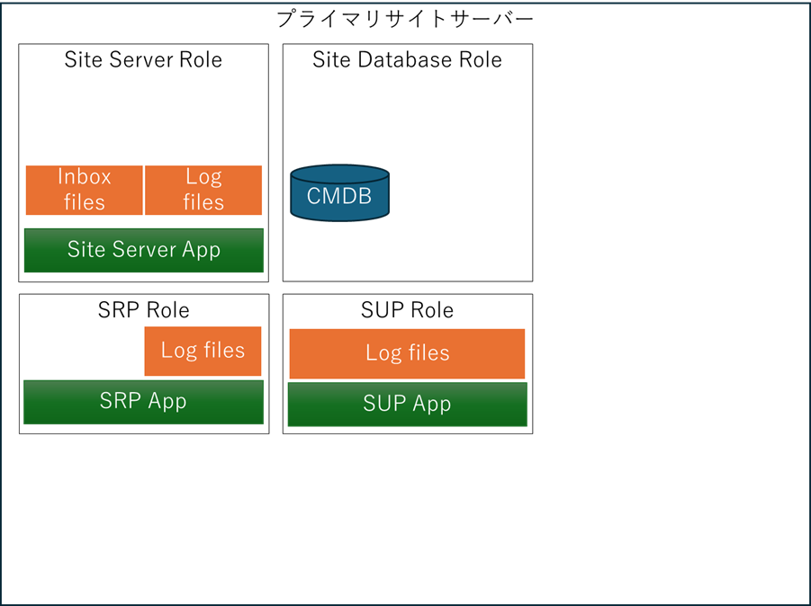
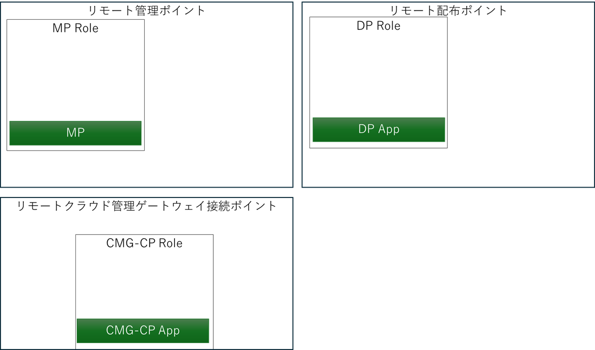
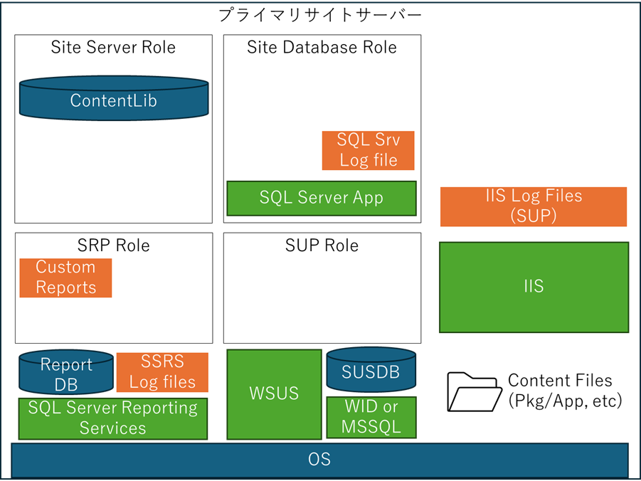
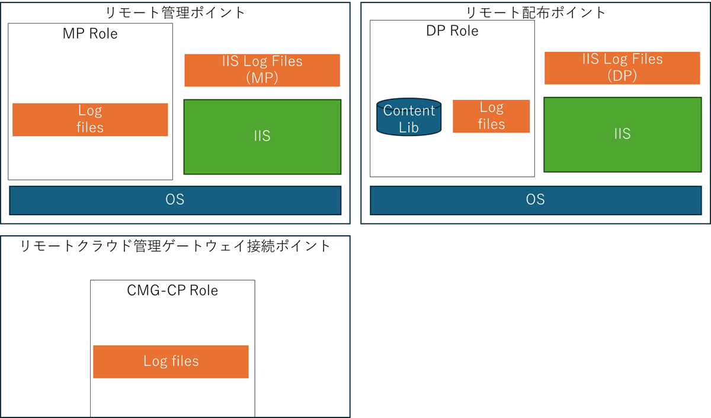

# ConfigMgr の バックアップ と リカバリ　(1)

こんにちは。Configuration Manager サポート チーム です。お客様によるバックアップ設計の参考になれば幸いです。  
なおバックアップには様々な方式がございますが、本記事では主に ConfigMgr が提供している「サイト バックアップ」を主眼に解説しております。なお、リカバリについては後日記事として作成予定です。

下記公開ドキュメントにも、バックアップとリカバリの詳細が記載されていますのでご参照ください。

- Configuration Manager サイトをバックアップする  
  https://learn.microsoft.com/ja-jp/intune/configmgr/core/servers/manage/backup-and-recovery

- Configuration Manager サイトを回復する  
  https://learn.microsoft.com/ja-jp/intune/configmgr/core/servers/manage/recover-sites

# 用語の定義

本記事では、各用語を以下のように定義しますので、予めご確認くださいますようお願いいたします。

- バックアップの種類
  - システム バックアップ:
     あるシステムが持つ全てのデータを含むバックアップのこと。
  - 仮想マシン バックアップ: システムが仮想マシン上で稼働していた場合、その仮想マシンが動作するための設定ファイル、および所有する仮想ディスクの全てが含まれるバックアップのこと。
  - OS バックアップ: サーバーのデータのうち、OS データを含むドライブのバックアップのこと。便宜上、 WMI レポジトリや レジストリのバックアップはここに含まれる。
  - DB バックアップ: システムが利用するデータベースのバックアップのこと。データ、および トランザクション ログを含む。
  - ファイル バックアップ: サーバーのデータのうち、OS や DB、アプリケーション 以外のデータファイルバックアップのこと。
  - サイト バックアップ: ConfigMgr が独自に用意している、ConfigMgr のサイト回復に必要なファイル群をバックアップしたもの。
- 仮想マシン スナップショット: サーバーが仮想マシン上で稼働していた場合に、その仮想マシンのある時点での動作状態を復元可能なよう一時保存したもの。 バックアップとは異なる。
- RTO: 目標復旧時間 (Recovery Time Objective): サーバーのダウンタイムとして許容できる時間。

# 構成別のデータ格納場所

下記では、よくある以下の二例の構成について、データの格納場所を図に示します。

## 例1: スタンドアロン サイト サーバー構成

開発 / ラボ 環境など、非常に少ない端末台数を管理されている際の構成です。

- プライマリ サイト サーバー 1台
  - 以下 サイト ロールが同居
    - サイト データベース 
    - 管理ポイント (MP)
    - 配布ポイント (DP)
    - ソフトウェア更新ポイント (SUP)
    - レポート サービス ポイント (SRP)
    - クラウド管理ゲートウェイ接続 ポイント (CMG-CP)

### データの格納場所

例1の場合のデータの格納場所は以下の図の通りです。

   

## 例2: MP / DP / CMG-CP 分離構成

本番環境にて一定の端末台数を管理されている際の構成例です。

- プライマリ サイト サーバー 1台
  - 以下サイト ロールが同居
    - サイト データベース     
    - ソフトウェア更新ポイント (SUP)
    - レポート サービス ポイント (SRP)
- リモート管理ポイント (MP) 1台
- リモート配布ポイント (DP) 1台
- リモート クラウド管理ゲートウェイ接続ポイント (CMG-CP) 1台    

### データの格納場所

例2の場合のデータの格納場所は以下の図の通りです。プライマリ サイト サーバーとそれ以外のサイト システム サーバーで図を分けています。

     
     

# ConfigMgr が取り扱うデータ

ConfigMgr はご利用の階層設計により、取り扱っているデータの配置場所が異なります。
代表的なサイト ロールで取り扱っているデータは以下の通りです。上記の図でご案内している要素の説明ともなっておりますので、図を確認しながら、お読みいただければと存じます。

##  サイト サーバー
- Site Server Apps:  
  ConfigMgr サイト サーバー のアプリケーション 本体です。クライアント プログラムや各種ツール群も含まれます。また、各サイト システムのアプリケーション バイナリや、セットアップ プログラム、リストア プログラムなども含まれています。
- Inbox files  
  クライアントから収集したデータや、各サイト システムからのジョブ ファイルが一時的に格納されています。サイト データベースに反映され次第、各ジョブ ファイルは削除されます。
- Log files  
  サイト サーバーのログです。
- ContentLib  
  ConfigMgrで配布しているパッケージやアプリケーション、更新プログラムの展開パッケージなどが保持されているコンテンツ ライブラリ です。

## サイト データベース
- SQL Server:   
  データベース管理ソフトウェアです。
- CMDB:  
  ConfigMgr のデータベースです。クライアント情報、パッケージやアプリケーション、更新プログラムの構成情報、展開ポリシー情報など多くのデータが管理されています。データおよび変更履歴である redo ログの形式でデータが保持されています。
- SQL Srv Log file:  
  SQL Server のログファイルです。

## 管理ポイント
- MP App:  
  管理ポイントのアプリケーション コンポーネントです。CCM フレームワーク、クライアント通知サービス、IIS Webアプリケーション等を含みます。
- Outbox files:  
  管理ポイントがクライアントから収集したデータを一時保管しているフォルダです。サイト データベースへ反映されるか、サイト データベースの Inbox files に転送され次第、各ファイルは削除されます。
- Log files:  
  管理ポイントのアプリケーション ログ ファイルです。
- IIS Log Files (MP):  
  IIS Web アプリケーションとして提供される、IIS 上のエンドポイントとしてのログファイルです。アクセス ログ、エラー ログが含まれます。

## 配布ポイント
以下では、配布ポイント機能のみを持っている場合のデータを示しています。Pull 配布ポイントや、PXE サポート、Microsoft Connected Cache for ConfigMgr を有効にした場合は、データが追加されます。
- DP App:  
  配布ポイントのアプリケーション コンポーネントです。IIS Webアプリケーションが主体となります。
- Log files:  
  配布ポイントのアプリケーション ログ ファイルです。
- ContentLib:  
  ConfigMgrで配布しているパッケージやアプリケーション、更新プログラムの展開パッケージなどが保持されているコンテンツ ライブラリ です。サイト サーバーから配布されたものが含まれます。

## レポート サービス ポイント
- SRP App:  
  レポート サービス ポイントのアプリケーション コンポーネントです。便宜上、ConfigMgr の標準レポート ファイルはこちらに含まれます。
- Log files:  
  レポート サービス ポイントのアプリケーション ログ ファイルです。
- Custom Reports:  
  標準で用意されている, ConfigMgr のレポートの他にお客様が別途作成されたレポート ファイル群です。

## ソフトウェア更新ポイント
- SUP App:  
  ソフトウェア更新ポイントのアプリケーション コンポーネントです。WSUS との連携に使われるモジュールなどが含まれます。
- Log files:  
  ソフトウェア更新ポイントのアプリケーション ログ ファイルです。

## クラウド管理ゲートウェイ接続ポイント
- CMG-CP App:  
  クラウド管理ゲートウェイ接続ポイントのアプリケーション コンポーネントです。
- Log files:  
  クラウド管理ゲートウェイ接続ポイントのログ ファイルです。

## その他

サイト サーバーやサイト システムの役割とは別に生成される/必要とされるデータ群を以下に示します。

### レポート サービス ポイントに必要なコンポーネントとデータ

レポート サービス ポイントに必要なコンポーネントとデータを以下に示します。

- SQL Server Reporting Services:  
レポート サービス ポイントの前提サービスです。略称 SSRS.
- SSRS Log files:  
SQL Server Reporting Servicesのログ ファイルです。
- Report DB:
SQL Server Reporting Servicesのデータベースです。SQL Server 上に生成します。

### ソフトウェア更新ポイントに必要なコンポーネントとデータ

ソフトウェア更新ポイントの動作に必要なコンポーネントとデータを以下に示します。

- Windows Server Update Services (WSUS):  
  Windows Server Update Services です。イントラ ネット上の端末の更新プログラムの管理に使われます。ソフトウェア更新ポイントの前提コンポーネントです。
- SUSDB: 
  WSUSのデータベースです。
- WID or MSSQL:  
  SUSDBのデータベース管理ソフトウェアとして、Windows Internal Database (WID) もしくは SQL Server Database のアプリケーション コンポーネントが必要となります。

### その他

- Content Files:  
  アプリケーションやパッケージ、展開パッケージなど、コンテンツ ライブラリに取り込む前のファイル群です。サイト サーバーのローカルフォルダや、別サーバーの共有フォルダに置かれます。
- Internet Information Service (IIS):  
  Web サーバーです。管理ポイント、配布ポイントはクライアントとの通信に使うエンドポイントを IIS アプリケーションとして提供しています。ソフトウェア更新ポイントの前提となる WSUS も同様に IIS でエンドポイントを提供しています。
- IIS Log files:  
  IIS ログ ファイルです。クライアントから管理ポイント、配布ポイント、ソフトウェア更新ポイントへのアクセス ログや、エラー ログが含まれます。
- OS:
  ConfigMgr サイト サーバーやサイト システムが動作するためのWindows Server OSです。

# ConfigMgr がサポートするバックアップ

ConfigMgr がサポートするバックアップは以下の二つです。

- サイト バックアップ
- DB バックアップ

以下のバックアップ方式については、サードパーティ製バックアップ ソリューションを含め、お客様による動作検証を推奨します。

- システム バックアップ
- 仮想マシン バックアップ
- 仮想マシン スナップショット
- ファイル バックアップ

以降では冒頭にも述べました通り、サイト バックアップを主に解説いたします。

## ConfigMgr サイト バックアップ

ConfigMgr が用意しているサイト バックアップは、以下の性質をもつバックアップです。

1. ConfigMgr にて指定したサイトの ConfigMgr アプリケーション バイナリ、DB のバックアップ、および inboxesファイルやログ ファイルのバックアップを行います。
2. メンテナンス タスクそのものでは、タスクの最終実行時点での断面のフル バックアップを 1 世代だけ持つ形になります。そのため、次回のメンテナンス タスク時には過去のバックアップは上書きされます。
   複数世代のバックアップを取得したい場合は、AfterBackup.bat でバックアップの退避を行うなどバッチを作成する必要があります。
   
   AfterBackup.bat ファイルを使用する  
   https://learn.microsoft.com/ja-jp/intune/configmgr/core/servers/manage/backup-and-recovery#use-the-afterbackupbat-file  

3. リカバリのためのプログラムも、バックアップ内に生成される形となります。
4. 下記のメンテナンス タスクとして設定でき、定期的なバックアップを容易に実現できます。
  [ConfigMgr コンソール] - [管理] - [概要] - [サイトの構成] - バックアップするサイトを選択 - [サイトのメンテナンス] - [サイト サーバーのバックアップ]

      

### サイト バックアップでバックアップされるデータとバックアップされないデータ

サイト バックアップでバックアップされるデータは、上述した通り、アプリケーション バイナリ、DB、inboxes ファイルやログ ファイルとなります。先に示した、構成例別でバックアップされるデータと、されないデータを以降、図に示します。

#### 例1: スタンドアロン サイト サーバー構成でバックアップされるデータ

全てのロールを一台のプライマリ サイト サーバーに格納している場合にバックアップされているデータは以下の通りです。レポート サービス ポイント、クラウド管理ゲートウェイ接続ポイントの 2 つのロールのアプリケーション ログは、サイト サーバー のアプリケーション ログ格納フォルダと同フォルダに保持されるため、バックアップされます。それ以外の、管理ポイント、配布ポイントのログ ファイルは別フォルダに保持されているため、バックアップされません。

  

#### 例1: スタンドアロン サイト サーバー構成でバックアップされないデータ

全てのロールを一台のプライマリ サイト サーバーに格納している場合、バックアップされないデータは下図の通りです。

  

#### 例2: MP / DP / CMG-CP 分離構成でバックアップされるデータ

管理ポイント、配布ポイント、クラウド管理ゲートウェイ接続ポイントをそれぞれ別のサーバーに分離した場合にバックアップされるデータは以下の通りです。

  

  

#### 例2: MP / DP / CMG-CP 分離構成でバックアップされないデータ

管理ポイント、配布ポイント、クラウド管理ゲートウェイ接続ポイントをそれぞれ別のサーバーに分離した場合にバックアップされないデータは以下の通りです。

  

  

## サイト バックアップでバックアップされないデータについて別途バックアップすべきかの検討指針

サイト バックアップでバックアップされないデータについて、別途バックアップすべきかの指針をご案内します。中にはバックアップが必須となるデータもありますが、それ以外のデータは、RTO (復旧所用時間) の観点から運用方針を検討いただければと存じます。これらの検討の結果、バックアップを実施するデータについては OS バックアップ、ファイル バックアップの方法を使ってバックアップを取得することになりますが、それらの具体的な方法についてはお客様にてご検討くださいますようお願いいたします。なお、ファイル バックアップについては AfterBackup.bat 等を利用したファイル コピーも考えられます。

### 全ロール共通のバックアップされないデータ
- OS バックアップ   
  システムが完全に破損した際に、RTO の短期化のためにはバックアップが別途必要になります。目標とする RTO に合わせて取得要否をご検討ください。  
  **必要度: 中**  

- Content Files  
  アプリケーションやパッケージ、更新プログラムといった、コンテンツ ファイルが格納されている、サイト サーバー上のローカル フォルダもしくは、ファイル サーバー 上の共有フォルダが破損してしまうと、再度コンテンツ ファイルを収集するのは非常に難しくなります。管理しているコンテンツが非常に少ないのであれば再度ファイルを収集してくることも可能と考えられますが、通常、大量のコンテンツ ファイルを取り扱っているかと存じますので、別途ファイル バックアップされることを推奨します。  
  **必要度: 大**

### 複数ロール共通のバックアップされないデータ
- IIS
  IIS は Windows Server の機能として提供されておりますので、アプリケーション自体は特にバックアップ不要ではございます。ただし、リカバリ時に機能の有効化等の手順が必要となりますので RTO を少しでも短期化されたい場合はバックアップをご検討ください。  
  **必要度: 小**

- IIS Log Files  
  過去のログとなりますので、トラブルシューティングの観点では不要となることがほとんどです。セキュリティ監査等のご要件がある場合は、バックアップや定期的なログ採取の仕組みをご検討いただくのが良いかと存じます。  
  **必要度: 極小**

### サイト サーバー
- ContentLib  
  ソース ファイルは Content Files になるので、こちらが別途バックアップされている場合であれば、配布ポイントへのコンテンツ再配布の過程で再度 ContentLib は再生成されます。再生成のために RTO が長期化することにはなります。そのため、(別途バックアップ運用 + バックアップ容量) と RTO がトレード オフになることを意識して要否を決定ください。  
  **必要度: 中**

### サイト データベース
- SQL Server  
  システムが完全に破損した際に、RTO を短期化するためには SQL Server を含めたシステム バックアップが必要になります。一方で、RTO が多少長期化してもよいのであれば、別途イメージから再インストールしてやれば問題ないとも言えます。 (システム バックアップ運用 + バックアップ容量) と RTO がトレード オフになることを意識して要否を決定ください。  
  **必要度: 小**

- SQL Srv Log Files  
　過去のログとなりますので、トラブルシューティングの観点では不要となることがほとんどです。セキュリティ監査等のご要件がある場合は、バックアップや定期的なログ採取の仕組みをご検討いただくのが良いかと存じます。  
  **必要度: 極小**

### 管理ポイント
- Log Files  
　過去のログとなりますので、トラブルシューティングの観点では不要となることがほとんどです。セキュリティ監査等のご要件がある場合は、バックアップや定期的なログ採取の仕組みをご検討いただくのが良いかと存じます。  
  **必要度: 極小**

### 配布ポイント
- ContentLib  
  ソース ファイルは Content Files になるので、こちらが別途バックアップされている場合であれば、配布ポイントへのコンテンツ再配布の過程で再度 ContentLib は再生成されます。再生成のために RTO が長期化することにはなります。そのため、(別途バックアップ運用 + バックアップ容量) と RTO がトレード オフになることを意識して要否を決定ください。  
  **必要度: 中**

- Log Files
  過去のログとなりますので、トラブルシューティングの観点では不要となることがほとんどです。セキュリティ監査等のご要件がある場合は、バックアップや定期的なログ採取の仕組みをご検討いただくのが良いかと存じます。  
  **必要度: 小**

### レポート サービス ポイント
  - Custom Report  
    本データは失われると、再度1から作成が必要となりますので、バックアップが必須となります。既に使われておらず不要となっているレポートとなっていない限り、バックアップを推奨します。  
    **必要度: 大**

### レポート サービス ポイントに必要なコンポーネントとデータ
   - SQL Server Reporting Services  
   別途 インターネット上からダウンロードしてインストールすればリカバリ可能ですが、インストール手順を実施する分、RTO が長期化しますので、そちらとのトレード オフをご検討いただくことになります。  
   **必要度: 小**

   - Report DB  
   SQL Server Reporting Services の再インストールによりリカバリ可能です。RTO とのトレード オフをご検討ください。  
   **必要度: 小**

   - SSRS Log files  
   過去のログとなりますので、トラブルシューティングの観点では不要となることがほとんどです。セキュリティ監査等のご要件がある場合は、バックアップや定期的なログ採取の仕組みをご検討いただくのが良いかと存じます。  
   **必要度: 極小**

### ソフトウェア更新ポイントに必要なコンポーネントとデータ
- Windows Server Update Services (WSUS):  
  WSUS は Windows Server の機能として提供されておりますので、アプリケーション自体は特にバックアップ不要ではございます。ただし、リカバリ時に機能の有効化等の手順が必要となりますので RTO を少しでも短期化されたい場合はバックアップをご検討ください。この他、ソフトウェア更新ポイントのためにアプリケーション設定ファイルを編集されている場合も、リカバリ時の再編集作業漏れを防ぎたいなどでバックアップをご検討いただくことになるかと存じます。  
  **必要度: 小**

- SUSDB:  
  SUSDB はソフトウェア更新ポイントにおいては更新プログラムのメタ データ保持のために使われるだけですので、更新プログラムの再同期が実施するタイミングで自動的に復帰します。ただし、同期時間がそれなりにかかることが多いので、 RTO を長期化したくない場合は、バックアップをご検討ください。  
  **必要度: 小**

- WID or MSSQL:  
  WID は Windows Serverの機能として提供されておりますので、アプリケーション自体は特にバックアップ不要ではございます。ただし、リカバリ時に機能の有効化等の手順が必要となりますので RTO を少しでも短期化されたい場合はバックアップをご検討ください。MS SQL Server をご利用の場合は、リカバリのためにアプリケーション インストールが必要となりますので、RTO を短期化されたい場合は、バックアップをご検討ください。
  **必要度: 小**