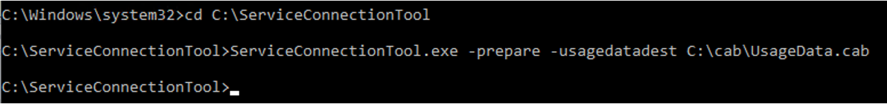
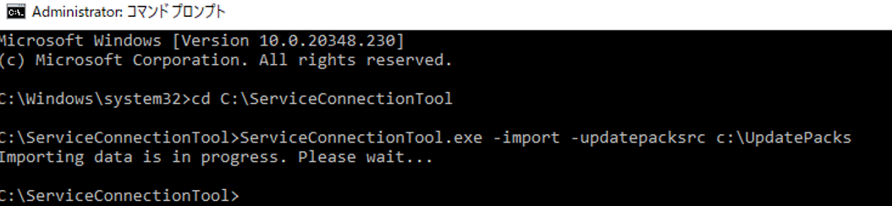

# Configuration Manager オフライン アップデートの流れと注意点

みなさま、こんにちは。  
本記事では Configuration Manager (ConfigMgr) のオフライン アップデートの流れと注意点をご案内します。  
サポート期限を迎える前に計画的に進めておくことで、予期せぬトラブルが発生しても製品サポートを引き続きご利用いただけます。  
本記事を参考に、ぜひ早めの準備をご検討ください。  
  
なお、オンライン アップデート手順やアップデートの前提条件などの一般的な情報につきましては下記ブログにてご紹介しておりますので併せてご参考いただけますと幸いでございます。  

[Configuration Manager オンライン アップデートの流れと注意点](https://jpmem.github.io/blog/mecm/20251022_01/)
  
また、オフライン アップデートを行う際の注意点につきましても下記ブログにてご紹介しておりますので、ご一読くださいませ。  
[Configuration Manager のアップグレードをオフラインで行う場合の注意点について](https://jpmem.github.io/blog/mecm/20250207_01/)

## オフライン アップデートの流れ

本手順にて使用するサービス接続ツールは、下記の公開情報をもとに作成しております。
サービス接続ツールの概要やツールを使用するための前提条件は下記公開情報をご参照ください。
[サービス接続ツールを使用してConfiguration Manager](https://learn.microsoft.com/ja-jp/intune/configmgr/core/servers/manage/use-the-service-connection-tool)

### ■プライマリ サイト サーバー上の操作 
1. [管理]-[サイトの構成]-[サーバーとサイト システムの役割]より、サービス接続ポイントをインストールしたサーバーを選択します。 

  

<br>
<br>

2. [サービス接続ポイント]を選択の上、[プロパティ] を選択します。 

  

<br><br>


3. [サービス接続ポイントのプロパティ] 画面で、[オフラインのオンデマンド接続] が選択されていることを確認します。
もし、[オンラインの永続的接続] になっている場合は、[オフラインのオンデマンド接続] を選択し、[OK] で適用します。この際に OS 再起動を実施します。 

  

<br><br>

4. サイトサーバー上で、以下のファイルをフォルダーごと、[C:\ServiceConnectionTool] にコピーします。 
<CM インストールディレクトリ>\cd.latest\SMSSETUP\TOOLS\ServiceConnectionTool 
（例）C:\Program Files\Microsoft Configuration Manager\cd.latest\SMSSETUP\TOOLS\ServiceConnectionTool

<br>

5. [C:\cab] フォルダーを作成します。  
<br>

6. コマンドプロンプトを管理者権限で起動のうえ、以下のコマンドを実行し、cabファイルを生成します。
```
    cd C:\ServiceConnectionTool 
    ServiceConnectionTool.exe -prepare -usagedatadest C:\cab\UsageData.cab 
```



### ■インターネットに接続可能な端末上の操作 
7. インターネットに接続可能な端末で、以下のレジストリを設定し、OS の再起動を実施します。 
本レジストリは、.NET Framework の通信時に TLS 1.2 を優先して使用するためのレジストリとなります。  
　※TLS 1.0 等の古いプロトコルを使用する必要のあるアプリケーションをお使いの場合は影響が出る可能性がございますので、影響のない端末にてご実施ください。


```
[HKEY_LOCAL_MACHINE\SOFTWARE\Microsoft\.NETFramework\v2.0.50727] 
      "SystemDefaultTlsVersions" = dword:00000001 
      "SchUseStrongCrypto" = dword:00000001 
```

```
[HKEY_LOCAL_MACHINE\SOFTWARE\Microsoft\.NETFramework\v4.0.30319] 
      "SystemDefaultTlsVersions" = dword:00000001 
      "SchUseStrongCrypto" = dword:00000001 
```

```
[HKEY_LOCAL_MACHINE\SOFTWARE\Wow6432Node\Microsoft\.NETFramework\v2.0.50727] 
      "SystemDefaultTlsVersions" = dword:00000001 
      "SchUseStrongCrypto" = dword:00000001 
```

```
[HKEY_LOCAL_MACHINE\SOFTWARE\WOW6432Node\Microsoft\.NETFramework\v4.0.30319] 
      "SystemDefaultTlsVersions" = dword:00000001 
      "SchUseStrongCrypto" = dword:00000001 
```

  

<br><br>

8. プライマリサイトサーバーの C:\ServiceConnectionTool、C:\cab をフォルダーごとコピーし、インターネットに接続可能な端末にコピーします。
その上で、C:\UpdatePacks フォルダーを新規作成します。 

  


<br><br>

9. インターネットに接続可能な端末にてコマンドプロンプトを管理者権限で起動し、以下のコマンドを実施します。 
```
   cd C:\ServiceConnectionTool 
   ServiceConnectionTool.exe –connect -downloadsiteversion -usagedatasrc C:\cab -updatepackdest C:\UpdatePacks 
```


<br><br>

10. ダウンロードが完了した後、インターネットに接続可能な端末上の C:\UpdatePacks を
    プライマリ サイト サーバーの、C:\UpdatePacks にフォルダーごとコピーします。 

<br>

### ■プライマリ サイト サーバー上の操作 
11. 以下のコマンドにて、インポートを実行します。 
```
    cd C:\ServiceConnectionTool 
    ServiceConnectionTool.exe -import -updatepacksrc c:\UpdatePacks
```


<br>

12. [更新とサービス] に更新プログラムが表示され、ダウンロード ボタンを押下後にインストールの準備完了となることを確認します。 

  

<br><br>

古い更新プログラムをダウンロードする場合は下記のようなポップアップが表示されますが [はい] をクリックしダウンロードを進めます。

  

  

<br><br>
しばらく時間をおき、インストールの準備完了となることを確認します。

  

<br><br>

13. これ以降のインストール手順についてはオンライン アップデートと同様の手順となりますため、下記ブログを参考に進めます。
[Configuration Manager オンライン アップデートの流れと注意点](https://jpmem.github.io/blog/mecm/20251022_01/)
