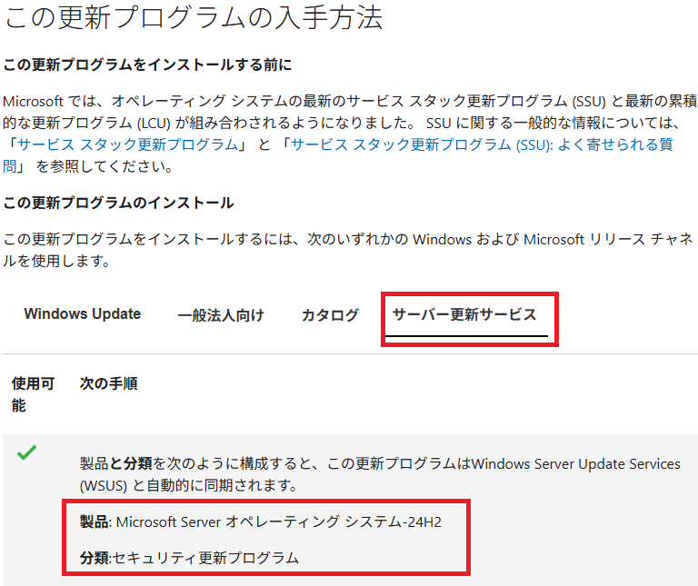
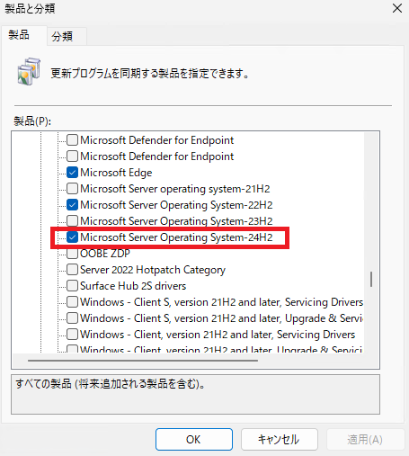

# 同期したい更新プログラムの製品と分類の探し方

みなさま、こんにちは。 Configuration Manager / WSUS サポート チーム です。  

本日は、時折皆様よりお問い合わせいただく、Configuration Manager (ConfigMgr) / WSUS で今まで同期していなかった製品の
累積更新プログラムについて、同期を開始したいときの製品ラベルの探し方についてご案内いたします。

## 「製品」と「分類」 ラベルの探し方 その1

1. 弊社は各累積更新プログラムの情報を公開しております。必要とする製品の履歴ページにアクセスします。(一覧にない製品の更新プログラムが欲しい場合はインターネット検索でお探しください)
   - [Windows 11バージョン 25H2 更新履歴](https://support.microsoft.com/ja-jp/topic/windows-11%E3%83%90%E3%83%BC%E3%82%B8%E3%83%A7%E3%83%B3-25h2-%E6%9B%B4%E6%96%B0%E5%B1%A5%E6%AD%B4-99c7f493-df2a-4832-bd2d-6706baa0dec0)
   - [Windows 11、バージョン 24H2 の更新履歴](https://support.microsoft.com/ja-jp/topic/windows-11-%E3%83%90%E3%83%BC%E3%82%B8%E3%83%A7%E3%83%B3-24h2-%E3%81%AE%E6%9B%B4%E6%96%B0%E5%B1%A5%E6%AD%B4-0929c747-1815-4543-8461-0160d16f15e5)
   - [Windows 11、バージョン 23H2 の更新履歴](https://support.microsoft.com/ja-jp/topic/windows-11-%E3%83%90%E3%83%BC%E3%82%B8%E3%83%A7%E3%83%B3-23h2-%E3%81%AE%E6%9B%B4%E6%96%B0%E5%B1%A5%E6%AD%B4-59875222-b990-4bd9-932f-91a5954de434)
   - [Windows Server 2025の更新プログラムの履歴](https://support.microsoft.com/ja-jp/topic/windows-server-2025-%E3%81%AE%E6%9B%B4%E6%96%B0%E3%83%97%E3%83%AD%E3%82%B0%E3%83%A9%E3%83%A0%E3%81%AE%E5%B1%A5%E6%AD%B4-10f58da7-e57b-4a9d-9c16-9f1dcd72d7d7)
   - [Windows Server 2022 更新履歴](https://support.microsoft.com/ja-jp/topic/windows-server-2022-%E6%9B%B4%E6%96%B0%E5%B1%A5%E6%AD%B4-e1caa597-00c5-4ab9-9f3e-8212fe80b2ee)
   - [Windows 10 および Windows Server 2019 の更新履歴](https://support.microsoft.com/ja-jp/topic/windows-10-%E3%81%8A%E3%82%88%E3%81%B3-windows-server-2019-%E3%81%AE%E6%9B%B4%E6%96%B0%E5%B1%A5%E6%AD%B4-725fc2e1-4443-6831-a5ca-51ff5cbcb059)

2. 各ページの左ペインに過去の更新プログラムの履歴情報がが記載されておりますので、適当なものをクリックします。例えば、2026 年 1 月 13 日リリースの Windows Server 2025 向け累積品質更新プログラムをクリックします。

3. 各更新プログラムの案内ページに「この更新プログラムの入手方法」の節があります。そちらのメニューより、「サーバー更新サービス」の項目をクリックすると、下記の通り、対象の更新プログラムの製品と分類が記載されています。  

   

4. WSUS や ConfigMgrで該当の[製品]と[分類]ラベルにチェックを入れれば、更新プログラムの同期が実施されます。

   - WSUS の場合: [WSUSコンソール] - 左ペイン [オプション] - [製品と分類]  
      

   - ConfigMgr の場合: [ConfigMgrコンソール] - [管理] - [概要] - [サイトの構成] - [サイト] - [サイト コンポーネントの構成] - [ソフトウェアの更新ポイント] - [製品] タブ  
      

## 「製品」と「分類」 ラベルの探し方 その2

具体的に適用したい更新プログラムの名前や KB 番号がわかっている場合、Microsoft Update カタログの検索で、「製品」ラベルを探すこともできます。

   - [Microsoft Update カタログ](https://www.catalog.update.microsoft.com/Home.aspx)

1. Microsoft Update カタログにアクセスします。
2. 更新プログラム名や KB 番号で検索します。例えば、以下は KB5073379 で検索した結果です。
   
3. 確認した「製品」と「分類」で 先にご案内した 通り WSUS コンソールやConfigMgr コンソールで同期を実施ください。

## 同期されない更新プログラム

上記手順で製品や分類を設定しても同期できない更新プログラムは、インポートする必要がございます。下記ブログ記事をご参照いただければと存じます。

- [通常では同期されない Windows OS 更新プログラムの同期方法](https://jpmem.github.io/blog/mecm/20250707_01/)
