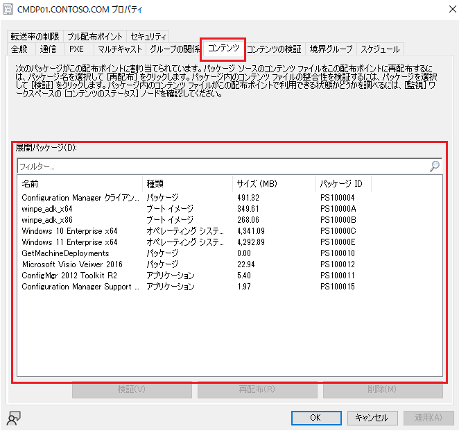

# 肥大化したコンテンツ ライブラリ (SCCMContentLib) フォルダー内の不要なコンテンツを削除する

みなさま、こんにちは。Configuration Manager サポート チームです。  
Configuration Manager を長期間運用していると、クライアントに配布するアプリケーションや更新プログラムなどのコンテンツの格納先である[コンテンツ ライブラリ (SCCMContentLib)](https://learn.microsoft.com/ja-jp/intune/configmgr/core/plan-design/hierarchy/the-content-library) フォルダーが肥大化します。  
このフォルダーが肥大化することで、空きディスク容量が少なくなり、不要なコンテンツの削除を検討されているお客様も多いかと思います。  

この記事では、そのような場合に、SCCMContentLib フォルダー内の不要なコンテンツを削除する方法をご案内します。  
なお、エクスプローラーで SCCMContentLib フォルダーを開いて、ファイルを手動で削除する方法はサポートされておりません。そのような手動削除をすると、予期しない問題が発生する可能性がありますので、ご注意ください。  

削除の基本的な流れとしては　**「展開されているコンテンツの確認」** **「不要なコンテンツの削除」** の順となりますので、こちらの順でご案内します。  

# 1. 展開されているコンテンツの確認
展開されているコンテンツの確認手順には、以下の方法があります。

A. Configuration Manager コンソールからの確認  
B. レポートによる確認  
C. ツール（Content Library Explorer）による確認  

これらの方法を使って、削除されたい不要なコンテンツを特定してください。

## A. Configuration Manager コンソールからの確認
Configuration Manager コンソールから確認いただく場合には、配布ポイントのプロパティより展開されているコンテンツを確認します。  
確認方法につきましては、以下のとおりです。  

1. Configuration Manager コンソールより、[管理] > [概要] > [配布ポイント] へ移動します。  
2. [配布ポイント] の [ナビゲーション ペイン] より、確認対象の配布ポイントを右クリックし、[プロパティ] をクリックします。  
3. [配布ポイント プロパティ] より、[コンテンツ] タブをクリックします。  
4. [コンテンツ] タブより、対象配布ポイントに展開しているコンテンツの一覧を確認します。  

## B. レポートによる確認
特定の配布ポイントに展開されているコンテンツの一覧および状態をご確認いただけます。  
CSV 形式や Excel 形式などでエクスポート可能となりますので、展開しているコンテンツの比較を行う場合は、レポート利用が宜しいかと存じます。  

1. Configuration Manager コンソールより、[監視] > [概要] > [レポート] > [レポート] > [ソフトウェアの配布 - コンテンツ] へ移動します。  
2. [ソフトウェアの配布 - コンテンツ] のナビゲーション ペインより、[特定の配布ポイントのすべてのコンテンツ] のレポートを選択して、[リボン（上段のメニュー バー）] より、[実行] をクリックします。  
3. [特定の配布ポイントのすべてのコンテンツ] レポートより、確認した配布ポイントを検索条件に入力し、[レポートの表示] をクリックします。  

## C. ツール（Content Library Explorer）による確認
ツール（Content Library Explorer）を利用して、配布ポイントへ展開されているコンテンツを確認します。
ツールの使い方につきましては [こちらのブログ記事](https://jpmem.github.io/blog/mecm/20241004_01/) でも紹介しておりますので、ご参照ください。
 

# 2. 不要なコンテンツの削除
上記の手順にて、以前配布したコンテンツで、現在利用していないパッケージを特定します。  
そのうえで、不要となるコンテンツを以下の方法で削除して空き容量を確保します。　　
 
A. Configuration Manager コンソールからの削除  
B. ツール（Content library cleanup tool）による削除  

## A. Configuration Manager コンソールからの削除
Configuration Manager コンソールからの削除方法は以下の通りです。

1. Configuration Manager コンソールより、[管理] > [概要] > [配布ポイント] へ移動します。
2. [配布ポイント] の [ナビゲーション ペイン] より、確認対象の配布ポイントを右クリックし、[プロパティ] をクリックします。
3. [配布ポイント プロパティ] より、[コンテンツ] タブをクリックします。
4. [コンテンツ] タブより、不要なコンテンツを選択して、[削除] をクリックします。※ 複数選択可能です。

場合によってはコンソール上には表示されず、Content Library Explorer でしか確認ができない孤立コンテンツ（配布ポイント上のオブジェクトにて関連付けがなくなったコンテンツ）が存在します。  
コンソール上から削除が行えない場合は、次のツール（Content library cleanup tool）を利用して削除を行います。

なお、孤立コンテンツにつきましては、Content Library Explorer 上で対象コンテンツには ID の右側に「*」が付与されます。

表示例）PS100005*

## B. ツール（Content library cleanup tool）による削除
コンソールからの削除が行えない孤立コンテンツがある場合は、こちらの Content library cleanup tool を活用して、コンテンツの削除を行います。  
ツールの使い方につきましては以下の公開情報でも紹介しておりますので、ご参照ください。
 
[コンテンツ ライブラリのクリーンアップ ツール](https://learn.microsoft.com/ja-jp/intune/configmgr/core/plan-design/hierarchy/content-library-cleanup-tool)

プライマリ サイト サーバーでのツールの実行手順の例は以下の通りです。

1. `<プライマリ サイト インストール フォルダー>\CD.Latest\SMSSETUP\TOOLS\ContentLibraryCleanup` に、`ContentLibraryCleanup.exe` が存在することを確認します。
2. コマンド プロンプトを管理者として実行します。
3. 下記コマンドを順に実行します。  
※ <プライマリ サイト インストール フォルダー> が既定の場所の場合  
`cd C:\Program Files\Microsoft Configuration Manager\CD.Latest\SMSSETUP\TOOLS\ContentLibraryCleanup`  
4. ContentLibraryCleanup.exe を実行します。なお、対象がプライマリ サイトかそれ以外かでコマンドが異なりますのでそれぞれご確認下さい。  
コマンド実行の途中で入力を求められますので、「y」を入力して先に進んでください。  
なお、対象がセカンダリ サイトまたはリモート サイトであっても、コマンド実行はプライマリ サイトから実行可能です。  
4-1. 削除対象配布ポイントがプライマリ サイトの場合、下記を実行します。  
`ContentLibraryCleanup.exe /dp <プライマリ サイト FQDN>`  
例  
`ContentLibraryCleanup.exe /dp cm.contoso.com`  
4-2. 削除対象配布ポイントがセカンダリ サイトまたはリモート サイトの場合、下記を実行します。  
`ContentLibraryCleanup.exe /dp <セカンダリ サイトまたはリモート サイトの FQDN> /ps <プライマリ サイト FQDN> /sc <サイト コード>`  
例  
`ContentLibraryCleanup.exe /dp WIN-SRVR2016-01.contoso.com /ps cm.contoso.com /sc P01`
5. 上記実行後、WhatIf_cm_***.log が出力されます。「Orphaned contents:」以下に出力されるファイルが今回削除対象となります。ログの出力先は、実行結果の「Output has been logged to」直後のパスで確認可能です。
6. 上記削除対象確認後、下記コマンドを実行します。  
実行途中で入力を求められます。初めの入力は「y」で次に進みます。  
次からは削除対象となるパッケージそれぞれで削除するかどうかの入力を求められます。すべて一括で削除されたい場合には「a」を入力して下さい。  
なお、パッケージ ID を 手順 5 の WhatIf_cm_***.log で検索することで、削除対象のパスを確認可能です。
出力例：下記の場合 7babb759-0c79-41ae-9e2e-ed636984e67f がパッケージ ID です。  
`>Delete 7babb759-0c79-41ae-9e2e-ed636984e67f: 'y' = yes / 'n' = no / 'a' = yes to all / 's' = skip all :: y`  
6-1. 削除対象配布ポイントがプライマリ サイトの場合、下記を実行します。  
`ContentLibraryCleanup.exe /dp <プライマリ サイト FQDN> /delete`  
例：  
`ContentLibraryCleanup.exe /dp cm.contoso.com /delete`  
6-2. 削除対象配布ポイントがセカンダリ サイトまたはリモート サイトの場合、下記を実行します。  
`ContentLibraryCleanup.exe /dp <セカンダリ サイトまたはリモート サイトの FQDN> /ps <プライマリ サイト FQDN> /sc <サイト コード>  /delete`  
例：  
`ContentLibraryCleanup.exe /dp WIN-SRVR2016-01.contoso.com /ps cm.contoso.com /sc P01  /delete`

# 参考情報: NO_SMS_ON_DRIVE.SMS について
配布ポイントの構成は、利用できるドライブを確認すると自動で配布ポイントのコンテンツ ライブラリを作成する動作となります。  
そのため、配布ポイントのコンテンツ ライブラリを作成したくないドライブがある場合は（特に、システム領域となる Cドライブなど）、配布ポイントの役割と追加・構成いただく前に、ドライブのルートに NO_SMS_ON_DRIVE.SMS の空のファイルを配置します。  
こちらのファイルを検知すると、コンテンツ ライブラリを作成するドライブとして除外する動作となりますので、意図せずに別のディスク ドライブにコンテンツが配布されてディスクの使用量が増加することを防ぐことが可能となります。  

こちらのファイルにつきましては、以下にご案内するコマンドを管理者として実行した [コマンドプロンプト] にて実行いただくことで、簡単に作成できます。今後ディスクの増設等をご検討される際のご参考としていただけますと幸いです。  

- 実行コマンド  
`Type nul > <ドライブ レター>:\NO_SMS_ON_DRIVE.SMS`  
 
- 実行コマンド例(C ドライブに配置する場合)  
`Type nul > C:\NO_SMS_ON_DRIVE.SMS`  

