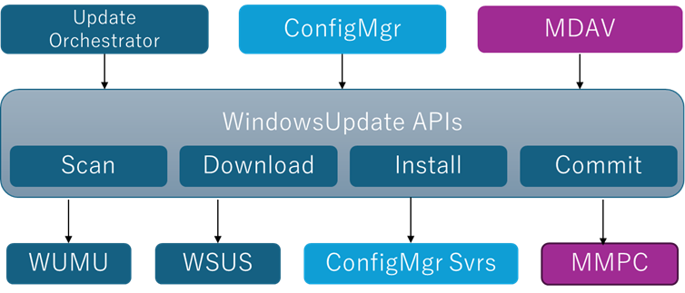
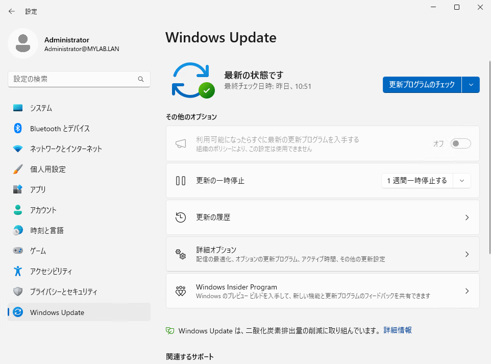
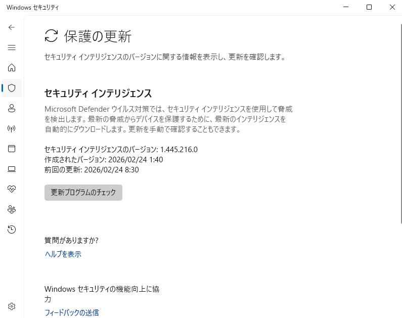
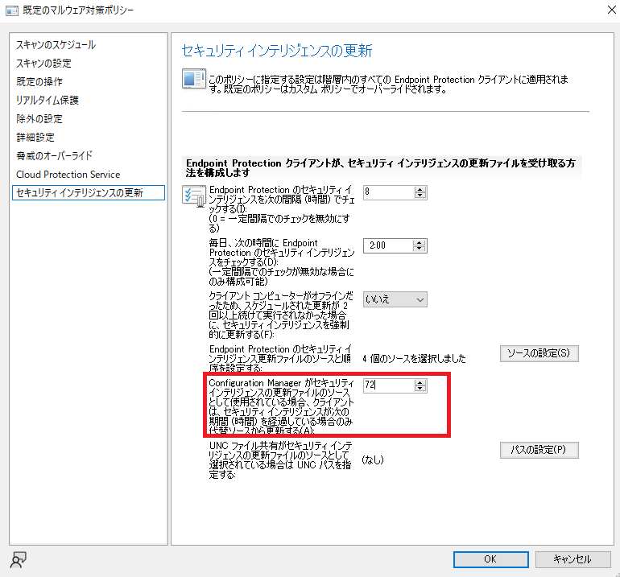
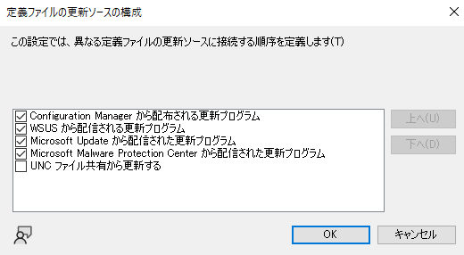
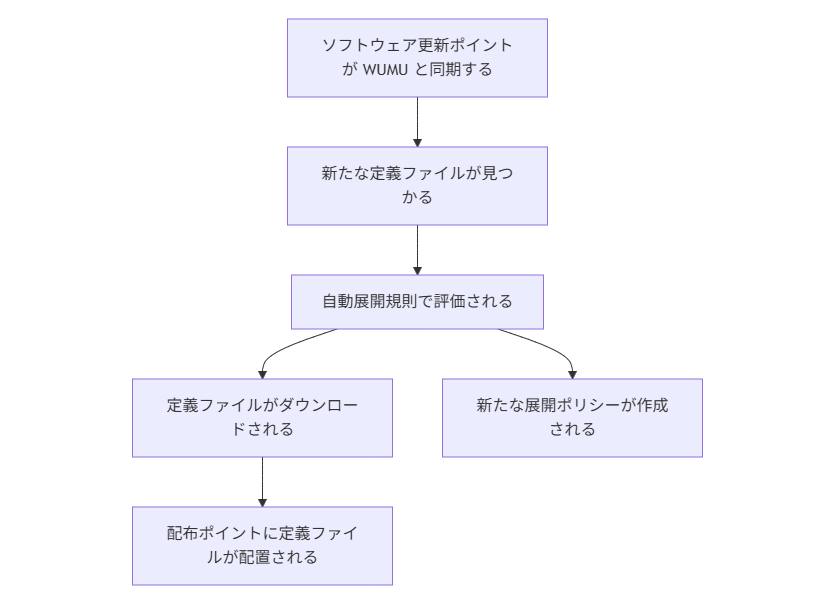
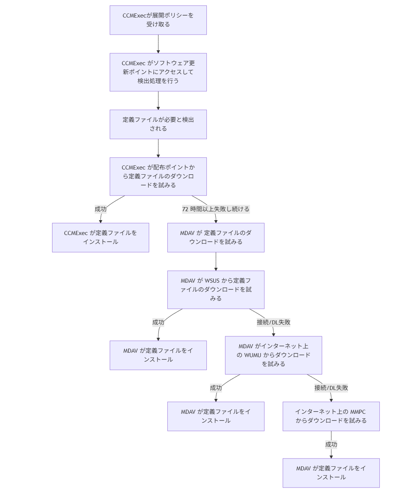

# ConfigMgr 環境における MDAV 定義ファイルの更新形式

皆さま、こんにちは。 Configuration Manager サポート チームです。

Configuration Manager (ConfigMgr) 環境における、MDAV 定義ファイルの更新方式は、更新する主体が、ConfigMgr 以外にも存在するため、挙動が複雑になりがちです。本稿では、その挙動を解説します。皆様のご理解の助けになれば幸いです。

## MDAV 定義ファイルの更新を行う主体

まず、前提として、更新プログラムの更新を行う直接の主体は、Windows Update Agent (WUA) となります。WUA の API は外部に公開されており、様々なプログラムから呼び出すことが可能です。Windows Update による更新を必要とするプログラムは、WUA API を呼び出すことで更新を実現しています。

- [Windows Update エージェント API](https://learn.microsoft.com/ja-jp/windows/win32/wua_sdk/portal-client)

MDAV 定義ファイルを更新する主体は、一般的には、以下の 3 つとなります。(例外として、WUA APIを使ったスクリプトやサードベンダー製のプログラムもあります)

- Update Orchestrator 
- Microsoft Defender
- ConfigMgr (CCMExec)

全体的な概要図は以下となります。  



### Update Orchestrator

Windows 標準の更新プログラムを適用管理するプログラムです。以下の画面で更新した場合、Update Orchestrator 経由で更新が行われます。

- [Windowsの設定] - [Windows Update]

  

また、本プログラムが定義ファイルのダウンロード元として利用するのは、弊社 Microsoft Update サービスもしくは、下記で設定されている WSUS サーバーとなります。**ConfigMgr 管理下であっても、Update Orchestrator が配布ポイントをダウンロード元として選択することはありません。**

- [コンピューターの構成] - [管理用テンプレート] - [Windows コンポーネント] - [Windows Update] - [イントラネットの Microsoft 更新サービスの場所を指定する]

定義ファイルの更新スケジュールなどは、以下の配下のグループ ポリシーで制御されます。
- [コンピューターの構成] - [管理用テンプレート] - [Windows コンポーネント] - [Windows Update]


### Microsoft Defender

Microsoft Defender 自体が定義ファイルを運用管理しています。以下の画面で更新した場合、Microsoft Defender 経由で更新しているとご認識ください。

- [Windowsの設定] - [プライバシーとセキュリティ] - [Windows セキュリティ] - [ウィルスと脅威の防止] - [ウィルスと脅威の防止の更新] - [保護の更新]

  

また、本プログラムは、以下で設定している順序で定義ファイルのダウンロードを試みます。

- [コンピューターの構成] - [管理用テンプレート] - [Windows コンポーネント] - [Microsoft Defender ウィルス対策] - [セキュリティ インテリジェンスの更新] - [セキュリティ インテリジェンスの更新をダウンロードするための更新元の順序を定義する]

一方、ConfigMgr 管理下の場合は、上記内容と類似の設定を以下の「マルウェア対策ポリシー」で配ります。**ConfigMgr 管理下であっても、Microsoft Defender が配布ポイントをダウンロード元として選択することはありません。**

- [ConfigMgr コンソール] - [資産とコンプライアンス] - [概要] - [Endpoint Protection] - [マルウェア対策ポリシー] - [セキュリティ インテリジェンスの更新] - [Endpoint Protection のセキュリティ インテリジェンスの更新ファイルのソースと順序を設定する]

  

定義ファイルの更新スケジュールなど種々の設定は、以下のどちらかで制御することになります。
- [コンピューターの構成] - [管理用テンプレート] - [Windows コンポーネント] - [Microsoft Defender ウィルス対策] 
- [ConfigMgr コンソール] - [資産とコンプライアンス] - [概要] - [Endpoint Protection] - [マルウェア対策ポリシー] 

### ConfigMgr (CCMExec)

ConfigMgr クライアント (CCMExec) は 利用可能展開で MDAV 定義ファイルを配布した場合、ソフトウェア センターの画面で MDAV 定義ファイルを受け取ります。

  

ここで、MDAV ファイルの検出やダウンロードなどは、他の OS 更新プログラムの展開と同様になります。すなわち、以下の通りです。

 - 定義ファイルの検出先: クライアントが所属する境界グループに紐づくソフトウェア更新ポイント
 - 定義ファイルのダウンロード元: クライアントが所属する境界グループに紐づく配布ポイント
 - 定義ファイル適用のスケジュール: 更新プログラムの展開ポリシー


## ConfigMgr 環境における MDAV 定義ファイルの更新

上記でご案内した内容が前提知識となります。さて、ConfigMgr 環境において、 MDAV 定義ファイルはどのように更新されるのでしょうか。重要なポイントは、Update Orchestrator, Microsoft Defender, ConfigMgr クライアントそれぞれが、それぞれ独立して MDAV 定義ファイルを更新しようとする点です。それぞれに定義ファイルの更新スケジュールを設定してやると、それぞれに定義ファイルの取得を行おうとします。
ただ、ConfigMgr のデフォルトの設定では、それが起こらないようにしています。

### ConfigMgr による定義ファイル取得の優先

ConfigMgr のマルウェア対策ポリシーでは、通常のグループポリシーには該当するものが無い、独自設定として、[Configuration Manager がセキュリティ インテリジェンスの更新ファイルのソースとして使用されている場合、クライアントはセキュリティ インテリジェンスが次の期間(時間)を経過している場合のみ代替ソースから更新する] という設定があります。



この期間は、Microsoft Defender が定義ファイルの最終更新時刻を参照して動作します。
上記で設定した猶予期間が経過していない場合、Microsoft Defender 自身による定義ファイルの更新は行われません。
この時間が経過したときのみ、Microsoft Defender は独自で、[Endpoint Protection のセキュリティ インテリジェンス更新ファイルのソースと順序を設定する]で設定されている順序で定義ファイルのダウンロードを試みるようになります。既定の設定では、ConfigMgr -> WSUS -> WUMU -> MMPC となります。

(なお、下記画面で「Configuration Manager から配布される更新プログラム)にチェックが入っていない場合は上記猶予期間の設定も不活性化します)



### ConfigMgr 環境下での定義ファイル更新の流れ 

自動展開規則を含めて、ConfigMgr 環境下での定義ファイル更新の一般的な流れを図に示すと、以下のようになります。ConfigMgr として WUMU やピアキャッシュ、Branch Cache からダウンロードする場合もありますが、単純化のため除外しています。

#### 自動展開規則により 配布ポイントに配置されるまで



#### クライアント側での インストール




### MDAV のフォールバックについての注意点

- WUMU / MMPC は インターネットからのダウンロードになります。
- ConfigMgr / WUMU からのダウンロードの際、差分ファイル ダウンロード が行われますが、 MMPC からのダウンロードはフル ダウンロードになるのでダウンロード容量が増加します。
- WSUS からのダウンロードは、実際はソフトウェア更新ポイントの部品として動作している WSUS からのダウンロードになりますので、別途承認処理が必要です。（※ ConfigMgr 管理下では、WSUS は単体での承認運用ではなく、ConfigMgr により制御されます）ConfigMgr のソフトウェア更新ポイントとして利用している WSUS において、MDAV の定義ファイルは承認がサポートされています。
    - https://learn.microsoft.com/ja-jp/intune/configmgr/protect/deploy-use/endpoint-definitions-wsus


## 更新した主体が誰かを確認する

定義ファイルを更新した主体が誰かについては、以下のログから確認可能です。
```
%Windir%\SoftwareDistribution\ReportingEvents.log
```

ログの例は以下です。第 5 項目の [AGENT_INSTALLING_SUCCEEDED] でインストールが成功したことがわかり、第 10 項目の CCMExec で ConfigMgr クライアントにより定義ファイルのインストールが完了したことがわかります。

```
{580AAE62-AFD5-4441-838B-8DCA9B6484DF}	2026-02-26 14:29:02:119+0900	1	181 [AGENT_INSTALLING_STARTED]	101	{FF397EE8-82EA-4BC2-96EE-DF228450112B}	200	0	CcmExec	Success	Content Install	Installation Started: Windows has started installing the following update: Microsoft Defender Antivirus のセキュリティ インテリジェンス更新プログラム - KB2267602 (バージョン 1.445.243.0) - 現在のチャネル (広範)	LA7GZfSNlUGMsN9L.6.0.0.1.0
{0B69425F-D39F-4472-BDBB-6FCD094ADCC0}	2026-02-26 14:29:22:344+0900	1	183 [AGENT_INSTALLING_SUCCEEDED]	101	{FF397EE8-82EA-4BC2-96EE-DF228450112B}	200	0	CcmExec	Success	Content Install	Installation Successful: Windows successfully installed the following update: Microsoft Defender Antivirus のセキュリティ インテリジェンス更新プログラム - KB2267602 (バージョン 1.445.243.0) - 現在のチャネル (広範)	LA7GZfSNlUGMsN9L.6.0.0.3.0
```