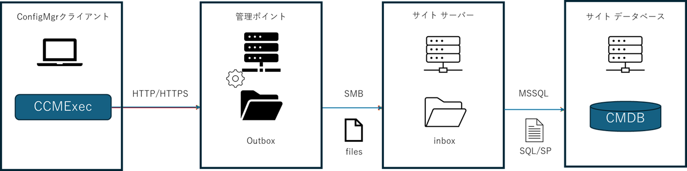

# ConfigMgr におけるクライアントからの情報収集の仕組み

皆さま、こんにちは。 Configuration Manager サポート チームです。 本日は、 Configuration Manager (ConfigMgr) におけるクライアントからの情報収集について、仕組みを解説します。多数のクライアントから情報収集を行うため、パフォーマンスへの影響も大きい部分となりますので、設定および運用設計の参考にしていただければと存じます。

## 概要

ConfigMgr の情報収集の全体的な流れは以下の通りです。ConfigMgr は定期的もしくは必要に応じて、管理ポイントに対して情報を HTTP / HTTPS 通信でアップロードします。管理ポイントはその内容を 自身の Outbox フォルダに格納し、ファイル共有の仕組みを介して、定期的にサイト サーバーの Inbox フォルダに移動します。サイト サーバーは Inbox フォルダのファイルの存在を検知すると、その内容を解釈し、 SQL 命令に変換して サイト データベース内の SQL Server に書き込みます。

管理ポイント、サイト サーバーには、 1 クライアントにつき、情報の種類ごと、情報収集のタイミングごとに 1 つのファイルが生成されます。



なお、inbox, outbox はサーバー間の通知処理でも使われます。

## フォルダの場所

サイト サーバーの inbox フォルダは ConfigMgr のインストール フォルダ 配下です。
- [ConfigMgr インストール フォルダ]\inboxes

管理ポイントの outbox フォルダは、以下の通りです。
- サイト サーバーと同居している場合:
  - [ConfigMgr インストール フォルダ]\MP\outboxes
- サイト サーバーと別居している(リモート管理ポイント)場合:
  - [ドライブルート]\SMS\MP\OUTBOXES

## 情報収集の代表例

上記仕組みを用いる代表例は以下の通りです。この他にもございます。

- クライアント登録
- クライアント通知
- 探索情報
- インベントリ 
   - ハードウェア
   - ソフトウェア
- ステータス メッセージ
- 状態メッセージ

## モニタリングの方法

ある時点での inbox, outbox に格納されているファイル個数を見ることで、処理に滞留が発生していないかを判断できます。

### ログからの確認

- Inbox
   - [ConfigMgrインストールフォルダ]\Logs\inboxmon.log 
     - 15 分に 1 回、inbox 内に存在するファイル個数が出力される
- Outbox
   - サイト サーバーと同居している場合:
     - [ConfigMgr インストール フォルダ]\Logs\outboxmon.log
   - サイト サーバーと別居している(リモート管理ポイント)場合:
     - [ドライブルート]\SMS\logs\outboxmon.log
   - - 15 分に 1 回、outbox 内に存在するファイル個数が出力される

## パフォーマンスに与える影響

```
　弊社サポートではサイジング、チューニングに関するお問い合わせに関しましては 公開情報のご案内までとなります。お客様固有のワークロード、ユースケース、環境固有の条件等、種々の状況に合わせたお問い合わせに関してはご対応いたしませんので予めご容赦くださいますようお願いいたします。
```

クライアントから収集する情報のサイズはそれほど大きくはありませんが、ConfigMgr は非常に多くのクライアントから情報収集を行うので、その処理負荷は非常に大きなものとなります。

### 負荷を増大する要素

負荷を増大する要素は以下となります。

- データ収集サイズ
- データ収集するクライアント台数
- データ収集間隔

#### データ収集サイズ

インベントリ系の情報収集の場合、設定によって収集する情報量が異なります。多くのシナリオで、アプリケーション情報やストアアプリ情報は情報量を大幅に情報量を増加させる傾向があります。

また、インベントリや状態メッセージは通常時は前回との差分転送が行われますが、ネットワーク遅延などで転送に失敗すると、次回の転送はフル転送となります。

#### データ収集するクライアント台数

管理台数が多ければ多いほど、当然、収集されるデータ量も多くなります。

#### データ収集間隔

データ収集間隔が短くなれば短くなるほど、負荷が増加します。
データ収集間隔の設定方法及び、デフォルト間隔は以下の通りです。

| # | 項目 | デフォルト間隔 | 設定箇所 |
|--:|:--|:--|:--|
| 1 | 探索情報 | 週 1 回 | [管理] - [階層の構成] - [探索方法] - [定期探索] - [プロパティ]| 
| 2 | ハードウェア インベントリ | 7 日に 1 回 | [管理] - [クライアント設定] - クライアント設定を選択 - [プロパティ] - [ハードウェア インベントリ] - [ハードウェア インベントリのスケジュール]|
| 3 | ソフトウェア インベントリ | 7 日に 1 回 | [管理] - [クライアント設定] - クライアント設定を選択 - [プロパティ] - [ソフトウェア インベントリ] - [[ソフトウェア インベントリおよびファイル収集をスケジュールする] |
| 4 | 状態メッセージ | 15 分に 1 回 |  [管理] - [クライアント設定] - クライアント設定を選択 - [プロパティ] - [状態メッセージ] - [状態メッセージのレポート サイクル (分) ]

### データ処理速度に影響を与える要素

データ処理速度に影響を与える主な要素は以下となります。

- サイト サーバー のストレージ性能
- サイト サーバー / 管理ポイント間の通信遅延

## サイト サーバーのストレージ性能

以下のガイダンスに、クライアントの管理台数ごとに inbox や SQL サーバーに凡そ必要とされる IOPS 値が記載されています。
2026/3/17 時点で確認できる値を用いると、例えば、1 台のサーバーにプライマリ サイト サーバー とサイト データベースを同居させる環境の場合で、25,000 台以下の端末を管理させる場合、inbox を配置する論理ドライブでは 600, データベース ファイルを配置する論理ドライブでは 1,700 の IOPS が必要とされます。

https://learn.microsoft.com/ja-jp/intune/configmgr/core/plan-design/configs/site-size-performance-guidelines#general-sizing-guidelines

この時、例えばハードウェア インベントリの収集間隔をデフォルトの 7 日に 1 回から、2 日に 1回とした場合、
下記でもご案内の通り、 約 3 倍強の管理台数、すなわち 75,000 台以上の端末を管理できる IOPS を目安に用意する必要があります。ガイダンスでは近い値として 100,000 台の端末を管理するときの IOPS がありますので、 inbox を配置する論理ドライブでは 1,200, データベース ファイルを配置する論理ドライブでは 5,000 の IOPS を目安とします。

https://learn.microsoft.com/ja-jp/intune/configmgr/core/plan-design/configs/site-size-performance-guidelines#feature-intervals-settings

### サイト サーバー / 管理ポイント間の通信遅延

管理ポイントの outbox から サイト サーバーの inbox へのファイル転送は SMB が使われますが、通信遅延が大きい環境の場合、ファイル一つ一つが小さい分、ファイルを転送する通信よりもプロトコルのための通信の方が、通信時間の大部分を示すようになります。サイト サーバーと管理ポイントをネットワーク的に離れた場所に置くと、outbox にファイルが滞留する、といった事象が発生しやすくなります。ネットワーク距離が遠い場所にはリモート 管理ポイントではなく、サイト サーバーを置くことを検討ください。サイト サーバー間通信では、ファイル レプリケーション ではなく、データベース レプリケーションでデータのやり取りが行われるため、通信遅延による影響を軽減できます。


