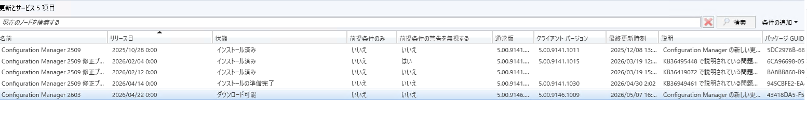

# Configuration Manager Current Branch 2603 がリリースされました。(Early Ring)

皆さま、こんにちは。
Configuration Manager サポート チームです。長らくお待たせしましたが、Configuration Manager Current Branch 2603 がリリースされました。

現在のブランチのバージョン 2603 の新機能Configuration Manager
https://learn.microsoft.com/ja-jp/intune/configmgr/core/plan-design/changes/whats-new-in-version-2603

現在のブランチ、バージョン 2603 Configuration Manager変更の概要
https://learn.microsoft.com/ja-jp/intune/configmgr/hotfix/2603/37426535

更新プログラム 2603 for Configuration Managerをインストールするためのチェックリスト
https://learn.microsoft.com/ja-jp/intune/configmgr/core/servers/manage/checklist-for-installing-update-2603

チェックリストにもある通り、5/7 現在では、Early Ring リリースとなっておりますので、事前にオプト インの実行が必要です。
下記でご案内しているスクリプトを実行して、お試しいただければと存じます。

https://learn.microsoft.com/ja-jp/intune/configmgr/core/servers/manage/checklist-for-installing-update-2603#early-update-ring

実行後、以下のように 2603 がリスト表示されるかと存じます。

 

Slow Ring リリースにつきましては、恐れながら現時点では日程が不明ですので、お待ちいただければと存じます。

