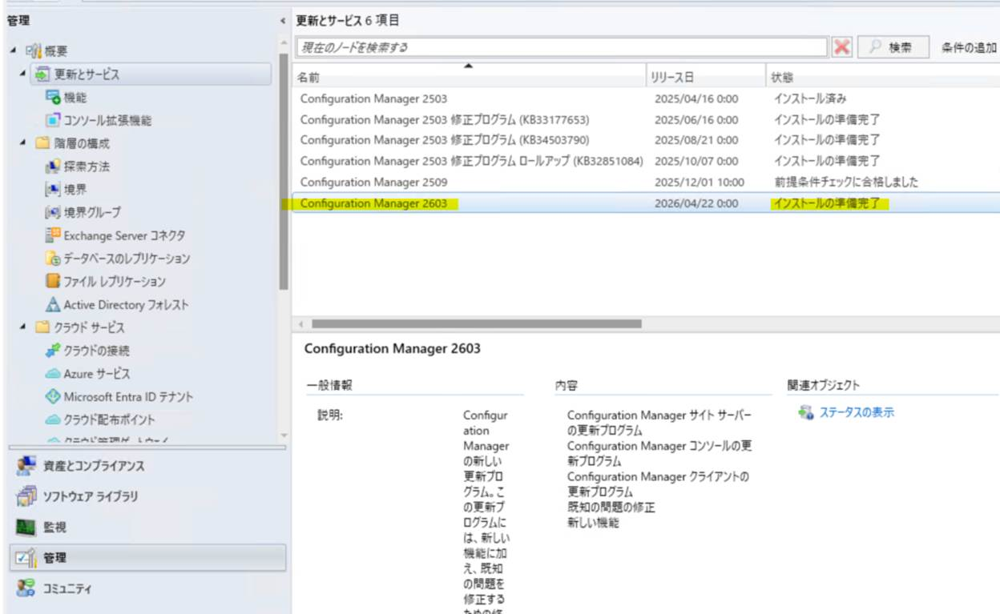

# オフライン環境の ConfigMgr でバージョン 2603 の更新プログラムをインポートする手順

こんにちは。Configuration Manager サポート チームです。  
本記事では、オフライン環境でバージョン 2603 の Early update ring へオプトインする手順と、サービス接続ツールを用いた更新プログラムのインポート手順をご紹介します。  
オンライン環境の手順ではオプトインのみを実施頂ければ バージョン 2603 の更新プログラムはコンソール上に表示されますが、オフライン環境の場合はサービス接続ツールを用いた追加の手順が必要です。  

## 早期更新リングのオプトイン  
バージョン 2603 は早期更新リングでリリースされています。この更新プログラムをインストールするには、オプトインする必要があります。  

- 参考情報  
  Title: Configuration Manager Current Branch 2603 がリリースされました。(Early update ring)  
  URL: https://jpmem.github.io/blog/mecm/20260507_01/  

### 手順  

1. インターネットへ接続可能な端末で、下記公開情報の「バージョン 2603 オプトイン スクリプト」をクリックし、EnableEarlyUpdateRing2603.exe をダウンロードします  

   Title: 早期更新リング  
   URL: https://learn.microsoft.com/ja-jp/intune/configmgr/core/servers/manage/checklist-for-installing-update-2603#early-update-ring

2. EnableEarlyUpdateRing2603.exe を実行すると [Choose Directory For Extracted Files] 画面が開くため、ダウンロード先パスを指定し [OK] をクリックします  
3. [Extraction Complete] 画面で [OK] をクリックします  
4. 「2.」で指定したダウンロード先パスに enableearlyupdatering2603.ps1 がダウンロードされたことを確認します  
5. ConfigMgr 最上位サイト (中央管理サイトが無ければプライマリ サイト) サーバーにログオンします  
6. ダウンロードした enableearlyupdatering2603.ps1 を任意の場所に配置します  
7. 管理者権限で PowerShell を開きます  
8. enableearlyupdatering2603.ps1 の配置パスへ移動します (cd <配置パス>)  
9. ps1 を下記コマンドで実行し、「The command(s) completed successfully」が表示されたら、オプトイン成功です  

   ```  
   .\EnableEarlyUpdateRing2603.ps1 <SiteServer_Name>  
   ```  
   ※ <SiteServer_Name> は貴社最上位サイトのホスト名に置き換えてください  

## サービス接続ツールを用いた更新プログラムのインポート  
オフライン アップデート手順やアップデートの前提条件などの一般的な情報につきましては下記ブログにてご紹介しておりますので併せてご参考いただけますと幸いでございます。  
[Configuration Manager オフライン アップデートの流れと注意点](https://jpmem.github.io/blog/mecm/20251030_01/)  

### A. cab ファイルの準備  

1. ConfigMgr 最上位サイト (中央管理サイトが無ければプライマリ サイト) サーバーにログオンします  
2. 管理者権限で PowerShell を開きます  
3. ServiceConnectionTool フォルダへ移動します  

   ```  
   cd <ConfigMgr インストール フォルダ>\cd.latest\SMSSETUP\TOOLS\ServiceConnectionTool  
   ```  

4. 下記コマンドを実行し、UsageData.cab を生成します  
   ```  
   .\serviceconnectiontool.exe -prepare -usagedatadest <保存先パス>\UsageData.cab  
   ```  
   ※ <保存先パス> は cab ファイルの保存先を任意で設定ください (例.C:\usagedata\UsageData.cab)  

### B. 更新データのダウンロード  

1. インターネットへ接続可能な端末にログオンします  
2. <ConfigMgr インストール フォルダ>\cd.latest\SMSSETUP\TOOLS\ServiceConnectionTool フォルダごと、サイトサーバーからインターネットへ接続可能な端末へコピーし配置します  
3. 「A. cab ファイルの準備」で生成された cab ファイルを、サイトサーバーからインターネットへ接続可能な端末へコピーし配置します  
4. 管理者権限で PowerShell を開きます  
5. ServiceConnectionTool フォルダへ移動します  
   ```  
   cd <「2.」で配置したパス>\ServiceConnectionTool  
   ```  

6. 下記コマンドを実行し、更新データをダウンロードします  
   ```  
   .\serviceconnectiontool.exe -connect -downloadsiteversion -usagedatasrc <cab ファイルの保存先パス> -updatepackdest <更新データのダウンロード先パス>  
   ```  
   ※ 「A. cab ファイルの準備」で生成された cab ファイルを `-usagedatasrc` のソース ファイルとして設定ください。(例.C:\usagedatasrc)   
    ※ `‐usagedatasrc` ではフォルダーのパスまでを指定します。ファイル名までパスに含めるとエラーとなります。  
   ※ 更新データの保存先パスを `-updatepackdest` のダウンロード パスとして指定します (例.C:\usagedatadest)   
   ※ `‐downloadsiteversion` は、サイトのバージョン以降のバージョンの更新プログラムと修正プログラムがダウンロードされます。このオプションを使用しない場合、過去バージョンのモジュールもダウンロードされ、30 GB 以上のサイズとなってしまいますので、必ず付与下さい。  

### C. ダウンロードしたデータをインポート  

1. ConfigMgr 最上位サイト (中央管理サイトが無ければプライマリ サイト) サーバーにログオンします  
2. 管理者権限で PowerShell を開きます  
3. 「B. 更新データのダウンロード」で生成された更新データを、インターネットへ接続可能な端末からサイト サーバーへコピーし配置します  
4. ServiceConnectionTool フォルダへ移動します  
   ```  
   cd <ConfigMgr インストール フォルダ>\cd.latest\SMSSETUP\TOOLS\ServiceConnectionTool  
   ```  

5. 下記コマンドを実行し、更新データをインポートします  
   ```  
   .\serviceconnectiontool.exe -import -updatepacksrc <更新データの保存先パス>  
   ```  
   ※ 「B. 更新データのダウンロード」で生成された更新データの保存先パスを、`-updatepacksrc` のソースファイルとして指定します。(例.C:\updatepacksrc)     

### D. 更新の確認  

ConfigMgr コンソールより、[管理] - [更新とサービス] を展開し、2603 の更新プログラムが表示されたことを確認します。  
  