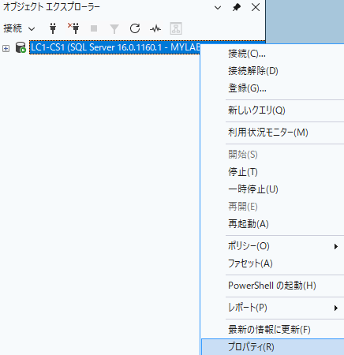
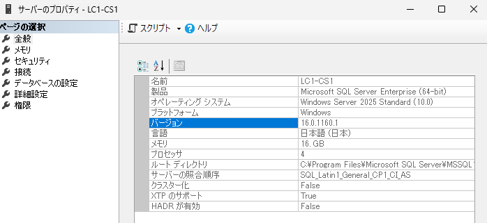
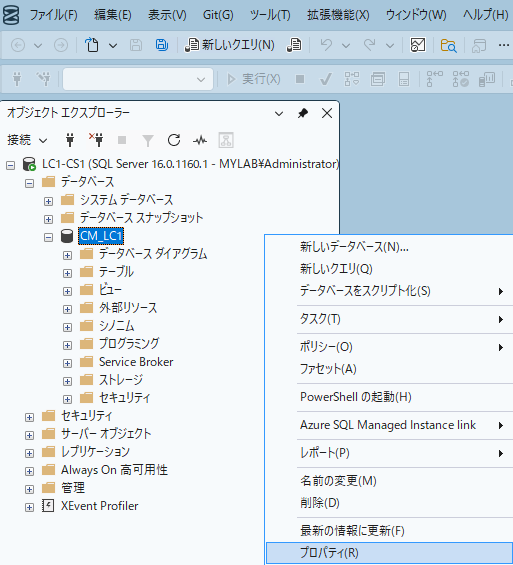
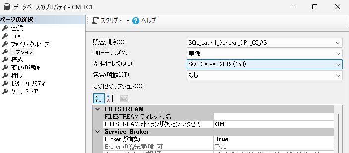

# Configuration Manager での SQL Server / 互換性レベル サポートについて

こんにちは。Configuration Manager サポート チームです。  
Configuration Manager (ConfigMgr) Current Branch (CB) での SQL Server サポートについて、2026/6/16 現在のサポート バージョンをご案内します。詳しくは下記にも記載していますので、ご確認ください。

- https://learn.microsoft.com/en-us/intune/configmgr/core/plan-design/configs/support-for-sql-server-versions#standard--enterprise-sql-editions

お使いの CB によって、サポートされる SQL Server のバージョンや互換性レベルが異なりますので、ご注意ください。特に ConfigMgr 2509、2503 は SQL Server 2025 をサポートしていません。また、SQL Server 2022 自体はサポートしていますが、デフォルトの互換性レベル 160 はサポートしていません。互換性レベル 150 に変更してご利用ください。

## SQL Server および互換性レベルの確認方法

SQL Server Management Studio (SSMS) よりデータベース接続後、以下の手順で確認できます。

### SQL Server バージョンの確認
1. [SSMS] - [オブジェクト エクスプローラー] - データベース サーバー - [プロパティ]

2. [全般] ページ、[製品]

### 互換性レベルの確認

1. [SSMS] - [オブジェクト エクスプローラー] - データベース サーバー - [データベース] - CM_<サイト コード> - [プロパティ]

2. [オプション] ページ、[互換性レベル]

## Current Branch での SQL Server / 互換性レベル サポート

### ConfigMgr CB 2603

ConfigMgr CB 2603 での SQL Server サポート、互換性レベル サポートは以下の通りです。

- SQL Server 2025 (RTM 以降)
  170, 160, 150, 140, 130, 120, 110
- SQL Server 2022 (RTM 以降)
  160, 150, 140, 130, 120, 110
- SQL Server 2019 (CU5 以降)
  150, 140, 130, 120, 110
- SQL Server 2017 (CU2 以降)
  140, 130, 120, 110
- SQL Server 2016 (現時点でサポートされる最小サービスパック 以降)
  130, 120, 110

### ConfigMgr CB 2509

ConfigMgr CB 2509 での SQL Server サポート、互換性レベル サポートは以下の通りです。**SQL Server 2022 はサポートしていますが、互換性レベル 160 はサポートしていないことにご注意ください。**

- SQL Server 2022 (RTM 以降)
  150, 140, 130, 120, 110
- SQL Server 2019 (CU5 以降)
  150, 140, 130, 120, 110
- SQL Server 2017 (CU2 以降)
  140, 130, 120, 110
- SQL Server 2016 (現時点でサポートされる最小サービスパック 以降)
  130, 120, 110

### ConfigMgr CB 2503

ConfigMgr CB 2503 での SQL Server サポート、互換性レベル サポートは以下の通りです。**SQL Server 2022 はサポートしていますが、互換性レベル 160 はサポートしていないことにご注意ください。**

- SQL Server 2022 (RTM 以降)
  150, 140, 130, 120, 110
- SQL Server 2019 (CU5 以降)
  150, 140, 130, 120, 110
- SQL Server 2017 (CU2 以降)
  140, 130, 120, 110
- SQL Server 2016 (現時点でサポートされる最小サービスパック 以降)
  130, 120, 110
