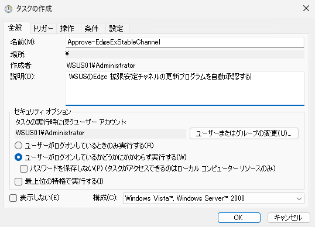
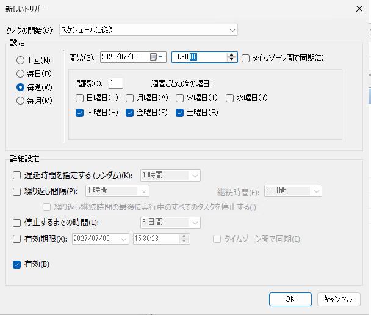
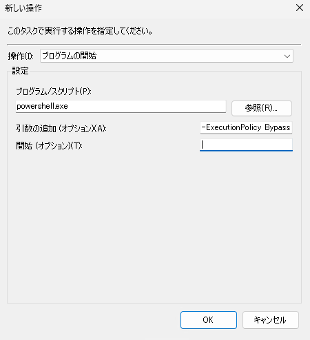

# WSUS で Edge の特定チャネル承認を自動化する

皆さま、こんにちは。 WSUS サポートチームです。

本日は、Edge の特定チャネル承認の自動化方法についてご案内します。

## WSUS の自動承認の限界

WSUS でも自動承認の仕組みはございますが、承認の単位が製品ごとまでしか指定できないため、特定のチャネルだけ、特定のアーキテクチャだけの承認を自動化したい、といった要件は満たせない形となります。
なお、弊社 ConfigMgr ではより詳細なフィルタ条件で自動展開規則を組むことができますので、本 blog 記事でご案内しているような方法は不要となります。より詳細な更新プログラム管理を実施されたい場合はぜひ ConfigMgr への移行もご検討ください。

## 実現方法

WSUS の自動承認では実現できないので、同等の内容を WSUS API を用いたPowerShell スクリプトとタスク スケジューラを使って実現します。

- Windows Server Update Services 3.0 Class Library  
https://learn.microsoft.com/en-us/previous-versions/windows/desktop/ms744624(v=vs.85)

### 注意点

タイトル名でフィルタされた更新プログラムに対して承認を実施する仕組みとなっている都合上、承認したいタイトル名が変わると、上手く動作しなくなりますのであらかじめご承知おきください。

### 実現手順

承認したい Edge の更新プログラムのタイトルを確認します。2026 年 7 月 8 日現在の、チャネルごとの名称は以下の通りです。

- Beta
  - Microsoft Edge-Beta Channel Version [XXX] Update for [Arch] based Editions (Build [WWW.X.YYYY.ZZ])

- Dev
  - Microsoft Edge-Dev Channel Version [XXX] Update for [Arch] based Editions (Build [WWW.X.YYYY.ZZ])

- Stable
  - Microsoft Edge-Stable Channel Version [XXX] Update for [Arch] based Editions (Build [WWW.X.YYYY.ZZ])

- Extended Stable
  - Microsoft Edge-Extended Stable Channel Version [XXX] Update for [Arch] based Editions (Build [WWW.X.YYYY.ZZ])

上記それぞれごとに正規表現パターンを考えておきます。

このほか、Edge WebView2 も承認したい場合は、以下の文字列も利用します。

- WebView2
  - Microsoft Edge-WebView2 Runtime Version [XXX] Update for [Arch] based Editions (Build [WWW.X.YYYY.ZZ])

### スクリプトを書く

上記と WSUS API をもとに定期実行する PowerShell スクリプトを書きます。以下は以下の更新プログラムを承認するサンプル スクリプトになります。対象のチャネルや CPU アーキテクチャ、承認対象のコンピューター グループに沿ってスクリプトを書き換えください。

- 拡張安定チャネル
- WebView2 も含む
- x64 向け
- "すべてのコンピューター" グループに対して承認

```
サンプル スクリプト免責事項

サンプル スクリプトは弊社環境で検証した上でご案内しておりますが、弊社にてその動作を保証するものではございません。
ご使用の際は、お客様の環境に合わせて変更いただき、十分にテストした上で、ご利用くださいますようお願いいたします。

なお、お客様要件に合わせた変更を弊社に依頼されてもお受けいたしかねますので予めご承知おきください。
```

```powershell
Import-Module UpdateServices

$wsus = [Microsoft.UpdateServices.Administration.AdminProxy]::GetUpdateServer();

$scopeFilterText = "Edge"

$targetScope = New-Object Microsoft.UpdateServices.Administration.UpdateScope
$targetScope.ApprovedStates = [Microsoft.UpdateServices.Administration.ApprovedStates]::NotApproved
$targetScope.TextIncludes = $scopeFilterText

$targetUpdates = $wsus.GetUpdates($targetScope)

$archPattern     = 'x64' # select 'x86' 'x64' 'ARM64'

$betaPattern     = "^Microsoft Edge-Beta Channel Version \d+ Update for (?:$archPattern) based Editions \(Build \d+\.\d+\.\d+\.\d+\)$"
$devPattern      = "^Microsoft Edge-Dev Channel Version \d+ Update for (?:$archPattern) based Editions \(Build \d+\.\d+\.\d+\.\d+\)$"
$stablePattern   = "^Microsoft Edge-Stable Channel Version \d+ Update for (?:$archPattern) based Editions \(Build \d+\.\d+\.\d+\.\d+\)$"
$exStablePattern = "^Microsoft Edge-Extended Stable Channel Version \d+ Update for (?:$archPattern) based Editions \(Build \d+\.\d+\.\d+\.\d+\)$"

$wv2Pattern      = "^Microsoft Edge-WebView2 Runtime Version \d+ Update for (?:$archPattern) based Editions \(Build \d+\.\d+\.\d+\.\d+\)$"

$targetGrpId = "a0a08746-4dbe-4a37-9adf-9e7652c0b421" #All Computer
$targetGrp = $wsus.GetComputerTargetGroup($targetGrpId)

foreach ($update in $targetUpdates){       
    
    if($update.Title -match $exStablePattern){
        "Approved:" + $update.Title 
        $update.Approve([Microsoft.UpdateServices.Administration.UpdateApprovalAction]::Install, $targetGrp)
    }
    
    if($update.Title -match $wv2Pattern){
        "Approved:" + $update.Title 
        $update.Approve([Microsoft.UpdateServices.Administration.UpdateApprovalAction]::Install, $targetGrp)
    }
}


```

### タスク スケジューラ に登録する

1. 作成したスクリプトを適宜名前を付けて保存します。(本記事ではApprove-EdgeExStableChannel.ps1とします。)  
2. タスク スケジューラを起動します。
3. タスク スケジューラ ライブラリを右クリックして、「タスクの作成」を指定します。  
   
4. [全般]タブで適宜名前と説明を変更します。また、タスクの実行時に使うユーザーアカウントは管理者権限のあるアカウントとし、「ユーザーがログオンしているかどうかにかかわらず実行する」を選択します。  
   
5. [トリガー]タブで[新規]ボタンをクリックします。  
   
6. 自動承認を実行するスケジュールを適宜設定して、「OK」をクリックします。
   
7. [操作]タブで[新規]ボタンをクリックします。  
   
8. 以下のように設定して、「OK」をクリックします。
   - 操作: プログラムの開始
   - プログラム/スクリプト: powershell.exe
   - 引数の追加: 
     ```
     -ExecutionPolicy Bypass -NoLogo -NonInteractive -NoProfile -WindowStyle Hidden -File [スクリプトファイルのパス]

     ```
     
     
9. OKをクリックし、タスク登録が終わったことを確認します。

10. 設定時間後に、タスク スケジューラの履歴と、WSUS コンソールをみて意図通り更新プログラムが承認されているか確認します。

