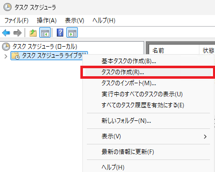
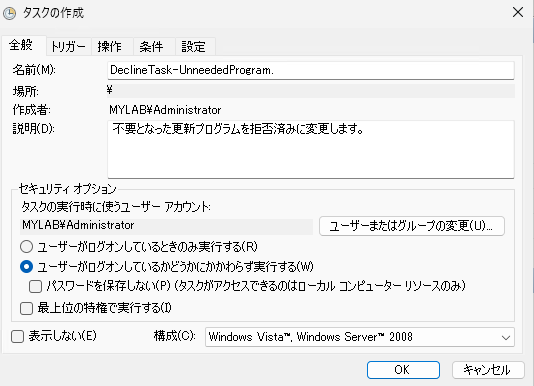
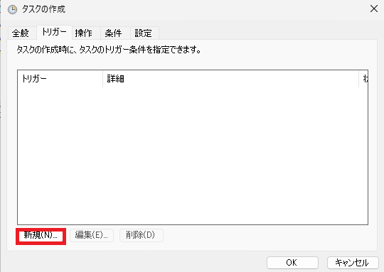
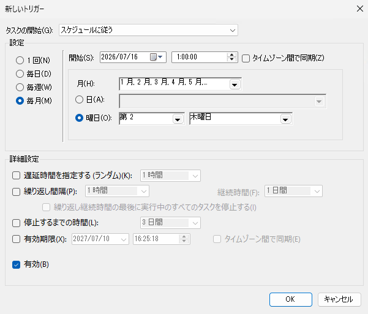
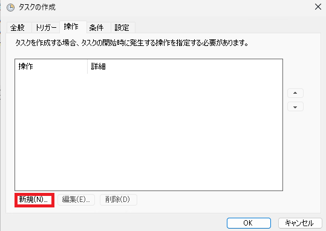

# Configuration Manager / WSUS で 更新プログラムの拒否を自動化する例

皆さま、こんにちは。 Configuration Manager / WSUS サポートチームです。

本日は、Configuration Manager (ConfigMgr) / WSUS のメンテナンスにおいて、重要である不要な更新プログラムの拒否を自動化する例についてサンプル スクリプトと共にご案内します。  

以下の URL などで、ConfigMgr / WSUS の安定運用のためには不要な更新プログラムの拒否が重要である旨、ご案内しております。弊社でよくパフォーマンス悪化でお問い合わせをいただく際も、メンテナンスが適切に行われていなかったことが原因であった事例が大部分を占めます。

- 不要な更新プログラムは「拒否済み」に設定しよう！  
  https://jpmem.github.io/blog/wsus/2017-12-11_01/

- WSUS メンテナンスガイド新版  
  https://jpmem.github.io/blog/wsus/2022-05-09_01/

一方で、更新プログラムの拒否を手動で定期的に実施するのも非常に負担がかかる作業かと存じます。そのため、WSUS API を用いた PowerShell スクリプトとタスク スケジューラを使って自動化することを推奨します。

- Windows Server Update Services 3.0 Class Library  
  https://learn.microsoft.com/en-us/previous-versions/windows/desktop/ms744624(v=vs.85)

## 自動化に向けた検討

「どのような更新プログラムが不要であるか」をあらかじめ定義しておく必要がございます。こちらを定義できないために、メンテナンスができずにパフォーマンスを悪化させてしまっている事例も多いですが、ConfigMgr / WSUS の安定運用には必ず必要な作業となりますので、関係者の方々を巻き込んで、必ず決めましょう。なお、CPU やメモリなどリソースを多めに積めばメンテナンスをしなくても大丈夫というわけではありません。

### 不要判定の軸

例えば、以下のような軸で不要な更新プログラムかどうかを判断します。

- すでにサポート期限切れを迎えている製品は製品の選択から外し、かつ拒否に変更する
- 置き換えられた更新プログラムは拒否に変更する、もしくは数か月分のみ残す
- 社内ですでに配布していない/配布を予定していないアーキテクチャの更新プログラム (x86, ARM64)は拒否する
- M365 更新プログラムのうち、社内で利用していないチャネルは拒否する

など。

### 実行時間の検討

タスク スケジューラにて拒否の実行を行いますが、以下のような時間帯はスケジュールから避けることを推奨します。

- サービス稼働時間
- バックアップ時間
- その他サービス連携を行っている時間

## スクリプトの作成

不要判定の軸を含めた要件が決まったら、スクリプトを作成していきます。以下はサンプル スクリプトを作成する前にあたり決めた要件となります。

### サンプル スクリプトにおける更新プログラムを配布する対象

- Windows 11
- Windows Server 2019 / 2022 / 2025
- Microsoft Defender Antivirus
- Microsoft Edge
- Office LTSC 2021 / 2024
- Microsoft 365 Apps

### サンプル スクリプトにおける更新プログラムを不要とする条件

- x86, ARM64 アーキテクチャの更新プログラムは不要とする (x64 のみ配る)
- 1 年以上前にリリースされた更新プログラムはすべて不要とする
- 置き換えられた更新プログラムのうち、リリースされてから 3 ヵ月以上経過した更新プログラムは不要とする
- Edge は Beta, Dev, Stable チャネルは不要とする。 (Extended Stable チャネルのみ配る)
- Microsoft 365 Apps は月次、カレントチャネルは不要とする。 (半期チャネルのみ配る)

### 注意点

一部、タイトル名でフィルタされた更新プログラムに対して拒否を実施する仕組みとなっている都合上、拒否したいタイトル名が変わると、上手く動作しなくなりますのであらかじめご承知おきください。

### モジュールをインポートする

PowerShell で WSUS API を実行するために、事前に UpdateServices モジュールをインポートしておきます。管理者権限で開いた PowerShell にて以下を実行しておきます。

```powershell
Import-Module UpdateServices
```

### サンプル スクリプト

```
サンプル スクリプト免責事項

サンプル スクリプトは弊社環境で検証した上でご案内しておりますが、弊社にてその動作を保証するものではございません。
ご使用の際は、お客様の環境に合わせて変更いただき、十分にテストした上で、ご利用くださいますようお願いいたします。

なお、お客様要件に合わせた変更を弊社に依頼されてもお受けいたしかねますので予めご承知おきください。
```

```powershell
$wsus = [Microsoft.UpdateServices.Administration.AdminProxy]::GetUpdateServer();

$targetAllCategories      = $wsus.GetUpdateCategories() | where Title -In ('Windows 11', 'Windows Server 2019', 'Microsoft Server Operating System-22H2', 'Microsoft Server Operating System-24H2', 'Microsoft Defender Antivirus', 'Microsoft Edge', 'Microsoft 365 Apps/Office 2019/Office LTSC')
$targetAllClassification  = $wsus.GetUpdateClassifications() | where Title -In ('Definition Updates', 'Security Updates', 'Updates',  'Upgrades')

# Decline x86 update program 
$x86Pattern   = ".*x86.*"

$targetScope = New-Object Microsoft.UpdateServices.Administration.UpdateScope
$targetScope.ApprovedStates = [Microsoft.UpdateServices.Administration.ApprovedStates]::NotApproved
$targetScope.Categories.AddRange($targetAllCategories)
$targetScope.Classifications.AddRange($targetAllClassification)
$targetScope.TextIncludes = "x86"

$targetUpdates = $wsus.GetUpdates($targetScope)

foreach ($update in $targetUpdates){       
    if($update.Title -match $x86Pattern){
        Write-Host "decline: " $update.Title
        $update.Decline()
    }
}

# Decline ARM64 update program 
$arm64Pattern = ".*ARM64.*"
$targetScope = New-Object Microsoft.UpdateServices.Administration.UpdateScope
$targetScope.ApprovedStates = [Microsoft.UpdateServices.Administration.ApprovedStates]::NotApproved
$targetScope.Categories.AddRange($targetAllCategories)
$targetScope.Classifications.AddRange($targetAllClassification)
$targetScope.TextIncludes = "ARM64"

$targetUpdates = $wsus.GetUpdates($targetScope)

foreach ($update in $targetUpdates){       
    if($update.Title -match $arm64Pattern){
        Write-Host "decline: " $update.Title
        $update.Decline()
    }
}

#Decline old update program 
$targetScope = New-Object Microsoft.UpdateServices.Administration.UpdateScope
$targetScope.ApprovedStates = [Microsoft.UpdateServices.Administration.ApprovedStates]::NotApproved
$targetScope.Categories.AddRange($targetAllCategories)
$targetScope.Classifications.AddRange($targetAllClassification)
$targetScope.ToCreationDate =  (Get-Date).AddYears(-1)

$targetUpdates = $wsus.GetUpdates($targetScope)

foreach ($update in $targetUpdates){       
    Write-Host "decline: " $update.Title
    $update.Decline()    
}

#Decline old superseded update program
$targetScope = New-Object Microsoft.UpdateServices.Administration.UpdateScope
$targetScope.ApprovedStates = [Microsoft.UpdateServices.Administration.ApprovedStates]::NotApproved
$targetScope.Categories.AddRange($targetAllCategories)
$targetScope.Classifications.AddRange($targetAllClassification)
$targetScope.ToCreationDate =  (Get-Date).AddMonths(-3)

$targetUpdates = $wsus.GetUpdates($targetScope)

foreach ($update in $targetUpdates){       
    if($update.IsSuperseded){
        Write-Host "decline: " $update.Title
        $update.Decline()    
    }
}

# Decline not needed Microsoft Edge channel update program
$archPattern     = 'x86|x64|ARM64' 
$excludedEdgePattern = "^Microsoft Edge-(Beta|Dev|Stable) Channel Version \d+ Update for (?:$archPattern) based Editions \(Build \d+\.\d+\.\d+\.\d+\)$"

$targetScope = New-Object Microsoft.UpdateServices.Administration.UpdateScope
$targetScope.ApprovedStates = [Microsoft.UpdateServices.Administration.ApprovedStates]::NotApproved

$targetCategory       = $wsus.GetUpdateCategories() | where Title -eq 'Microsoft Edge'
$targetClassification = $wsus.GetUpdateClassifications() | where Title -eq 'Updates'

$targetScope.Categories.Add($targetCategory) | Out-Null
$targetScope.Classifications.Add($targetClassification) | Out-Null

$targetUpdates = $wsus.GetUpdates($targetScope)

foreach ($update in $targetUpdates){       
    if($update.Title -match $excludedEdgePattern){
        Write-Host "decline: " $update.Title
        $update.Decline()    
    }
}

# Decline not needed M365 channel update program

$excludedM365Pattern = '^Microsoft 365 Apps Update - (?<channel>(?!Semi-Annual)(?:Current Channel(?: \(Preview\))?|Monthly Enterprise Channel)) (?<updateType>Extended Quality Update|Feature Update|Quality Update) for (?<arch>x64|x86) based Edition Version (?<version>\d{4}) \(Build (?<build>\d+\.\d+)\)$'

$targetScope = New-Object Microsoft.UpdateServices.Administration.UpdateScope
$targetScope.ApprovedStates = [Microsoft.UpdateServices.Administration.ApprovedStates]::NotApproved
$targetCategory       = $wsus.GetUpdateCategories() | where Title -eq 'Microsoft 365 Apps/Office 2019/Office LTSC'
$targetClassification = $wsus.GetUpdateClassifications() | where Title -eq 'Updates'
$targetScope.Categories.Add($targetCategory) | Out-Null
$targetScope.Classifications.Add($targetClassification) | Out-Null

$targetScope.TextIncludes = "Microsoft 365 Apps Update"
$targetUpdates = $wsus.GetUpdates($targetScope)

foreach ($update in $targetUpdates){       
    if($update.Title -match $excludedM365Pattern){
        Write-Host "decline: " $update.Title
        $update.Decline()    
    }
}
```

### タスク スケジューラ に登録する

1. 作成したスクリプトを適宜名前を付けて保存します。(本記事では Decline-UnneededProgram.ps1 とします。)  
2. タスク スケジューラを起動します。
3. タスク スケジューラ ライブラリを右クリックして、「タスクの作成」を指定します。  
   
4. [全般]タブで適宜名前と説明を変更します。また、タスクの実行時に使うユーザーアカウントは管理者権限のあるアカウントとし、「ユーザーがログオンしているかどうかにかかわらず実行する」を選択します。  
   
5. [トリガー]タブで[新規]ボタンをクリックします。  
   
6. 拒否を実行するスケジュールを適宜設定して、「OK」をクリックします。
   
7. [操作]タブで[新規]ボタンをクリックします。  
      
8. 以下のように設定して、「OK」をクリックします。
   - 操作: プログラムの開始
   - プログラム/スクリプト: powershell.exe
   - 引数の追加: 
     ```
      -ExecutionPolicy Bypass -NoLogo -NonInteractive -NoProfile -WindowStyle Hidden -File "[スクリプトファイルのパス]"
     ```
     
          
9. OK をクリックし、タスク登録が終わったことを確認します。

10. 設定時間後に、タスク スケジューラの履歴と、WSUS コンソールをみて意図通り更新プログラムが拒否されているか確認します。