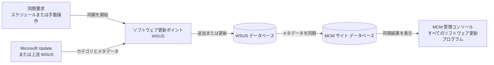

皆様、こんにちは。Configuration Manager / WSUS サポート チームです。

本記事では、Microsoft Configuration Manager [MCM] の [ソフトウェア更新ポイント] における同期処理、設定方法、およびログによる進捗確認方法を説明します。

[ソフトウェア更新プログラムの同期] は、指定した [製品]、[分類] などの条件に一致する更新プログラムのカタログ情報を、上流の同期元から [WSUS] の役割を通じて [WSUS データベース] に同期し、その後に [MCM サイト データベース] に同期する処理です。

同期するのは、更新プログラムのタイトル、製品、分類、適用条件、置き換え関係などのメタデータです。この時点では、クライアントへ配布する更新プログラムのバイナリはダウンロードまたは展開されません。

MCM に更新プログラムをダウンロードする動作 および MCM クライアントに対する展開動作については、本記事の対象外です。

・ MCM に更新プログラムをダウンロードする際の動作について (リンクを貼る)
・ MCM クライアントに対する展開動作について (リンクを貼る)


# ソフトウェア更新ポイントの同期処理について

### 同期処理の全体像

最上位サイト [中央管理サイト、またはスタンドアロン プライマリ サイト] では、同期は次の順序で進みます。



1. スケジュール、または管理コンソールからの手動操作により同期要求が発生します。
2. [WSUS] が [Microsoft Update]、または指定された上流の [WSUS] から、更新プログラムのカテゴリとメタデータを同期します。
3. 2 で同期された更新プログラムのメタデータを [MCM サイト データベース] に挿入または更新します。
4. [MCM サイト データベース] の同期が正常に完了すると、同期された更新プログラムが管理コンソールの [ソフトウェア ライブラリ] - [ソフトウェア更新プログラム] - [すべてのソフトウェア更新プログラム] に表示されます。

管理コンソールに表示される情報は [MCM サイト データベース] の情報です。このため、[WSUS] 側の同期が完了しただけでは不十分であり、その後の [MCM サイト データベース] との同期が完了している必要があります。


### 第 1 段階 : 上流の同期元から WSUS への同期

最初に既定の [ソフトウェア更新ポイント] 上の [WSUS] に同期を要求します。
[WSUS] は、構成された同期元へ接続し、カテゴリと更新プログラムのメタデータを [WSUS データベース] に追加または更新します。

最上位サイトの同期元には、通常、[Microsoft Update] を指定します。
インターネットに直接接続しない構成では、既存の上流 [WSUS] または切断環境向けのエクスポート・インポート方式を使用します。
子プライマリ サイトとセカンダリ サイトの [ソフトウェア更新ポイント] は、親サイト側の同期元を使用します。

### 第 2 段階 : WSUS から MCM サイト データベースへの同期

[WSUS] の同期完了後、 [WSUS データベース] からカテゴリと更新プログラムを読み取り、[MCM サイト データベース] に同期します。
前回同期後に追加または変更されたメタデータが、[構成項目] として挿入または更新されます。

この工程では、[ソフトウェア更新ポイント コンポーネントのプロパティ] で指定した [製品]、[分類]、[言語] が使用されます。
対象を過剰に選択すると [WSUS] のメタデータ量、同期時間、およびクライアントのスキャン負荷が増えるため、管理対象環境で必要な項目だけを選択します。

### 複数サイトおよび複数ソフトウェア更新ポイントがある場合

最上位サイトで作成された更新プログラムの [構成項目] は、データベース レプリケーションによって子プライマリ サイトへ複製されます。
最上位サイトから同期通知を受け取った子サイトでは、親サイトの [WSUS] を上流として [WSUS] 同期を行います。

同一サイトに複数の [ソフトウェア更新ポイント] がある場合、最初にインストールした [ソフトウェア更新ポイント] が既定の同期元として動作し、追加の [ソフトウェア更新ポイント] はレプリカとして同期されます。

# インターネット アクセス要件

## ソフトウェア更新ポイントから Microsoft Update への接続

最上位サイトで同期元に [Microsoft Update] を指定する場合、アクティブな [ソフトウェア更新ポイント] から [Microsoft Update] クラウド サービスへの送信通信が必要です。

[WSUS] から [Microsoft Update] への接続には [HTTP] の [TCP 80] と [HTTPS] の [TCP 443] が使用されます。組織のファイアウォールまたはプロキシでインターネット通信を制限している場合は、公開情報に記載のエンドポイントへの接続を許可します。

- [インターネット アクセス要件 - ソフトウェア更新プログラム](https://learn.microsoft.com/ja-jp/intune/configmgr/core/plan-design/network/internet-endpoints#software-updates)

## Microsoft 365 Apps の更新プログラムを同期する場合

[製品] で [Microsoft 365 Apps] を選択する場合、通常の [Microsoft Update] 用エンドポイントに加え、[Office CDN] と [Microsoft 365 Apps ファイル リスト API] への接続が必要です。次の公開情報に記載のエンドポイントへの接続を許可します。

- [インターネット アクセス要件 - Microsoft 365 Apps](https://learn.microsoft.com/ja-jp/intune/configmgr/core/plan-design/network/internet-endpoints#manage-microsoft-365-apps)

# 設定方法

### 1. WSUS をインストールする

[ソフトウェア更新ポイント] のサイト システム役割を追加する前に、対象サーバーへ [Windows Server Update Services] をインストールします。
[WSUS] は、更新プログラムの同期とクライアントによる更新プログラムのスキャンサイクルの際にメタデータをダウンロードするサーバーとして必要です。

1. [サーバー マネージャー] で [役割と機能の追加] を開始します。
2. [Windows Server Update Services] を選択します。
3. 環境設計に従い、[WID Connectivity] または [SQL Server Connectivity] を選択します。
4. 更新ファイルをローカルに保存する設計の場合は、コンテンツ格納先を指定します。
5. 役割のインストール後、[WSUS] のインストール後タスクを完了します。

[WSUS 管理コンソール] で [製品]、[分類]、同期元などを個別に構成しないでください。
[MCM] が [ソフトウェア更新ポイント] 上の [WSUS] に接続し、[ソフトウェア更新ポイント コンポーネントのプロパティ] で指定した設定を反映します。

### 2. ソフトウェア更新ポイントをインストールする

1. [MCM 管理コンソール] で [管理] - [サイトの構成] - [サーバーとサイト システムの役割] を開きます。
2. [WSUS] をインストールした既存のサイト システム サーバーを選択し、[サイト システムの役割の追加] を実行します。新しいサーバーを使用する場合は、[サイト システム サーバーの作成] を実行します。
3. 必要に応じて、サイト システムのプロキシ設定と資格情報を指定します。
4. [システムの役割の選択] で [ソフトウェア更新ポイント] を選択します。
5. [WSUS] で使用しているポートを指定します。[WSUS] を SSL で構成している場合は、[WSUS サーバーとの SSL 通信を必須にする] を有効にします。
6. リモートの [WSUS] へサイト サーバーのコンピューター アカウントで接続できない場合は、適切な権限を持つ [WSUS サーバー接続アカウント] を指定します。
7. ウィザードを完了し、[SUPSetup.log] で役割のインストール結果、[WCM.log] で [WSUS] への接続と構成結果を確認します。

階層がある場合は、中央管理サイト、子プライマリ サイト、必要に応じてセカンダリ サイトの順に追加します。

### 3. 製品、分類、同期元、言語、およびスケジュールを設定する

初めて最上位サイトへ [ソフトウェア更新ポイント] を追加する場合は、初回同期で最新の [製品] と [分類] の一覧を取得してから、実際に必要な項目を選択する方法を推奨します。

1. 初回の役割追加時は、[製品] と [分類] をすべてオフにした状態でウィザードを完了します。
2. 初回同期を実行し、最新の [製品] と [分類] の一覧を取得します。
3. [管理] - [サイトの構成] - [サイト] を開き、中央管理サイトまたはスタンドアロン プライマリ サイトを選択します。
4. [ホーム] タブの [設定] から [サイト コンポーネントの構成] - [ソフトウェア更新ポイント] を開きます。
5. [同期設定] タブで、[Microsoft Update から同期する]、または設計した上流データ ソースを指定します。
6. [分類] タブで、[セキュリティ更新プログラム]、[重要な更新]、[更新]、[定義更新プログラム]、[Upgrades] など、必要な分類を選択します。
7. [製品] タブで、管理対象の Windows 11、Microsoft 365 Apps、Microsoft Edge など、必要な製品だけを選択します。
8. [言語] タブで、必要な更新ファイルおよび更新プログラムの詳細の言語を選択します。English は必須でチェックを入れます。
9. [同期スケジュール] タブで [スケジュールに従って同期する] を有効にし、[WSUS]、サイト サーバー、およびネットワークの負荷が低い時間帯を指定します。
10. 設定を保存した後、再度同期を実行して、選択した条件に一致する更新プログラムのメタデータを取得します。

[製品] の親項目を選択すると、配下の現在および将来の製品が対象となる場合があります。不要なメタデータの増加を避けるため、選択範囲を定期的に見直してください。

### 4. 同期する

#### スケジュール同期

設定した日時になると、最上位サイトの [WSUS Synchronization Manager] が起動し、同期を開始します。通常運用では、定期スケジュールによる同期を使用します。

#### 手動同期

1. [MCM 管理コンソール] で [ソフトウェア ライブラリ] - [ソフトウェア更新プログラム] - [すべてのソフトウェア更新プログラム] を開きます。
2. [ホーム] タブで [ソフトウェア更新プログラムの同期] を選択します。
3. 確認画面で [はい] を選択します。

#### 同期状態の確認

[監視] - [ソフトウェア更新ポイントの同期ステータス] で、階層内の [ソフトウェア更新ポイント] ごとの状態を確認できます。詳細な工程とエラーは、サイト サーバーの [Logs] フォルダーにある [wsyncmgr.log] を確認します。

# ソフトウェア更新ポイントの同期時に確認するログ について

ログ名 | 主な用途
--- | ---
[SUPSetup.log] | [ソフトウェア更新ポイント] 役割のインストール状態を確認します。
[WCM.log] | [WSUS] のバージョン、接続、ポート、上流サーバー、プロキシ、およびカテゴリ設定の構成状態を確認します。
[wsyncmgr.log] | 同期要求の開始、[WSUS] 同期、[MCM サイト データベース] 同期、進捗率、完了、および失敗を確認します。
[SoftwareDistribution.log] | [WSUS] サービス内部の同期開始、上流との通信、および同期完了を確認します。
[SMSProv.log] | 管理コンソールから手動同期を要求した操作を確認します。
[SMSDBMON.log] | 手動同期要求を検知し、[WSyncMgr.box] に同期通知を生成する処理を確認します。

以下の抜粋は、提供された [WCM.log] および [wsyncmgr.log] 相当のログを読みやすい形式に整えた例です。サーバー名、時刻、件数は環境によって異なります。

### 工程 1 : WSUS の構成と接続を確認する

[WCM.log] で、サポート対象の [WSUS] が検出され、指定ポートで接続でき、上流サーバーとカテゴリが正しく構成されていることを確認します。

```text
Supported WSUS version found
Attempting connection to WSUS server: CON-PS1DPMPSUP1.contoso.com, port: 8530, useSSL: False
Successfully connected to server: CON-PS1DPMPSUP1.contoso.com, port: 8530, useSSL: False
No changes - WSUS Server settings are correctly configured and Upstream Server is set to Microsoft Update
Refreshing categories from WSUS server
Successfully refreshed categories from WSUS server
```

[Successfully connected] が記録されない場合は、[Update Services] サービス、[IIS] の [WSUS Administration] サイト、FQDN、ポート、SSL、ファイアウォール、プロキシ、および接続アカウントを確認します。

### 工程 2 : 同期要求の開始を確認する

[wsyncmgr.log] で、スケジュールまたは手動要求により同期が開始され、対象の [ソフトウェア更新ポイント] が検出されたことを確認します。

```text
Wakeup for scheduled regular sync
Starting Sync
Performing sync on regular schedule
Read SUPs from SCF for CON-PS1SITE.contoso.com
Found 2 SUPs
STATMSG: ID=6701 SEV=I
```

手動同期の場合は、[Performing sync on local request] が記録されます。[STATMSG: ID=6701] は同期処理の開始を示します。

### 工程 3 : 上流の同期元から WSUS への同期を確認する

次の記録は、[WSUS] がカテゴリ 28 件、更新プログラム 414 件を処理し、[WSUS データベース] への同期を完了したことを示します。[STATMSG: ID=6704] は [WSUS] 同期フェーズを示します。

```text
Synchronizing WSUS, default server is CON-PS1DPMPSUP1.contoso.com
STATMSG: ID=6704 SEV=I
sync: Starting WSUS synchronization
sync: WSUS synchronizing categories, processed 28 out of 28 items (100%)
sync: WSUS synchronizing updates, processed 414 out of 414 items (100%)
Done synchronizing WSUS Server con-ps1dpmpsup1.contoso.com
```

[Done synchronizing WSUS Server] が記録されれば、第 1 段階の [WSUS] 同期は完了しています。ただし、この時点では [MCM サイト データベース] への同期完了ではありません。

### 工程 4 : WSUS から MCM サイト データベースへの同期を確認する

[STATMSG: ID=6705] と [Starting SMS database synchronization] は、第 2 段階が開始されたことを示します。[Requested categories] では、実際に要求された [製品] と [分類] を確認できます。

```text
Synchronizing SMS database with WSUS, default server is CON-PS1DPMPSUP1.contoso.com
STATMSG: ID=6705 SEV=I
sync: Starting SMS database synchronization
Requested categories: Product=Microsoft 365 Apps/Office 2019/Office LTSC, Product=Microsoft Edge, Product=Windows 11, Product=Microsoft Defender Antivirus, Product=Microsoft SQL Server 2022, Product=Windows 10, version 1903 and later, UpdateClassification=Security Updates, UpdateClassification=Upgrades, UpdateClassification=Updates, UpdateClassification=Definition Updates
sync: SMS synchronizing categories, processed 447 out of 447 items (100%)
sync: SMS synchronizing updates, processed 0 out of 603 items (0%)
sync: SMS synchronizing updates, processed 603 out of 603 items (100%)
```

処理中は [processed X out of Y items] とパーセント表示で進捗を確認できます。[Synchronizing update] は更新対象、[Skipped update ... because it is up to date] は既に最新で更新不要と判定された対象を示します。

### 工程 5 : MCM サイト データベースの同期完了を確認する

次の記録が揃っていることを確認します。[Done synchronizing SMS with WSUS Server] はサイト データベースとの同期完了、[STATMSG: ID=6702] と [Sync succeeded] は同期処理全体の正常完了を示します。

```text
Done synchronizing SMS with WSUS Server con-ps1dpmpsup1.contoso.com
STATMSG: ID=6702 SEV=I
Sync succeeded. Setting sync alert to canceled state on site PS1
Updated 8467 items in SMS database, new update source content version is 181
Sync time: 0d00h25m35s
```

同期成功後、管理コンソールの [すべてのソフトウェア更新プログラム] を最新の情報に更新し、選択した条件に一致する更新プログラムが表示されることを確認します。

### 進捗率が 100 パーセントでも最終結果を確認する

[WSUS] 同期または [MCM サイト データベース] 同期の [100%] は、その工程で列挙された項目の処理が終わったことを示します。
個別の更新プログラムでエラーが発生した場合、[100%] の後に同期全体が失敗として終了することがあります。
必ず最後まで追跡し、[Sync succeeded] または [Sync failed] を確認してください。


### よく確認する失敗メッセージ

状態 | ログ例 | 確認箇所
--- | --- | ---
[WSUS] が未構成 | [WSUS server not configured. Please refer to WCM.log] | [WCM.log] で [WSUS] 接続、ポート、SSL、プロキシ、サービス、および IIS を確認します。
再試行待ち | [Sync failed. Will retry in 60 minutes] | 原因を解消し、次回の再試行時刻または手動同期を確認します。
個別更新の同期失敗 | [Failed to synchronize O365 update] | 直前の例外、接続先、プロキシ、およびファイアウォールを確認します。
全体の同期失敗 | [STATMSG: ID=6703]、[Sync failed] | 同じ時刻の直前に記録された最初のエラーを確認します。
全体の同期成功 | [STATMSG: ID=6702]、[Sync succeeded] | [すべてのソフトウェア更新プログラム] を更新して表示を確認します。

### STATMSG: ID=6706 が記録される処理

同一サイトに複数の [ソフトウェア更新ポイント] がある場合、既定の [ソフトウェア更新ポイント] の同期後に、追加の [ソフトウェア更新ポイント] 上の [WSUS] がレプリカとして同期されます。[STATMSG: ID=6706] は、この追加の [WSUS] に対する同期フェーズが開始されたことを示します。

```text
Starting cleanup on WSUS, default server CON-PS1DPMPSUP1.contoso.com
sync: SMS performing cleanup
Cleanup processed 606 total updates and declined 0
Done Declining updates in WSUS Server con-ps1dpmpsup1.contoso.com
Synchronizing replica WSUS servers
STATMSG: ID=6706 SEV=I
sync: Starting Replica WSUS synchronization
```

# 参考リンク

- [インターネット アクセス要件 - Configuration Manager](https://learn.microsoft.com/ja-jp/intune/configmgr/core/plan-design/network/internet-endpoints#software-updates)
- [Microsoft Configuration Manager を使用して Microsoft 365 Apps の更新プログラムを管理する](https://learn.microsoft.com/ja-jp/microsoft-365-apps/updates/manage-microsoft-365-apps-updates-configuration-manager)
- [ソフトウェア更新ポイントのインストールと構成](https://learn.microsoft.com/intune/configmgr/sum/get-started/install-a-software-update-point)
- [Configuration Manager のソフトウェア更新プログラムの前提条件](https://learn.microsoft.com/intune/configmgr/sum/plan-design/prerequisites-for-software-updates)
- [同期する分類と製品の構成](https://learn.microsoft.com/intune/configmgr/sum/get-started/configure-classifications-and-products)
- [ソフトウェア更新プログラムの同期](https://learn.microsoft.com/intune/configmgr/sum/get-started/synchronize-software-updates)
- [ソフトウェア更新プログラムの同期の追跡](https://learn.microsoft.com/troubleshoot/mem/configmgr/update-management/track-software-update-synchronization)
- [ソフトウェア更新プログラムの同期に関するトラブルシューティング](https://learn.microsoft.com/troubleshoot/mem/configmgr/update-management/troubleshoot-software-update-synchronization)
