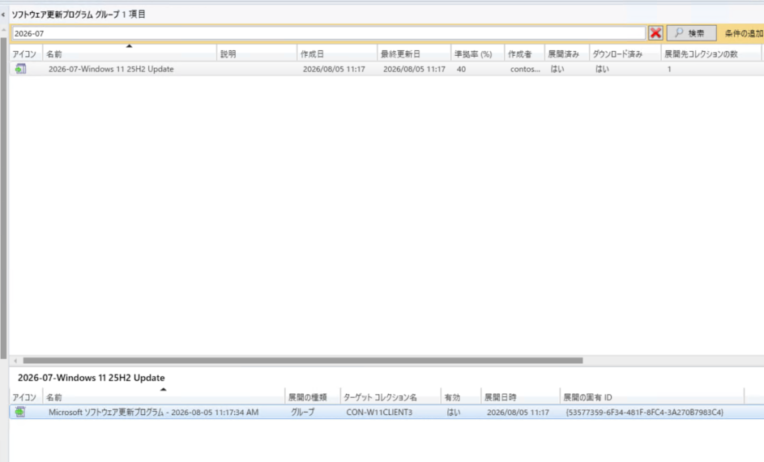

皆様、こんにちは。Configuration Manager / WSUS サポート チームです。

本記事では、Microsoft Configuration Manager (ConfigMgr) でソフトウェア更新プログラムを展開した後、クライアントが展開ポリシーを受信し、更新プログラムをスキャン、ダウンロード、インストールするまでの流れとログの確認方法をご案内します。

ソフトウェア更新ポイントでの同期や、展開パッケージを配布ポイントへ配布するサーバー側の処理は、本記事の対象外です。

## 全体の流れ

全体の流れは以下のとおりです。

1. 管理者様が設定した更新プログラムの展開ポリシーを受信する
2. スケジューラ―によって展開設定のスケジュールをセットする
3. ソフトウェア更新プログラムのスキャンサイクルを実行する
4. ソフトウェア更新プログラムのコンテンツ ダウンロードを実行する
5. ソフトウェア更新プログラムのインストールを実行する
6. 再起動の指示 および 再起動を実施する

## 各ステップとログの追跡方法

### 関連ログ

クライアント ログの既定の保存先は C:\Windows\CCM\Logs です。

ログ名 | 主な用途
--- | ---
PolicyAgent.log | コンピューター ポリシーの要求、受信、ダウンロード、適用を確認します。
Scheduler.log | 展開の有効化時刻や期限トリガーの登録、実行を確認します。
UpdatesDeployment.log | 展開の評価、対象判定、ダウンロード、インストールの全体的な進捗を確認します。
ScanAgent.log | スキャン要求、ソフトウェア更新ポイントの場所、およびスキャン完了を確認します。
WUAHandler.log | Windows Update Agent [WUA] API を介したスキャン、ダウンロード、インストールを確認します。
UpdatesStore.log | スキャン結果として更新プログラムが [Missing] または [Installed] と判定されたことを確認します。
UpdatesHandler.log | 更新プログラム単位のダウンロードおよびインストール ジョブを確認します。
CAS.log | クライアント キャッシュとコンテンツ要求を確認します。
ContentTransferManager.log | 配布ポイントの場所取得と Data Transfer Service ジョブを確認します。
DataTransferService.log | Background Intelligent Transfer Service [BITS] による転送状態を確認します。
CMBITSManager.log | Unified Update Platform [UUP] コンテンツの BITS チャンク情報を確認します。
DeltaDownload.log | Delivery Optimization [DO] から localhost:8005 への範囲要求と Delta Download 処理を確認します。
StateMessage.log | 展開評価、準拠、および適用状態の状態メッセージを確認します。

### テスト展開の情報

本記事で使用するテスト展開は、以下のとおりです。

項目 | 値
--- | ---
展開の一意の ID | <span style="background-color: #FFE08A; color: #24292F; padding: 1px 3px;">{53577359-6F34-481F-8FC4-3A270B7983C4}</span>
対象更新プログラム | 2026-07 Cumulative Update for Windows 11, version 25H2 for x64-based Systems (KB5101650) (26200.8875)
Update ID | <span style="background-color: #B6E3FF; color: #24292F; padding: 1px 3px;">99751b16-0794-4995-925d-9840365e1133</span>
子更新プログラムの Update ID | <span style="background-color: #B7E4C7; color: #24292F; padding: 1px 3px;">6d6c0ee4-cd71-4f59-b643-e0056b99f730</span>

本記事のログ抜粋では、同じ ID の紐づきを視覚的に追跡できるよう、次の色で統一しています。

色 | ID の種類 | 用途
--- | --- | ---
<span style="background-color: #FFE08A; color: #24292F; padding: 1px 12px;">黄色</span> | 展開の一意の ID | ポリシー、スケジュール、および展開処理を関連付けます。
<span style="background-color: #B6E3FF; color: #24292F; padding: 1px 12px;">青色</span> | Update ID | 更新プログラムのダウンロードおよびインストールを関連付けます。
<span style="background-color: #B7E4C7; color: #24292F; padding: 1px 12px;">緑色</span> | 子更新プログラムの Update ID | UUP コンテンツと DO / BITS の処理を関連付けます。
<span style="background-color: #D8B4FE; color: #24292F; padding: 1px 12px;">紫色</span> | ダウンロード ジョブ ID | UpdatesDeployment.log と UpdatesHandler.log を関連付けます。
<span style="background-color: #FFC9A9; color: #24292F; padding: 1px 12px;">橙色</span> | CTM ジョブ ID | ContentTransferManager.log と CMBITSManager.log を関連付けます。
<span style="background-color: #FFB3C7; color: #24292F; padding: 1px 12px;">桃色</span> | DTS ジョブ ID | ContentTransferManager.log と DataTransferService.log を関連付けます。
<span style="background-color: #D0D7DE; color: #24292F; padding: 1px 12px;">灰色</span> | CM BITS ジョブ ID | CMBITSManager.log 内の分割ダウンロードを追跡します。

### ステップ 1 : 展開の一意の ID を確認する

複数の展開がある環境では、展開名だけでログを追跡すると別の展開を混同する可能性があります。
最初に [展開の一意の ID] を確認します。

[Configuration Manager コンソール] で [ソフトウェア ライブラリ] - [ソフトウェア更新プログラム] - [ソフトウェア更新プログラム グループ] を開き、対象グループの [展開] タブを表示します。列見出しを右クリックして [展開の一意の ID] 列を追加すると、展開 ID を確認できます。



対象の [AssignmentID] が出力されない場合は、展開対象コレクションへの所属、管理ポイントとの通信、およびコンピューター ポリシーの取得状況を確認します。

### ステップ 2 : クライアント ポリシーの取得

ソフトウェア更新プログラムを展開すると、展開割り当てポリシーがコンピューター ポリシーに追加されます。
クライアントは管理ポイントへポリシーを要求し、受信したポリシーをダウンロードして適用します。

<pre>
Requesting Machine policy assignments from authority 'SMS:PS1'
Received Machine delta policy update with 2 assignments
Compiling policy '<span style="background-color: #FFE08A; color: #24292F;">{53577359-6F34-481F-8FC4-3A270B7983C4}</span>' version '1.00'
PolicyDownload: &lt;File Source=".sms_pol?<span style="background-color: #FFE08A; color: #24292F;">{53577359-6F34-481F-8FC4-3A270B7983C4}</span>..."
Evaluating and applying policy ... PolicyID="<span style="background-color: #FFE08A; color: #24292F;">{53577359-6F34-481F-8FC4-3A270B7983C4}</span>"
Applying policy <span style="background-color: #FFE08A; color: #24292F;">{53577359-6F34-481F-8FC4-3A270B7983C4}</span>
</pre>

PolicyAgent.log において最後の [Applying policy] まで確認できれば、クライアントへの展開ポリシーの適用まで進んでいます。
要求後にポリシーを受信できない場合は、CcmMessaging.log も確認し、管理ポイントとの HTTP または HTTPS 通信に異常がないかを確認ください。

クライアントが保持する展開設定は、管理者として実行した Windows PowerShell からも確認できます。

```powershell
Get-CimInstance -Namespace "root\CCM\Policy\Machine\ActualConfig" -ClassName CCM_UpdateCIAssignment |
    Select-Object AssignmentID, AssignmentName |
    Sort-Object AssignmentName
```

### ステップ 3 : スケジューラ―による展開スケジュールのセット

ポリシーが適用されると、Scheduler.log に展開 ID を含むスケジュールが登録されます。
必須展開では、通常の有効化スケジュールと [DEADLINE] を含む期限スケジュールを確認します。

<pre>
SMSTrigger ... for scheduler 'Machine/DEADLINE:<span style="background-color: #FFE08A; color: #24292F;">{53577359-6F34-481F-8FC4-3A270B7983C4}</span>' will fire at 08/05/2026 11:27:48 AM without randomization.
</pre>

### ステップ 4 : ソフトウェア更新プログラムのスキャン

ソフトウェア更新プログラムのスキャンでは、クライアントがソフトウェア更新ポイントから更新プログラムのメタデータを取得し、WUA が端末に各更新プログラムのインストールが必要かを判定します。

スキャンにより、各更新プログラムが以下の何れかの状況であることを判断しております。
　・　インストール済み
　・　適用する必要がある 
　・　適用する必要がない (前提条件を満たさない もしくは 既に当該更新を置き換える新しい更新が適用済み)

ScanAgent.log ではスキャン要求と使用する更新ソースを確認し、WUAHandler.log では WUA API の検索開始、完了、および結果を確認します。

```text
[ScanAgent.log]
ScanByUpdateSource request received with ForceReScan=2
WUA locations updated
Scan completed successfully
```

```text
[WUAHandler.log]
Async searching of updates using WUAgent started.
Async searching completed.
Successfully completed scan.
```

この時点で、スキャンによる適用要否判定および展開対象への追加まで進んでいます。

クライアントの更新ストアに記録された必須の更新プログラムは、次のコマンドでも確認できます。

```powershell
Get-CimInstance -Namespace "root\CCM\SoftwareUpdates\UpdatesStore" -ClassName CCM_UpdateStatus | Select-Object UniqueId, Title, Status
```

このクラスには展開の有無にかかわらずスキャンで評価された更新プログラムの状態が含れます。

#### スキャンでよく確認する問題

・グループ ポリシーの競合

スキャン時にソフトウェア更新ポイントの場所を更新しますがこの際には WUA のポリシーとして設定されます。
ドメインのグループ ポリシーで別の WSUS が指定されている、必要なレジストリやコンポーネントが欠損または破損している、またはポリシー通知が完了しない場合は、スキャンに影響します。

次のコマンドで適用されたグループ ポリシーを確認します。

```cmd
gpresult /H gpresult.html
```

出力されたレポートで、[コンピューターの構成] - [ポリシー] - [管理用テンプレート] - [Windows コンポーネント] - [Windows Update] - [Windows Server Update Service から提供される更新プログラムの管理] を確認します。
特に [イントラネットの Microsoft 更新サービスの場所を指定する] の優勢なグループ ポリシー オブジェクト [GPO] と設定値を確認します。

GPO によって設定がされている場合には GPO 側を未構成に変更下さい。

・グループ ポリシーの不整合

グループポリシーオブジェクトの破損により、ソフトウェア更新ポイントの場所が更新できない場合があります。
その場合には以下の修復手順を実施下さい。

[registry.pol ファイルの破損について](https://jpwinsup.github.io/blog/2021/12/17/ActiveDirectory/GroupPolicy/Introduction-of-the-registry-pol-file/)

```text
[WUAHandler.log]
Unable to read existing WUA Group Policy object. Error = 0x800703ee.
```

0x800703ee は ERROR_FILE_INVALID を示します。

・通信タイムアウトと WSUS 応答エラー

WUAHandler.log で [Scan failed] または [Failed to end search job] を検索します。代表例は、次のとおりです。

エラー | 意味の例
--- | ---
0x80072EE2 | 通信がタイムアウトしました。
0x80244022 | HTTP 503 相当で、サービスが一時的に利用できません。
0x80244010 | サーバーへの最大往復回数を超えました。
0x8024400E | WSUS サーバーとのプロトコル処理で問題が発生しました。
0x80244007 | SOAP の処理で問題が発生しました。
0x80240439 | WUA と更新サービス間の通信または応答処理で問題が発生しました。

```text
[WUAHandler.log]
Scan failed with error = 0x80244010.
```

WSUS の同期時間増加やタイムアウトについては以下の Blog 記事を参照下さい。

[WSUS 同期時間の増加やタイムアウトの問題について](https://jpmem.github.io/blog/wsus/2026-07-21_01/)

・OS 更新プログラムが検出されない場合

スキャンは成功しているにもかかわらず Windows 製品の更新プログラムが一つも [Missing] もしくは [Installed] として記録されない場合はデュアル スキャンの可能性を確認します。デュアルスキャンについては以下の Blog 記事を参照下さい。

[Configuration Manager 管理クライアントにおける Windows Update クライアント ポリシーの取り扱い(デュアル スキャン関連)](https://jpmem.github.io/blog/mecm/20260403_01/)

### ステップ 5 :  コンテンツのダウンロード

必要な更新プログラムが展開対象に追加されると、UpdatesDeployment.log でダウンロード ジョブが開始されます。

<pre>
DownloadCIContents Job (<span style="background-color: #D8B4FE; color: #24292F;">{223A33E0-FA49-4B7E-A531-050A564CD7B1}</span>) started for assignment (<span style="background-color: #FFE08A; color: #24292F;">{53577359-6F34-481F-8FC4-3A270B7983C4}</span>)
Update (Site_4F61E47F-1169-4205-9252-51AD20EC884E/SUM_<span style="background-color: #B6E3FF; color: #24292F;">99751b16-0794-4995-925d-9840365e1133</span>) Name (2026-07 Cumulative Update for Windows 11, version 25H2 for x64-based Systems (KB5101650) (26200.8875)) ArticleID (5101650) added to the targeted list of deployment (<span style="background-color: #FFE08A; color: #24292F;">{53577359-6F34-481F-8FC4-3A270B7983C4}</span>)
Update (Site_4F61E47F-1169-4205-9252-51AD20EC884E/SUM_<span style="background-color: #B6E3FF; color: #24292F;">99751b16-0794-4995-925d-9840365e1133</span>) Progress: Status = ciStateDownloading, PercentComplete = 0, Result = 0x0
Update (Site_4F61E47F-1169-4205-9252-51AD20EC884E/SUM_<span style="background-color: #B6E3FF; color: #24292F;">99751b16-0794-4995-925d-9840365e1133</span>) Progress: Status = ciStateDownloading, PercentComplete = 5, Result = 0x0
Update (Site_4F61E47F-1169-4205-9252-51AD20EC884E/SUM_<span style="background-color: #B6E3FF; color: #24292F;">99751b16-0794-4995-925d-9840365e1133</span>) Progress: Status = ciStateDownloading, PercentComplete = 50, Result = 0x0
Update (Site_4F61E47F-1169-4205-9252-51AD20EC884E/SUM_<span style="background-color: #B6E3FF; color: #24292F;">99751b16-0794-4995-925d-9840365e1133</span>) Progress: Status = ciStateDownloading, PercentComplete = 90, Result = 0x0
Update (Site_4F61E47F-1169-4205-9252-51AD20EC884E/SUM_<span style="background-color: #B6E3FF; color: #24292F;">99751b16-0794-4995-925d-9840365e1133</span>) Progress: Status = ciStateDownloading, PercentComplete = 100, Result = 0x0
</pre>

UpdatesHandler.log でも、対象の Update ID に対するコンテンツ取得の成功を確認できます。

<pre>
FullAndExpress file for UpdateID [<span style="background-color: #B7E4C7; color: #24292F;">6d6c0ee4-cd71-4f59-b643-e0056b99f730</span>] created
Contents downloaded successfully for update (<span style="background-color: #B6E3FF; color: #24292F;">99751b16-0794-4995-925d-9840365e1133</span>).
Contents downloaded successfully for Update (<span style="background-color: #B7E4C7; color: #24292F;">6d6c0ee4-cd71-4f59-b643-e0056b99f730</span>).
Download completed for the job (<span style="background-color: #D8B4FE; color: #24292F;">{223A33E0-FA49-4B7E-A531-050A564CD7B1}</span>).
</pre>

配布ポイントの場所取得は ContentTransferManager.log、実際の BITS 転送は DataTransferService.log で追跡します。

<pre>
[ContentTransferManager.log]
CTMJob(<span style="background-color: #FFC9A9; color: #24292F;">{38C11DF2-BDAC-44DF-90D2-111E268F30FA}</span>): CCTMJob::_PersistLocations - DeploymentFlags : 9223387430018099216, Content Deployment Flag : 9223387430018097680, Persisted locations
    (SUBNET) http://CON-PS1DPMP1.contoso.com/SMS_DP_SMSPKG$/<span style="background-color: #B7E4C7; color: #24292F;">6d6c0ee4-cd71-4f59-b643-e0056b99f730</span>
    (SUBNET) https://CON-PS1DPMP1.contoso.com/CCMTOKENAUTH_SMS_DP_SMSPKG$/<span style="background-color: #B7E4C7; color: #24292F;">6d6c0ee4-cd71-4f59-b643-e0056b99f730</span>
CTMJob(<span style="background-color: #FFC9A9; color: #24292F;">{38C11DF2-BDAC-44DF-90D2-111E268F30FA}</span>): CCTMJob::_DownloadContent - Created corresponding DTSJob(<span style="background-color: #FFB3C7; color: #24292F;">{461D1EA9-523C-44EF-85FB-5A921DD2EF80}</span>)
</pre>

<pre>
[DataTransferService.log]
DataTransferService: DTSJob(<span style="background-color: #FFB3C7; color: #24292F;">{461D1EA9-523C-44EF-85FB-5A921DD2EF80}</span>) - created to download from 'http://CON-PS1DPMP1.contoso.com:80/SMS_DP_SMSPKG$/<span style="background-color: #B7E4C7; color: #24292F;">6d6c0ee4-cd71-4f59-b643-e0056b99f730</span>' to 'C:\Windows\ccmcache\h'.
DTSJob(<span style="background-color: #FFB3C7; color: #24292F;">{461D1EA9-523C-44EF-85FB-5A921DD2EF80}</span>): state changing from 'RetrievedManifest' to state 'PendingDownload'.
DTSJob(<span style="background-color: #FFB3C7; color: #24292F;">{461D1EA9-523C-44EF-85FB-5A921DD2EF80}</span>): state changing from 'PendingDownload' to state 'DownloadingData'.
DTSJob(<span style="background-color: #FFB3C7; color: #24292F;">{461D1EA9-523C-44EF-85FB-5A921DD2EF80}</span>): state changing from 'DownloadingData' to state 'RetrievedData'.
DTSJob(<span style="background-color: #FFB3C7; color: #24292F;">{461D1EA9-523C-44EF-85FB-5A921DD2EF80}</span>):CDTSJob::JobTransferred - Successfully completed download.
</pre>

#### [補足] 配信の最適化 (DO) について

Windows OS の累積更新プログラムにおいては UUP 形式の更新プログラムとなります。
UUP 形式の更新プログラムのダウンロードでは OS の BITS および DO エージェントも関与します。

DO エージェントは Configuration Manager クライアントがローカルに作成した localhost:8005 のサーバーへ必要なバイト範囲を要求し、Configuration Manager クライアント側が CMBITSManager を通じて配布ポイントなどからコンテンツを取得します。

DeltaDownload.log では [Microsoft-Delivery-Optimization/10.1] から localhost:8005 への要求、子更新プログラムの Update ID、範囲要求、および HTTP 206 [Partial Content] 応答を確認できます。

<pre>
DeltaDownloadListener: Service thread received a GET request for http://localhost:8005/Content/...msu
Update ID retrieved from header is: <span style="background-color: #B7E4C7; color: #24292F;">6D6C0EE4-CD71-4F59-B643-E0056B99F730</span>
Request is from User Agent: Microsoft-Delivery-Optimization/10.1
Single range request for bytes 2229272576-2230321151
Bytes Transferred: 9437184
Sending Response status code:206 with reason = Partial Content
</pre>

CMBITSManager.log では、対象の MSU ファイルが複数に分割の上でダウンロードされていることを確認できます。
<pre>
Started CTM job <span style="background-color: #FFC9A9; color: #24292F;">{38C11DF2-BDAC-44DF-90D2-111E268F30FA}</span> for the CM BITS job <span style="background-color: #D0D7DE; color: #24292F;">{B91E957B-F007-4659-B34F-EA8D4A889360}</span>
For CMBITS job <span style="background-color: #D0D7DE; color: #24292F;">{B91E957B-F007-4659-B34F-EA8D4A889360}</span>, CTM job <span style="background-color: #FFC9A9; color: #24292F;">{38C11DF2-BDAC-44DF-90D2-111E268F30FA}</span> entered phase CCM_DOWNLOADSTATUS_DOWNLOADING_DATA
Total Files: 1, Transferred Files: 0, Total Bytes: 0, Transferred Bytes: 0
For CMBITS job <span style="background-color: #D0D7DE; color: #24292F;">{B91E957B-F007-4659-B34F-EA8D4A889360}</span>, CTM job <span style="background-color: #FFC9A9; color: #24292F;">{38C11DF2-BDAC-44DF-90D2-111E268F30FA}</span> entered phase CCM_DOWNLOADSTATUS_DOWNLOADING_DATA
Total Files: 1, Transferred Files: 0, Total Bytes: 5242880, Transferred Bytes: 5242880
</pre>

・DO ジョブの 5 分タイムアウトに関する留意点

DO ジョブは 5 分間ダウンロードが待機した場合にはタイムアウトします。
BITS の転送が低速で必要な範囲の取得が間に合わない場合や、同じ端末で他の更新プログラムまたはアプリケーションが BITS を使用している場合は、転送待ち、再試行、または環境固有のタイムアウトに至る可能性があります。

DeltaDownload.log において以下のログが出力されている場合にはタイムアウトが発生しております。

```text
Bytes Transferred: 0
Bytes Transferred: 0
Bytes Transferred: 0
Correlation vector:u3Jow7qH6kSMAafw.38.0.0.56.4.1.3.1.1.13, Download error
Correlation vector:u3Jow7qH6kSMAafw.38.0.0.56.4.1.3.1.1.13, Sending Response status code:504 with reason = Gateway timeout
Download timed out with 5 minutes of no progress. Cancelling download job
```

この場合には以下の対処をお願いします。
　- BITS の通信速度を高速にする
　- 同時に配布している更新プログラムを減らす
　- 経過観測する (並行で配布中の更新プログラムの配布が完了することにより、事象が徐々に解消することも期待できます)

### ステップ 6 :  インストール

コンテンツのダウンロードが完了すると、UpdatesDeployment.log がインストールを開始し、UpdatesHandler が WUAHandler を介して WUA へインストールを要求します。

<pre>
[UpdatesDeployment.log]
Update (Site_4F61E47F-1169-4205-9252-51AD20EC884E/SUM_<span style="background-color: #B6E3FF; color: #24292F;">99751b16-0794-4995-925d-9840365e1133</span>) Name (2026-07 Cumulative Update for Windows 11, version 25H2 for x64-based Systems (KB5101650) (26200.8875)) ArticleID (5101650) added to the targeted list of deployment (<span style="background-color: #FFE08A; color: #24292F;">{53577359-6F34-481F-8FC4-3A270B7983C4}</span>)
Update (Site_4F61E47F-1169-4205-9252-51AD20EC884E/SUM_<span style="background-color: #B6E3FF; color: #24292F;">99751b16-0794-4995-925d-9840365e1133</span>) Progress: Status = ciStateWaitInstall, PercentComplete = 0, DownloadSize = 0, Result = 0x0
Update (Site_4F61E47F-1169-4205-9252-51AD20EC884E/SUM_<span style="background-color: #B6E3FF; color: #24292F;">99751b16-0794-4995-925d-9840365e1133</span>) Progress: Status = ciStateInstalling, PercentComplete = 0, DownloadSize = 0, Result = 0x0
Update (Site_4F61E47F-1169-4205-9252-51AD20EC884E/SUM_<span style="background-color: #B6E3FF; color: #24292F;">99751b16-0794-4995-925d-9840365e1133</span>) Progress: Status = ciStateInstalling, PercentComplete = 51, DownloadSize = 0, Result = 0x0
Update (Site_4F61E47F-1169-4205-9252-51AD20EC884E/SUM_<span style="background-color: #B6E3FF; color: #24292F;">99751b16-0794-4995-925d-9840365e1133</span>) Progress: Status = ciStateInstalling, PercentComplete = 92, DownloadSize = 0, Result = 0x0
Update (Site_4F61E47F-1169-4205-9252-51AD20EC884E/SUM_<span style="background-color: #B6E3FF; color: #24292F;">99751b16-0794-4995-925d-9840365e1133</span>) Progress: Status = ciStateInstalling, PercentComplete = 100, DownloadSize = 0, Result = 0x0
Update (Site_4F61E47F-1169-4205-9252-51AD20EC884E/SUM_<span style="background-color: #B6E3FF; color: #24292F;">99751b16-0794-4995-925d-9840365e1133</span>) Progress: Status = ciStatePendingSoftReboot, PercentComplete = 0, DownloadSize = 0, Result = 0x0
Update (Site_4F61E47F-1169-4205-9252-51AD20EC884E/SUM_<span style="background-color: #B6E3FF; color: #24292F;">99751b16-0794-4995-925d-9840365e1133</span>) Progress: Status = ciStateInstallComplete, PercentComplete = 0, DownloadSize = 0, Result = 0x0
</pre>

WUAHandler.log では、対象更新プログラムを再検索し、[Missing] であることを確認してから非同期インストールを開始しています。

<pre>
Synchronous searching started using filter: 'UpdateID = '<span style="background-color: #B6E3FF; color: #24292F;">99751b16-0794-4995-925d-9840365e1133</span>' ...
Successfully completed synchronous searching of updates.
 1. Update (Missing): ... (KB5101650) ... (<span style="background-color: #B6E3FF; color: #24292F;">99751b16-0794-4995-925d-9840365e1133</span>, 100)
Async installation of updates started.
Update 1 (<span style="background-color: #B6E3FF; color: #24292F;">99751b16-0794-4995-925d-9840365e1133</span>) finished installing (0x00000000), Reboot Required? Yes
Async install completed.
Installation of updates completed.
</pre>

UpdatesHandler.log でも、インストール結果と再起動状態を確認できます。

<pre>
WSUS update (<span style="background-color: #B6E3FF; color: #24292F;">99751b16-0794-4995-925d-9840365e1133</span>) installation result = 0x0, Reboot State = SoftReboot
Update (<span style="background-color: #B6E3FF; color: #24292F;">99751b16-0794-4995-925d-9840365e1133</span>) execution completed with state COMPLETE_SOFT_REBOOT_NEEDED.
</pre>

再起動後、WUAHandler.log には後処理の成功が記録されています。

<pre>
16:01:42.620 Update (<span style="background-color: #B6E3FF; color: #24292F;">99751b16-0794-4995-925d-9840365e1133</span>) has finished the post reboot operation. HResult: 0x00000000.
</pre>

WUAHandler.log は、WUA が返した進捗や結果を Configuration Manager 側のログとして記録します。
更新プログラムの実際のインストール処理は OS の WUA 側で行われるため、WUAHandler.log にエラーが記録された場合は、Configuration Manager のログだけでは原因を特定できないことがあります。

その場合は、OS 観点の調査を行いますのでご留意下さい。

## 参考リンク

- [ソフトウェア更新プログラムの展開プロセスを追跡する](https://learn.microsoft.com/troubleshoot/mem/configmgr/update-management/track-software-update-deployment-process)
- [Configuration Manager のログ ファイル リファレンス](https://learn.microsoft.com/intune/configmgr/core/plan-design/hierarchy/log-files)
- [Configuration Manager のソフトウェア更新プログラム管理のトラブルシューティング](https://learn.microsoft.com/troubleshoot/mem/configmgr/update-management/troubleshoot-software-update-management)
- [ソフトウェア更新プログラムのコンテンツ配信](https://learn.microsoft.com/intune/configmgr/sum/deploy-use/optimize-windows-10-update-delivery)
- [CCM_SoftwareUpdate クライアント WMI クラス](https://learn.microsoft.com/intune/configmgr/develop/reference/core/clients/sdk/ccm_softwareupdate-client-wmi-class)
- [ConfigMgr クライアントの OS 更新失敗を防ぐ - よくある原因と解決策 (1)](https://jpmem.github.io/blog/mecm/20250325_01/)
- [ConfigMgr クライアントでの OS 更新失敗を防ぐ - よくある原因と解決策 (2)](https://jpmem.github.io/blog/mecm/20250325_02/)
- [ConfigMgr クライアントでの OS 更新失敗を防ぐ - よくある原因と解決策 (3)](https://jpmem.github.io/blog/mecm/20250325_03/)
- [ConfigMgr クライアントでの OS 更新失敗を防ぐ - よくある原因と解決策 (4)](https://jpmem.github.io/blog/mecm/20250325_04/)
- [Configuration Manager 管理クライアントにおける Windows Update クライアント ポリシーの取り扱い (デュアル スキャン関連)](https://jpmem.github.io/blog/mecm/20260403_01/)
- [クライアントがコンテンツのダウンロードを行う際の帯域の制限](https://jpmem.github.io/blog/mecm/20250619_01/)
- [WSUS 同期時間の増加やタイムアウトの問題について](https://jpmem.github.io/blog/wsus/2026-07-21_01/)
