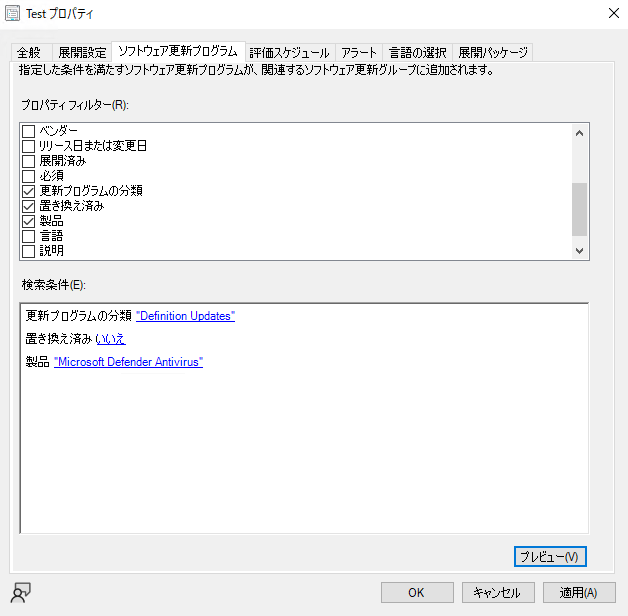
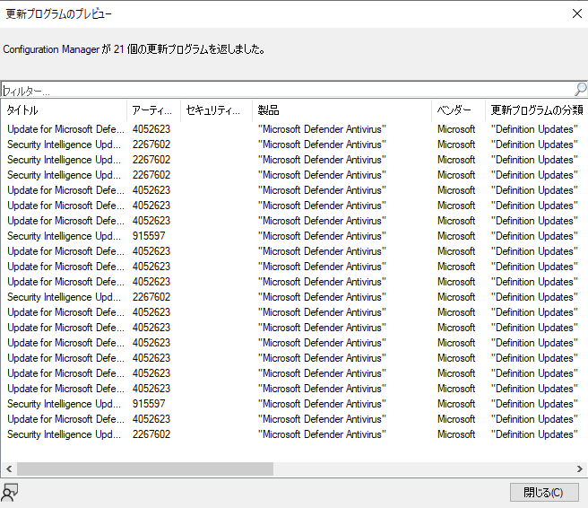

皆様、こんにちは。Configuration Manager / WSUS サポート チームです。

本記事では、Microsoft Configuration Manager (ConfigMgr) の自動展開規則 [ADR] を作成する方法、プロパティ フィルターとプレビュー機能、および規則の実行をサイト サーバーのログで確認する方法をご案内します。

本記事のログ抜粋は、Microsoft Defender Antivirus の定義更新プログラムを対象とした検証環境で取得しました。環境を特定できるサーバー名、共有パス、および識別子は、一貫したプレースホルダーへ置換しています。

配布ポイントへのコンテンツ転送、およびクライアントによる更新プログラムのスキャン、ダウンロード、インストールは、本記事の対象外です。

## 全体の流れ

自動展開規則は、概ね次の順序で処理されます。

1. 自動展開規則を作成し、フィルター規則とプレビュー結果を確認します。
2. 設定した評価スケジュール、または管理者による手動操作を契機に規則を実行します。
3. サイト サーバーの [Rule Engine] がフィルター規則を評価し、対象のソフトウェア更新プログラムを特定します。
4. 必要な更新プログラムのコンテンツを取得し、展開パッケージへ格納します。
5. 評価結果に基づいてソフトウェア更新プログラム グループを作成または更新します。
6. 対象コレクションへの展開を作成または更新し、規則の実行結果を記録します。

## 設定方法

### 自動展開規則の作成手順

自動展開規則を作成する前に、対象とするデバイス コレクションを準備します。新しい展開パッケージを使用する場合は、パッケージ ソースとして使用する共有フォルダーも準備します。

1. [Configuration Manager コンソール] で [ソフトウェア ライブラリ] - [ソフトウェア更新プログラム] - [自動展開規則] を開き、[自動展開規則の作成] を選択します。
2. [全般] で規則名、対象コレクション、および使用するソフトウェア更新プログラム グループを指定します。
3. [展開設定] で展開の種類、Wake on LAN、状態メッセージ、および使用許諾契約の設定を指定します。
4. [ソフトウェア更新プログラム] で、展開対象を選ぶプロパティ フィルターを指定します。
5. [評価スケジュール] で、ソフトウェア更新ポイントの同期後、指定したスケジュール、または自動実行なしのいずれかを指定します。
6. [展開スケジュール] で使用可能時刻とインストール期限を指定します。
7. [ユーザー側の表示と操作]、[アラート]、および [ダウンロードの設定] を運用要件に合わせて指定します。
8. [展開パッケージ] で既存または新規の展開パッケージを指定します。新規作成する場合は、続けて配布ポイントを指定します。
9. [ダウンロード場所] と [言語の選択] を指定します。
10. [概要] で設定を確認し、ウィザードを完了します。

[展開パッケージなし] を選択して作成した自動展開規則は、後から展開パッケージを使用する構成へ変更できません。また、1 回の自動展開規則で扱えるソフトウェア更新プログラムは最大 1,000 件です。フィルター規則は、対象が 1,000 件を超えないように設定してください。

各ページの詳細な画面例については、既存記事の [MECM 自動展開規則 ～使い方シリーズ～](https://jpmem.github.io/blog/mecm/20220706_01/) もあわせて参照してください。

### フィルター規則とプレビュー機能

[ソフトウェア更新プログラム] では、[製品]、[更新プログラムの分類]、[リリース日または変更日]、[必須]、[置き換え済み]、[タイトル] などを使用して、展開対象を絞り込みます。

次の例では、Microsoft Defender Antivirus の置き換えられていない定義更新プログラムを対象としています。



[プレビュー] を選択すると、サイト データベースに現在登録されているソフトウェア更新プログラムのうち、設定したフィルター規則に一致する項目を確認できます。次の検証環境では 21 件が表示されました。



意図しない製品、分類、アーキテクチャ、または古い更新プログラムが表示される場合は、規則を実行する前にフィルターを見直します。

[プレビュー] は、確認した時点で同期済みのメタデータに対する結果です。次回の同期で新しい更新プログラムが追加された場合や、既存の更新プログラムのメタデータが変更された場合は、その後の規則実行で異なる結果になることがあります。

初めて自動展開規則を作成する前に、ソフトウェア更新プログラムの同期を完了してください。同期前後で分類名などの表示が異なる場合、文字列に依存する条件が期待どおりに一致しない可能性があります。また、[タイトル] を使用する条件は、製品名や更新プログラムのタイトル変更による影響を受けるため、実行前に [プレビュー] で結果を確認してください。

## 各ステップとログの追跡方法

### 関連ログ

ログ名 | 保存場所 | 主な用途
--- | --- | ---
[ruleengine.log] | サイト サーバーの ConfigMgr ログ フォルダー | 自動展開規則による更新プログラムの識別、コンテンツのダウンロード、ソフトウェア更新プログラム グループおよび展開の作成を確認します。
[PatchDownloader.log] | 自動展開規則を実行したサイト サーバー | 更新プログラムごとのダウンロード元、進捗、信頼性とハッシュの検証、およびパッケージ ソースへの格納を確認します。

サイト サーバー ログの既定の保存先は C:\Program Files\Microsoft Configuration Manager\Logs です。[PatchDownloader.log] は、サイト サーバーに ConfigMgr クライアントがインストールされている場合、既定では C:\Windows\CCM\Logs に保存されます。

### テスト規則の情報

本記事では、次の規則を 2026 年 9 月 15 日に手動で実行したログを使用します。

項目 | 値
--- | ---
自動展開規則名 | Test
規則 ID | 1
対象製品 | Microsoft Defender Antivirus
更新プログラムの分類 | Definition Updates
置き換え済み | いいえ
評価結果 | 21 件
展開パッケージ ID | <PackageID>

ログがローテーションされると、1 回の実行が [ruleengine.lo_] と [ruleengine.log] に分かれる場合があります。本記事の例でも開始行は [ruleengine.lo_]、完了行は [ruleengine.log] に記録されています。規則名、規則 ID、実行時刻、およびスレッド ID を使用して、ローテーション前後のログを続けて確認します。

### ステップ 1 : 自動展開規則を作成してプレビューする

前述の手順で規則を作成し、[プレビュー] で対象を確認します。この検証では [更新プログラムの分類]、[置き換え済み]、[製品] を指定し、プレビューに 21 件が表示されました。

プレビュー結果は実行前の確認に使用します。実際にどの更新プログラムが選ばれたかは、規則実行後の [ruleengine.log] と、作成または更新されたソフトウェア更新プログラム グループで確認します。

### ステップ 2 : 自動展開規則を実行する

自動展開規則は、[評価スケジュール] で指定した契機に実行されます。管理者が直ちに確認する場合は、[自動展開規則] で対象の規則を選択し、[今すぐ実行] を選択します。

[ruleengine.log] では、規則名と規則 ID を含む [Processing Rule] が記録されていることを確認します。

```text
CRuleHandler: Need to Process 1 rules
CRuleHandler: Processing Rule with ID:1, Name:Test.
```

複数の規則が同じ時間帯に実行される場合は、以降も規則 ID [1] と同じスレッド ID の行を追跡します。

### ステップ 3 : フィルター規則を評価する

[Rule Engine] は規則に設定された条件を使用して、対象のソフトウェア更新プログラムを特定します。

今回のログでは、後続の処理で現在の評価結果が 21 件であることを確認できます。前回の評価結果は 19 件であったため、既存の展開が現在の評価結果と異なることも記録されています。

```text
21 of 21 updates are downloaded and will be added to the Deployment.
Updates Count in Old Deployment (19) is different from Current Rule Evaluation (21). Deployment is not current.
```

[プレビュー] の 21 件と現在の規則評価の 21 件が一致しています。ただし、常に一致することを保証するものではありません。プレビュー後に同期やメタデータの変更があった場合は、規則実行時点の評価結果を正としてください。

### ステップ 4 : 更新プログラムのコンテンツを取得する

[ruleengine.log] では、展開パッケージに存在するコンテンツはスキップされ、新たに必要なコンテンツは Content ID 単位でダウンロードされます。

```text
Contents <ExistingContentID> is already present in the package "<PackageID>". Skipping download.
Downloading content with ID 372436 in the package, srctype = 1
Successfully downloaded the update content with ID 372436 from internet.
```

Content ID [372436] の詳細は、同じ時刻の [PatchDownloader.log] で確認できます。

```text
Download destination = \\<SiteServer>\<PackageSource>\<TemporaryFolder>\<FileName> .
Contentsource = http://download.windowsupdate.com/.../<FileName> .
Downloading content for ContentID = 372436, FileName = <FileName>.
Download http://download.windowsupdate.com/.../<FileName> in progress: 95 percent complete
Download http://download.windowsupdate.com/.../<FileName> to C:\Windows\TEMP\<TemporaryFile> returns 0
Verifying file trust C:\Windows\TEMP\<TemporaryFile>
File trust C:\Windows\TEMP\<TemporaryFile> verified:
Verifying file hash C:\Windows\TEMP\<TemporaryFile>
File hash verified: C:\Windows\TEMP\<TemporaryFile>
Successfully moved C:\Windows\TEMP\<TemporaryFile> to \\<SiteServer>\<PackageSource>\<TemporaryFolder>\<FileName>
```

[returns 0]、[File trust ... verified]、[File hash verified]、および最後の [Successfully moved] を確認できれば、対象ファイルの取得、検証、およびパッケージ ソースへの格納まで完了しています。

コンテンツ取得の詳細と、配布ポイントへ配置されるまでの確認方法については、[ソフトウェア更新プログラムのコンテンツのダウンロードについての動作説明](https://jpmem.github.io/blog/mecm/20260812_03/) を参照してください。

### ステップ 5 : ソフトウェア更新プログラム グループを更新する

コンテンツの処理が完了すると、[ruleengine.log] にソフトウェア更新プログラム グループの処理が記録されます。

```text
Updating package "<PackageID>" now...
Download action completed for the AutoDeployment
Creating Software Update Group for ADR
21 of 21 updates are downloaded and will be added to the Deployment.
```

既存のソフトウェア更新プログラム グループを使用する規則では、現在のフィルター規則に一致した更新プログラムでグループが更新されます。実行後に [ソフトウェア更新プログラム グループ] を開き、メンバーが意図した更新プログラムであることも確認してください。

### ステップ 6 : 展開を更新して規則を完了する

ソフトウェア更新プログラム グループの処理後、評価結果に含まれる更新プログラムが展開へ追加されます。ログが長くなるため、次の抜粋では途中を省略しています。

```text
Associated Update Group ID found as: <UpdateGroupID>
Associated Deployment ID found as: <DeploymentID>
Added CI with CI_UniqueID=<CIUniqueID>, CI_ID=<CIID> to the deployment
...
CRuleHandler: Rule 1 Successfully Applied!
Rule result is: 1
Updated Success Information for Rule: 1
```

[Rule 1 Successfully Applied!] と [Updated Success Information for Rule: 1] まで確認できれば、規則 ID [1] の処理は成功として記録されています。[Configuration Manager コンソール] でも、対象規則の [最終規則評価]、[最後のエラー コード]、および [最後のエラーの説明] を確認してください。

今回のログには、展開作成中に [Failed to load additional properties xml doc] も記録されていますが、その後に 21 件の追加、[Rule 1 Successfully Applied!]、および成功情報の更新まで続いています。エラーを示す語を含む 1 行だけで成否を判断せず、同じ規則 ID の最終結果まで確認してください。

規則の成功後も展開パッケージの配布、クライアント ポリシーの受信、および更新プログラムのインストールは別の処理として続きます。自動展開規則の成功は、クライアントへのインストール完了を意味しません。

## ログ確認のポイント

- 最初に規則名と規則 ID を特定し、同じ実行時刻とスレッド ID の行を追跡します。
- [プレビュー] の件数と [Current Rule Evaluation] の件数を比較します。
- コンテンツ取得は [ruleengine.log] と [PatchDownloader.log] の Content ID および時刻で関連付けます。
- [Skipping download] は、対象コンテンツが既に展開パッケージに存在するため、取得を省略したことを示します。
- 最終的な成否は、単独の警告または失敗行ではなく、同じ規則 ID の [Successfully Applied] と成功情報の更新まで確認して判断します。
- 規則実行後は、ソフトウェア更新プログラム グループのメンバー、展開先コレクション、および展開スケジュールが意図した設定であることをコンソールでも確認します。

## 参考リンク

- [ソフトウェア更新プログラムを自動的に展開する](https://learn.microsoft.com/ja-jp/intune/configmgr/sum/deploy-use/automatically-deploy-software-updates)
- [Configuration Manager のログ ファイル リファレンス](https://learn.microsoft.com/ja-jp/intune/configmgr/core/plan-design/hierarchy/log-files)
- [Configuration Manager のログ ファイルについて](https://learn.microsoft.com/ja-jp/intune/configmgr/core/plan-design/hierarchy/about-log-files)
- [ソフトウェア更新プログラムのダウンロード](https://learn.microsoft.com/ja-jp/intune/configmgr/sum/deploy-use/download-software-updates)
- [Configuration Manager のインターネット アクセス要件 - ソフトウェア更新プログラム](https://learn.microsoft.com/ja-jp/intune/configmgr/core/plan-design/network/internet-endpoints#software-updates)
- [MECM 自動展開規則 ～使い方シリーズ～](https://jpmem.github.io/blog/mecm/20220706_01/)
- [ソフトウェア更新プログラムのコンテンツのダウンロードについての動作説明](https://jpmem.github.io/blog/mecm/20260812_03/)