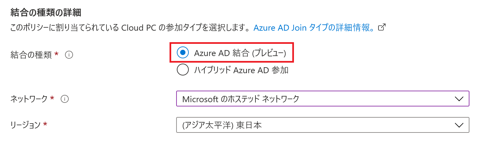
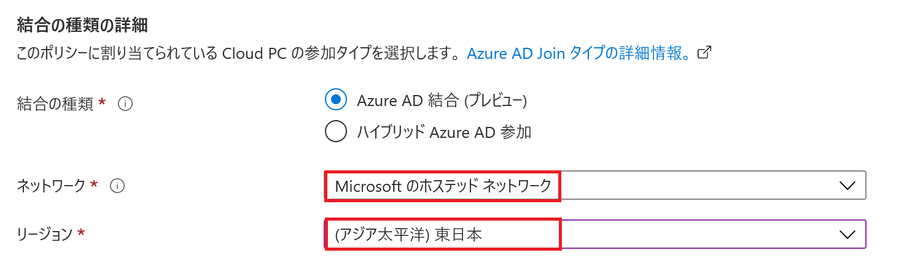
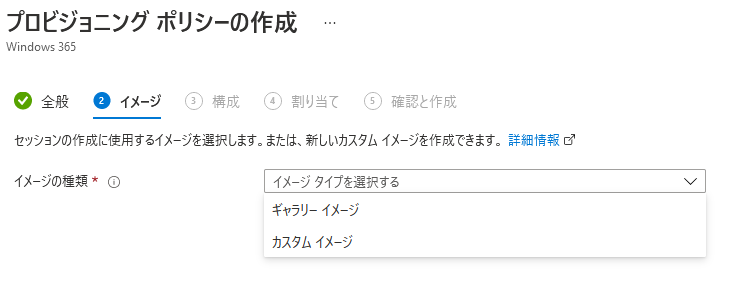
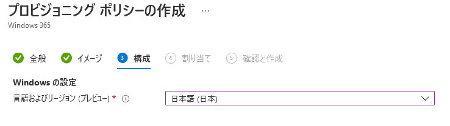
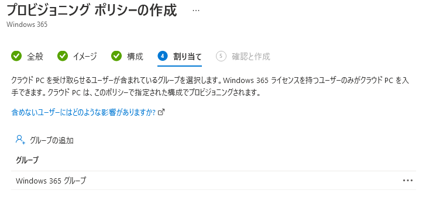
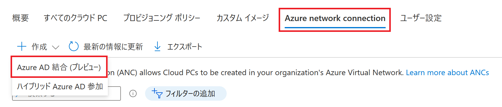

みなさま、こんにちは。Microsoft Endpoint Manager サポート チームです。
本日は、Azure AD 結合 によるプロビジョニングポリシーの作成方法についてご案内します。

本機能はまだパブリックプレビュー段階ですが、弊社環境では動作確認済みです。
また、Windows 365 Enterprise 環境でのみ使用可能でございます。

## 免責事項  

下記内容は 2022/3/28 時点での内容についての記載となっております。
今後内容が更新されることもございますので、その点ご承知置きくださいますようお願い致します。

## Azure AD 結合 について
従来の Windows 365 Enterprise では、Hybrid Azure AD Join の環境が前提だったため、オンプレミスの環境が必要でした。
また、Azure 上に作成した仮想ネットワークとオンプレミスを接続しなければならないため、Windows 365 Enterprise を使用するまでに環境の構築が必要でしたが、Azure AD 結合の Microsoft のホステッド ネットワーク を使用することで、オンプレミス環境や Azure の仮想ネットワークなしで Windows 365 Enterprise を使えるようになりました。

## 設定手順 
以下の順番で設定を行うことで、Microsoft のホステッド ネットワークを使用してプロビジョニングポリシーを作成し、クラウド PC を使用することができます。  

1. グローバル管理者などの権限を持つアカウントで Microsoft Endpoint Manager admin center にログインします。
https://endpoint.microsoft.com
  

2. [デバイス] - [Windows 365] - [プロビジョニングポリシー] と辿り、[ポリシーの作成] を選択します。  

3. [統合の種類] で [Azure AD 結合（プレビュー）] にチェックを入れます。

4. [ネットワーク] で [Microsoft のホステッド ネットワーク] を選択し、任意でリージョンを選択して次へ進みます。

※ 組み込みのネットワークと Azure network connection の違いについては後述いたします。
  
  

5. ギャラリーイメージかカスタムイメージを選択し、次へ進みます。
  

6. 言語を選択し、次へ進みます。

7. 本プロビジョニングポリシーを適用させたいグループを選択し、次へ進みます。

8. [作成] を選択し、プロビジョニングポリシーを作成します。

9. プロビジョニングが開始されますので、クラウド PC が作成されるまで待ちます。
  

## 組み込みのネットワークと Azure network connection（旧名：オンプレミスのネットワーク接続） の違いについて
それぞれ以下の違いがあります。

####a. 組み込みのネットワーク
Windows 365 Business のように Microsoft でホストされる仮想ネットワークに Cloud PC がデプロイされます。そのため、事前に Azure 上に仮想ネットワークを用意する必要がありません。また、オンプレミス環境も必要ないため、すぐに使用可能です。
社内ネットワークに接続させたくない場合等にもおすすめです。
  

####b. Azure network connection（旧名：オンプレミスのネットワーク接続
Azure 上の仮想ネットワークを使用することができるため、カスタマイズされたネットワークを使用することが出来ます。
[Azure network connection] - [Azure AD 結合（プレビュー）] から新規作成します。

以上、Azure AD 結合 によるプロビジョニングポリシーの作成方法について参考になりましたら幸いです。
