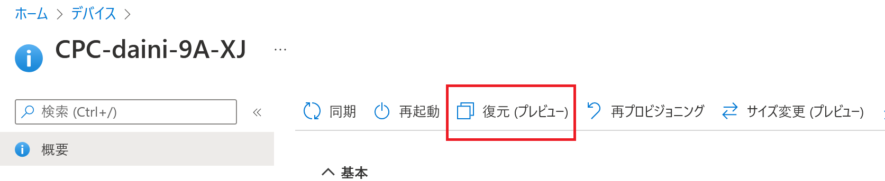
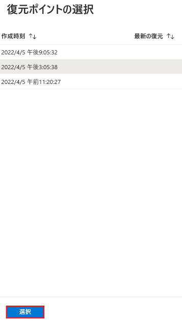
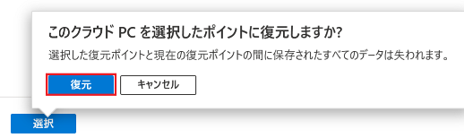
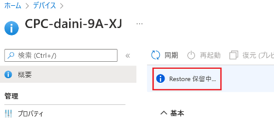
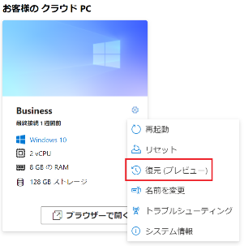
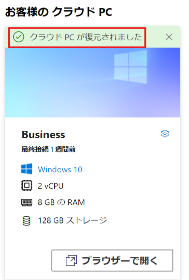

みなさま、こんにちは。Microsoft Endpoint Manager サポート チームです。
本日は、クラウド PC を以前の状態に復元する方法についてご案内します。

2022 年 3 月より、Windows 365 Enterprise / Business ともに特定の時点に復元することができるようになりました。本機能はまだパブリック プレビュー段階ですが、その使用方法をご紹介いたします。

## 免責事項

下記内容は 2022/4/6 時点での内容についての記載となっております。
今後内容が更新されることもございますので、その点ご承知置きくださいますようお願い致します。

## Windows 365 Enterprise 環境のクラウド PC を以前の状態に復元

1. グローバル管理者などの権限を持つアカウントで Microsoft Endpoint Manager admin center (https://aka.ms/memac) にログインします。
2. [デバイス] - [Windows 365] - [すべてのクラウド PC] と辿り、特定の地点に復元したいクラウド PC を選択します。
3. 画面上部の [復元（プレビュー）] を選択します。
  
4. 復元したい地点の日時を選択し、画面下部の [選択] を選択します。
  
5. 以下の画面が表示されるので、[復元] を選択します。  
  
6. [Restore 保留中...] と表示されるので、復元されるまで待ちます。  
  
7. [Restore 完了] と表示されたら（弊社環境では約 15 分ほどで完了しました）、クラウド PC にサインインし、選択した日時の状態に復元していることを確認します。
  

■ 補足事項
Windows 365 Enterprise ではユーザーによる復元を許可するか否かと復元ポイントの更新頻度を設定することが可能です。設定箇所は以下です。

1. グローバル管理者などの権限を持つアカウントで Microsoft Endpoint Manager admin center (https://aka.ms/memac) にログインします。
2. [デバイス] - [Windows 365] - [ユーザー設定] と辿り、[追加] を選択します。
3. [名前] を入力し、ユーザーによる復元を許可する場合は [ユーザーによる復元サービスの開始を許可する] にチェックを入れます。
4. [復元ポイント サービスの頻度] からプルダウンメニューで復元ポイントの更新頻度を選択し、[次へ] を選択します。
5. 割り当てるグループを選択し、[次へ] を選択します。
6. [作成] を選択し、ユーザー設定を完了させます。

参考公開情報
Title : 単一のクラウド PC を以前の状態に復元する  
URL : https://docs.microsoft.com/ja-jp/windows-365/enterprise/restore-single-cloud-pc

## Windows 365 Business 環境のクラウド PC を以前の状態に復元

Business は Microsoft Endpoint Manager admin center からの復元はできませんが、以下の手順で復元することが可能です。

1. Windows 365 Business のライセンスを持ったユーザーで以下の URL にサインインします。  
https://windows365.microsoft.com/
2. 歯車アイコンから、[復元（プレビュー）] を選択します。  

3. [はい、この クラウド PC を復元します。] にチェックを入れ、復元したい日時を選択して [復元] を選択します。  
   

4. 数十分待ち、[クラウド PC が復元されました] と表示されたら復元成功です（弊社環境では約 15 分ほどで完了しました）。クラウド PC にサインインし、選択した日時の状態に復元していることを確認します。  
   

■ 補足事項
2022/4/6 時点では、Windows 365 Business は復元ポイントの更新頻度が 12 時間で固定されています。

参考公開情報
Title : Windows 365 Business (プレビュー) の特定の時点への復元  
URL : https://docs.microsoft.com/ja-jp/windows-365/business/restore-overview

以上、クラウド PC を以前の状態に復元する方法について参考になりましたら幸いです。
