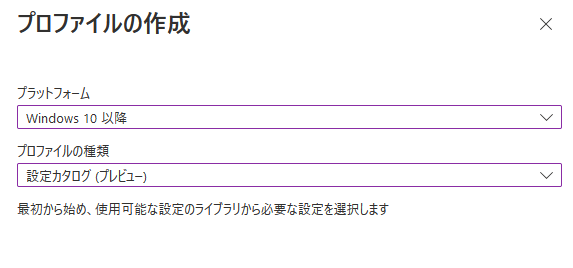
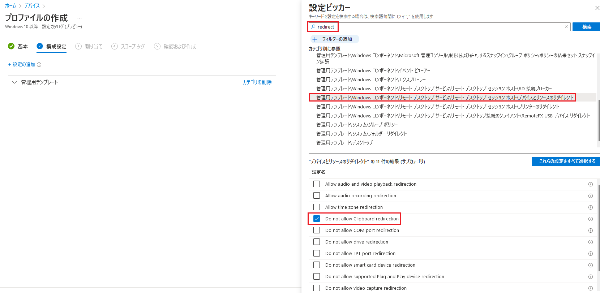
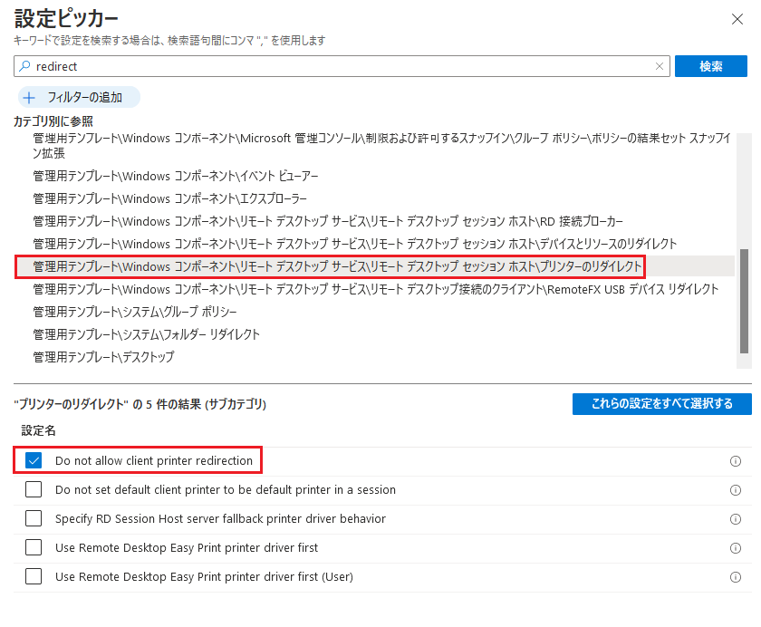

みなさま、こんにちは。Microsoft Endpoint Manager サポート チームです。
本日は、接続元の PC からクラウド PC へのクリップボードやファイルのコピーなどのリダイレクトを禁止する方法についてご紹介します。
今回は Intune の構成プロファイルを使用した方法をご案内いたしますが、この方法を使用すると iOS や Android OS など、Windows 以外のデバイスからのリダイレクトも禁止することが可能です。

## 免責事項

下記内容は 2022/4/12 時点での内容についての記載となっております。
今後内容が更新されることもございますので、その点ご承知置きくださいますようお願い致します。

## 構成プロファイルの作成方法

1. グローバル管理者などの権限を持つアカウントで Microsoft Endpoint Manager admin center (https://aka.ms/memac) にログインします。
2. [デバイス] - [構成プロファイル] と辿り、[プロファイルの作成] を選択します。
3. 以下のように選択し、[作成] を選択します。  
プラットフォーム：Windows 10 以降
プロファイルの種類：設定カタログ（プレビュー）  
  
  
4. [名前] を入力し、[次へ] を選択します。  
  
  
5. [設定の追加] を選択し、"redirect" と入力して [検索] を選択します。
  
6. 表示された検索結果から、[管理用テンプレート\Windows コンポーネント\リモート デスクトップ サービス\リモート デスクトップ セッション ホスト\デバイスとリソースのリダイレクト] を選択し、必要な項目にチェックを入れて [次へ] を選択します。  
  
  
■補足事項
プリンターのリダイレクトを禁止したい場合は [管理用テンプレート\Windows コンポーネント\リモート デスクトップ サービス\リモート デスクトップ セッション ホスト\プリンターのリダイレクト] から [Do not allow client printer redirection] を選択します。  
  

7. 割り当てるグループを選択し、[次へ] を選択します。
8. 必要に応じて スコープ タグ を設定し、 [次へ] を選択します。
9. [作成] を選択し、構成プロファイルの作成を完了させます。
10. 接続元 PC から文字やファイルなどをコピーし、クラウド PC で貼り付けができないことを確認します。

参考公開情報  
Title : クラウド PC の RDP デバイス リダイレクトを管理します  
URL : https://docs.microsoft.com/ja-jp/windows-365/enterprise/manage-rdp-device-redirections
  
以上、クラウド PC へのクリップボードやファイルのコピーなどのリダイレクトを禁止する方法について参考になりましたら幸いです。