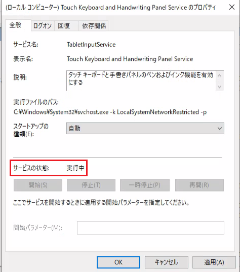

みなさま、こんにちは。Microsoft Endpoint Manager サポート チームです。
本日は、Windows 365 のクラウド PC で、日本語入力ができない場合のチェック項目ついてご紹介します。  
言語を日本語にしているにも関わらず、メモ帳や Edge の検索欄に英語しか入力ができない際にご確認いただければ幸いです。  
  

## 免責事項

下記内容は 2022/5/13 時点での内容についての記載となっております。
今後内容が更新されることもございますので、その点ご承知置きくださいますようお願い致します。

### A. 言語が日本語になっているか  
そもそも言語とキーボードの設定が日本語になっているか確認します。  
  
1. スタートメニューから [設定] を選択し、[時刻と言語] を選択します。  
2. [言語] を選択し、Windows の表示言語が日本語になっているか確認します。  
3. [優先する言語] 欄から日本語を選択し、[オプション] を選択します。  
  
  
4. [ハードウェア キーボード レイアウト] が "日本語キーボード（106/109 キー）" になっているか確認します。 "英語キーボード（101/102 キー）" になっている場合は日本語に変更し、再起動を実施します。  
  
  
5. 再起動後、メモ帳などで日本語が入力できるか確認します。  
  
### B. 代替キーボード レイアウトが有効化になっているか  
こちらはブラウザーからアクセスしている場合にチェックする項目です。そのため、リモート デスクトップ接続している場合は後述の [C. Touch Keyboard and Handwriting Panel Service が有効になっているか] の項目をご確認ください。  

1. 画面右上の歯車マークから [セッション中] を選択します。  
  
  
2. [代替キーボード レイアウトの有効化] を有効にし、[リモート キーボード レイアウトの選択] を "日本語キーボード（106/109 キー）" に設定し、Update を選択します。
  
  
3. 一度セッションを切断する必要があるので、[現在] を選択した状態で Continue を選択します。  
  
  
4. クラウド PC に再接続後、日本語が入力できるか確認します。    

### C. Touch Keyboard and Handwriting Panel Service が有効になっているか  
Touch Keyboard and Handwriting Panel Service は日本語入力をはじめとして、様々な入力機能に使われているサービスです。このサービスが無効化されているとそれらの機能が正しく動作できません。  
以下の手順で Touch Keyboard and Handwriting Panel Service が有効になっているかご確認いただき、無効になっている場合は有効としていただくようお願いいたします。  

1. スタートボタンを右クリックし、[ファイル名を指定して実行] を選択します。  
2. services.msc と入力し、[OK] を選択します。  
3. Touch Keyboard and Handwriting Panel Service をダブルクリックします。  
4. [スタートアップの種類] が [無効] になっていれば、[自動] または [手動] に変更し、[OK] を選択します。  
5. クラウド PC を再起動し、Touch Keyboard and Handwriting Panel Service が実行中となっていることを確認します。  
  
    
6. メモ帳などで日本語が入力できるか確認します。  

以上、日本語入力ができない場合のチェック項目ついてご紹介させていただきましたので、参考になれば幸いです。