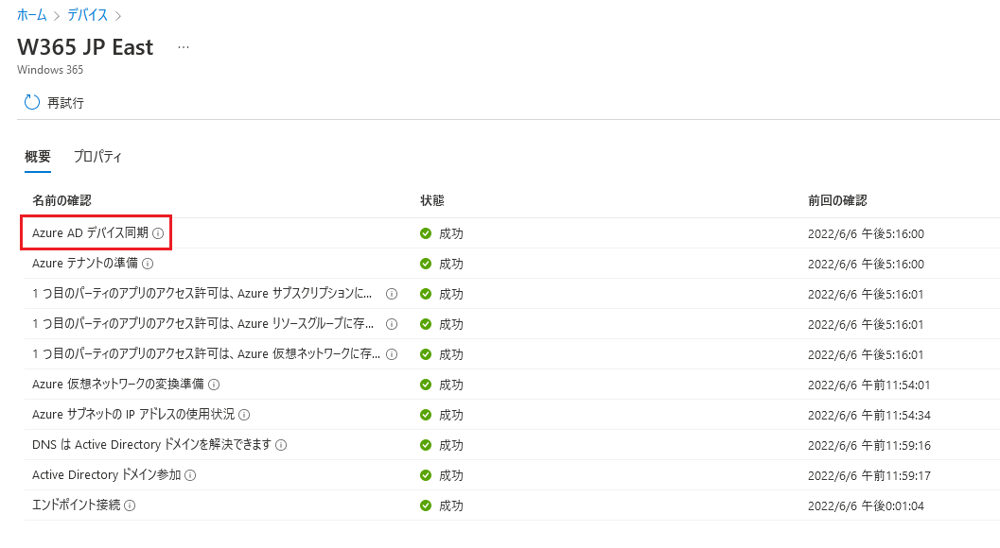

みなさま、こんにちは。Microsoft Endpoint Manager サポート 山田です。
本日は、Windows 365 Enterprise 環境で、Azure ネットワーク接続 (ANC) のチェック時に Azure AD デバイス同期の項目でエラーが発生する際に確認するポイントについてご紹介します。  

## 免責事項

下記内容は 2022/6/6 時点での内容についての記載となっております。
今後内容が更新されることもございますので、その点ご承知置きくださいますようお願い致します。  
  
### Azure AD デバイス同期とは  
ANC チェック時の一番上の項目です。  

  
  
上記項目でエラーが発生する際に見るべき点について以下にご紹介いたします。  

#### 1. ANC の [AD ドメイン] が正しく構成されているか  

a. グローバル管理者などの権限を持つアカウントで Microsoft Endpoint Manager admin center (https://aka.ms/memac) にログインします。  
b. [デバイス] - [Windows 365] - [Azure ネットワーク接続] と辿り、使用している ANC を選択します。  
c. [プロパティ] を開き、[AD ドメイン] の右にある [編集] を選択します。  
d. 以下の各項目を入力していきます。  
  
AD DNS ドメイン名：contoso.com のような形式でドメイン名を入力します。  
組織単位：クラウド PC のコンピューターオブジェクトが生成される OU を指定します。  

■例  
OU=CloudPC,DC=contoso,DC=com  

AD ユーザー名 UPN：ドメイン参加を実行し、コンピューターオブジェクトの書き込み権限がある UPN を指定します。  
  
■例
windows365@contoso.com  

AD ドメインのパスワード：上記 UPN のパスワードを入力します。  
AD ドメインのパスワードの確認：同じパスワードを入力します。  
  
e. [次へ] を選択し、ANC のチェックがすべて成功することを確認します。  
  
#### 2. 仮想ネットワークの DNS サーバー指定について  
以下の手順で、ご使用いただいている仮想ネットワークの DNS サーバーが、オンプレミスの DNS サーバーを指定しているか確認します。  

a. Azure Portal（https://portal.azure.com）から、Windows 365 Enterprise で使用する仮想ネットワークを開きます。  
b. [概要] 内にある [DNS サーバー] がオンプレミスの DNS サーバーの IP アドレスが入力されているか確認します。  
  
#### 3. ネットワーク要件について  
ご使用いただいている仮想ネットワークが VPN や Proxy などを使用している場合、ネットワーク構成を見直す必要がございます。  
具体的には、仮想ネットワークから以下の公開情報に記載されているエンドポイント URL に直接アクセスできるように構成していただき、再度 ANC チェックに成功するかご確認ください。  
  
[ネットワーク要件](https://docs.microsoft.com/ja-jp/windows-365/enterprise/requirements-network#allow-network-connectivity)  
  

以上、Azure AD デバイス同期時のエラー解消の参考になれば幸いです。