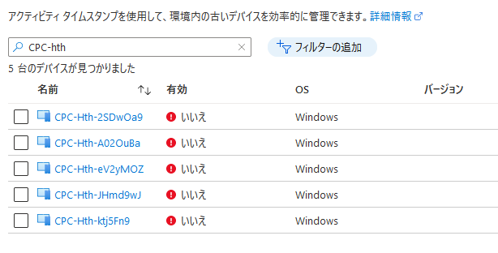

みなさま、こんにちは。Microsoft Endpoint Manager サポート 山田です。
本日は、Windows 365 Enterprise 環境を使用している際に見かける、Azure Active Directory 上の CPC-hth から始まるデバイス オブジェクトについてご紹介します。  

## 免責事項 

下記内容は 2022/6/16 時点での内容についての記載となっております。  
今後内容が更新されることもございますので、その点ご承知置きくださいますようお願い致します。  
  
### CPC-hth とは  
Windows 365 Enterprise で使用しているテナントの Azure Active Directory を開き、[すべてのデバイス] を見ると、以下のように CPC-hth から始まるデバイス オブジェクトが存在します。  

  

CPC-hth は Azure ネットワーク接続 (ANC) のチェックを行う際に、ドメイン参加を試みるために自動で生成されるデバイス オブジェクトです。  
ANC は内部的に 6 時間に 1 回の頻度で行われ、CPC-hth から始まるデバイス オブジェクトを削除しても、チェックのタイミングで再生成されますが、ANC のチェック毎に CPC-hth のデバイス オブジェクトが増え続けることはございませんので、ご安心ください。  
  
■補足事項  
オンプレミスの [Active Directory ユーザーとコンピューター] にも CPC-hth が存在することとなりますが、ANC のプロパティより以下の [組織単位] で指定した OU に CPC-hth のデバイス オブジェクトが生成されます。  
  
  
  
以上、CPC-hth から始まるデバイス オブジェクトについて、参考になれば幸いです。