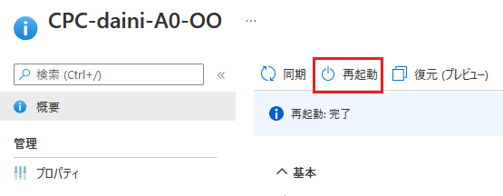
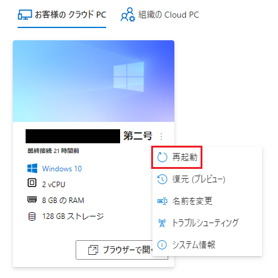
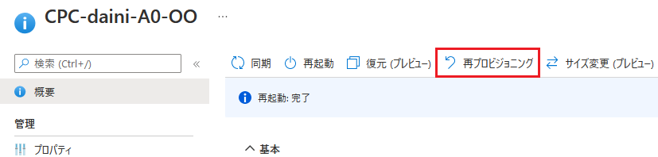
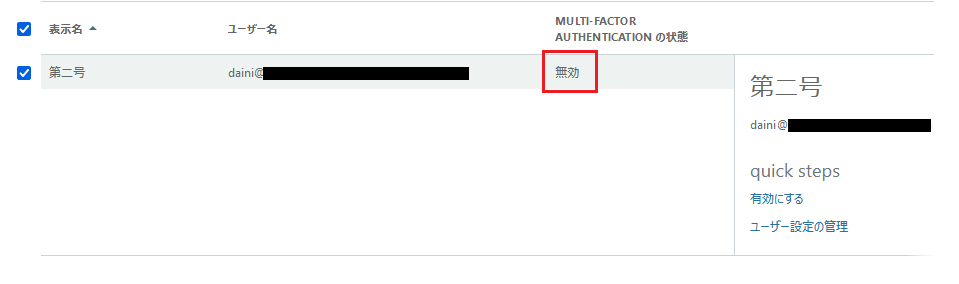

みなさま、こんにちは。Microsoft Endpoint Manager サポート 山田 です。
本日は、ブラウザ経由やリモート デスクトップ アプリからクラウド PC に接続ができない場合の対処方法をいくつかご紹介させていただきます。

## 免責事項 

下記内容は 2022/8/9 時点での内容についての記載となっております。  
今後内容が更新されることもございますので、その点ご承知置きくださいますようお願い致します。  
  
### 1. 再起動を実施  
以下の画面からクラウド PC を再起動することにより、接続が行なえるようになる可能性がございますので、お試しください。  
  
■Microsoft Endpoint Manager から  
  
  
  
■Windows 365 ポータル画面から  
  
  
  
  
### 2. 再プロビジョニングを実施  
再起動で改善がない場合、クラウド PC を再プロビジョニングすることにより、接続が行なえるようになる可能性がございますので、お試しください。  
  
■Microsoft Endpoint Manager から  
  
  
  
### 3. 多要素認証の設定について   
Microsoft 管理センターで多要素認証が有効になっている場合、クラウド PC への接続に失敗するため、以下をご確認ください。  
  
1. Microsoft 管理センターにサインインします。  
https://admin.microsoft.com/Adminportal/Home  
  
2. [設定] - [組織設定] を選択し、[多要素認証] - [多要素認証を構成する] を選択します。  
3. 表示された画面で、該当のユーザーの MULTI-FACTOR AUTHENTICATION の状態を確認します。  
4. [有効] になっている場合は、[無効] に設定の上、クラウド PC に接続できるか確認します。  
  
  
  
上記 3 点を実施後もクラウド PC への接続ができない場合、調査が必要でございますので、弊社サポートへのお問い合わせをご検討いただけますと幸いです。