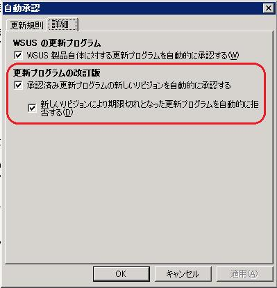
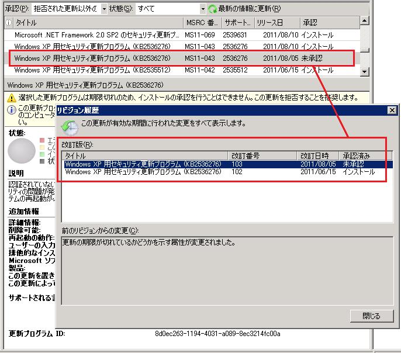
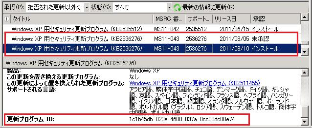

# 「リビジョン（改訂版）」について
みなさま、こんにちは。 WSUS サポート チームです。  
本日は WSUS の「リビジョン」と、関連オプションのご紹介をします。

WSUS の [オプション]- [自動承認] の [詳細] タブに、下記オプションがあります。

更新プログラムの改訂版
- [承認済み更新プログラムの新しいリビジョンを自動的に承認する]
  - [新しいリビジョンにより期限切れとなった更新プログラムを自動的に拒否する]

弊社では、上記オプションをどちらも既定値「オン」でお使いになるようお奨めをしていますが、その理由についてご説明をします。

# リビジョンとは？
WSUS 上の「リビジョン」（改訂版）とは、更新プログラムのインストーラー本体 (バイナリ) を指す言葉ではありません。

判りづらい用語で恐縮なのですが、「リビジョン」は、実は、更新プログラムの "メタデータ" --- つまり **WSUS サーバー / クライアントが配信処理に使用する管理情報**のことを指しています。具体的には、管理コンソールに表示されるタイトルや属性、検出ロジックなど、更新プログラムを配布するために必要な情報の集合体です。

ほとんどの更新プログラムは「リビジョン」を最初の１バージョンしか持ちません。しかし、たとえばリリース後にタイトルを修正するような場合は、修正内容を含む新しい「リビジョン」が WSUS へリリースされますので、そうした更新プログラムは、複数の「リビジョン」を持ちます。

また、更新プログラムのリリース後に見つかった問題などに対応するため公開を停止する場合も、「リビジョン」を更新する方法をとります。この場合は「期限切れ」という管理情報を含む新しい「リビジョン」が WSUS 向けにリリースされます。

「リビジョン」とはこのように、更新プログラム自体ではなく、配信管理情報を適切な内容に更新するものです。新しいリビジョンを受け入れるにあたって、何か追加の検証作業が必要となるといったものではありません。新しい「リビジョン」が WSUS に着信したら、すぐその情報を使用いただくことをお奨めします。

この理由から、上述のオプションは既定値「オン」のままにすることをお奨めしています。

# 「オフ」にした場合の影響
ところで、更新プログラムが「期限切れ」になる理由は、主に (1) 世代交代 または (2) 不具合 です。どちらも 一般にはWSUS からクライアントへの配信を停止することが望ましい状況です。

しかしながら、上述オプションが「オフ」ですと、「期限切れ」フラグを含むリビジョンが WSUS に着信しても、その情報が参照されません。もし、既にインストール承認が設定されていれば、クライアントへの配信が続きます。(一覧上は「未承認」と見えますが、「リビジョン履歴」画面を開くと、古いリビジョンがインストール承認されたままであることがわかります --- 下図参照)　 そのため、「期限切れ」になった更新プログラムは、手動で個別に配信を停止する必要があります。

こうした管理工数を省き、自動的に配信を停止するためにも、上述オプションは「オン」をお奨めしています。

(「期限切れ」になっていても、クライアントへの配信が継続されている状態)  

# バイナリ修正の場合は？
ところで、メタデータではなく、更新プログラムそれ自体、つまりバイナリの修正が発生した場合はどういうことになるでしょうか。

この場合は、全く新しい更新プログラムとして新バージョンが作成されます。これを弊社では**再リリース**と呼ぶことがあります。

新バージョンも、タイトルや KB 番号などは以前の内容を踏襲しますので、WSUS コンソールの表示上は、旧バージョンとほぼ同じです。しかしながら WSUS が更新プログラムを一意に識別するキー：“更新プログラムID”  は、新しい値が付けられているため、WSUS はこれを「新規の更新プログラム」として扱います。WSUS サーバーおよびクライアント側の振舞いも、新規の更新プログラムとなります。お客様環境における検証作業や承認設定などの運用は、一般の新規リリースと同じようにお取り扱いください。

下記画面は、再リリースのケースです。同タイトルが新・旧、2件並んでいて同じように見えますが、ID が違います。

(旧)

(新)

 なお、「再リリース」を行う場合は、それとほぼ同時に、旧バージョンの更新プログラムに対して、上述の「期限切れ」情報を設定するケースが多いです。古い更新プログラムを「期限切れ」と設定し新しい更新プログラムを「再リリース」することで、WSUS に配信する更新プログラムの新旧置換を行っています。