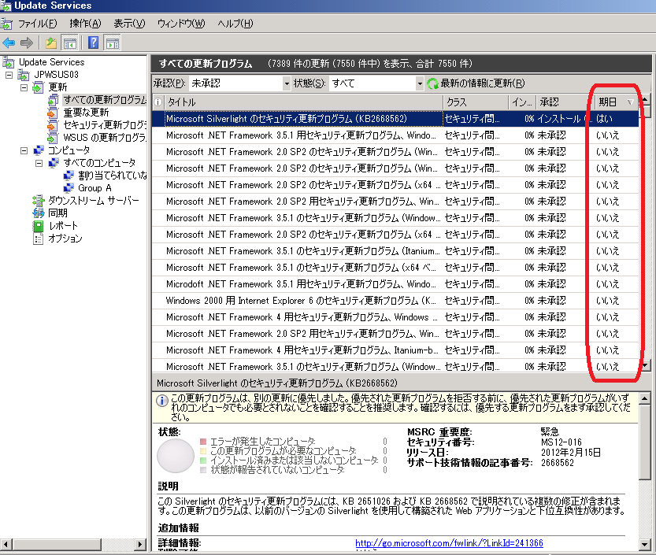

# WSUS 管理コンソールの表示カスタマイズ - 更新ビュー
こんにちは。WSUS サポート チームです。

WSUS 管理コンソールより更新プログラムの情報を確認する際に、便利な Tips をご紹介します。  
管理画面左のツリーから更新のビューをクリックすると、既定では更新プログラムのタイトル、クラス、承認などの情報が表示されます。  
ここで行見出しを右クリックすることで、表示する列を変更することができます。

例えば下記のような使い方を WSUS サポート担当ではしています。  
WSUS 管理者のみなさま、日々の運用に役立てていただけましたら幸いです。

## A. MSRC 番号でソート
セキュリティ更新プログラムをリリース順に並び替えることができます。

## B. 期日でソート
インストール期日の設定された更新プログラムは "はい" と表示されます。

## C. サポート技術情報の記事でソート
少々わかりにくい表現なのですが、更新プログラムに割り振られた KB 番号でソートされます。  
更新プログラムの情報を見たい KB 番号がわかっていれば検索する方法もあるのですが、ざっと並べて見たい場合に便利です。

