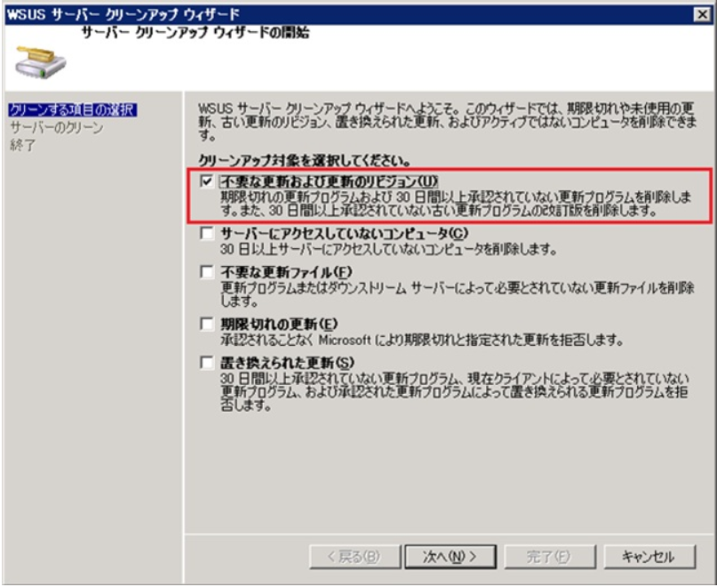

# レプリカ構成では サーバー クリーンアップ ウィザード にご注意ください

みなさま、こんにちは。WSUS サポート チームです。

サーバー クリーンアップ ウィザードは、不要なデータを整理・削除するためにお使いいただく機能ですが、WSUS サーバーをレプリカ構成 (※) されている環境では、実施上の注意点がありますのでご紹介します。

(※) 階層構成でも、レプリカに設定していない場合は、心配ありません。

クリーンアップ ウィザードの最初の項目「不要な更新および更新のリビジョン」は、必ず下位側のサーバー (レプリカ サーバー) で先に実行し、上位側 (マスター サーバー) はその後で実行するようお願いします。

この逆順、つまり上位側を先に実行すると、期限切れで不要となった古い更新プログラムの情報が、下位サーバー側に「未承認」の状態で残ってしまう場合があります。下位サーバー側に残ったレコードは、再度クリーンアップを実施しても削除されません。( その時点から 30 日を経過した後でクリーンアップを実行すると、ようやく削除されます )

もし Windows Defender の定義ファイルを WSUS から配布している場合は、上位サーバーでのみクリーンアップを行うと、下位サーバーに残った多量のレコードが、一気にクライアントの処理負荷を増やす場合がありますので、特にご注意ください。

なお、上記「不要な更新および更新のリビジョン」以外の項目は上位のサーバーから実行する必要があるため、ご留意ください。

設定箇所：

