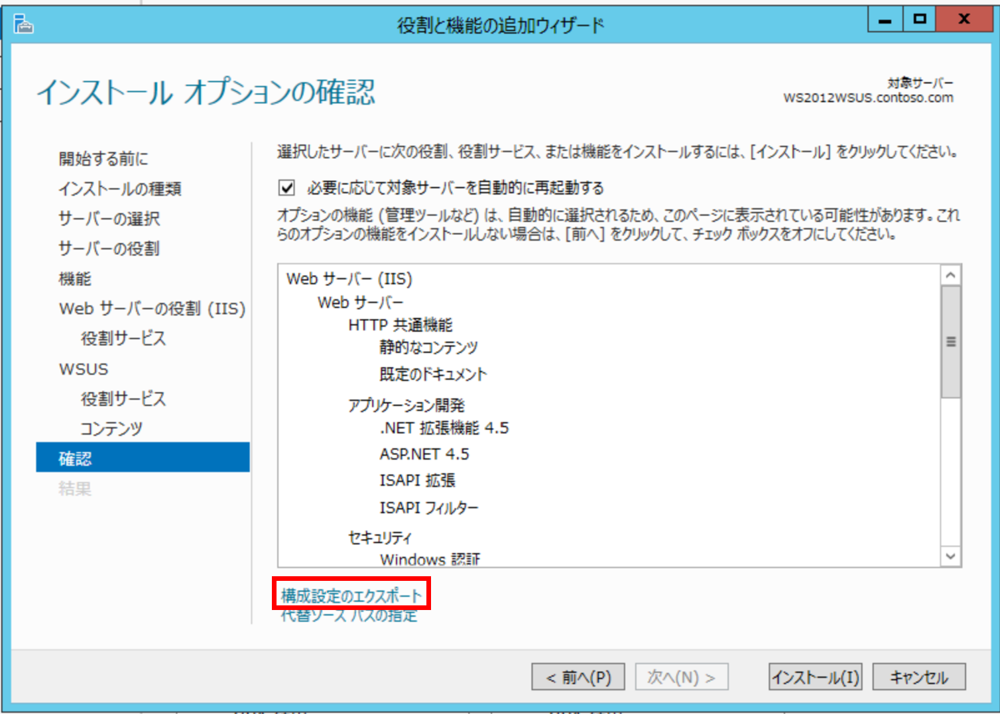

# Windows Server 2012 にて WSUS のインストールに失敗する事象について
皆さま こんにちは。 WSUS サポートチームです。

Windows Server 2012 にて、WSUS サーバーを構築中のお客様より、「 Windows Server 2012 で 役割と機能の追加ウィザードを利用し、WSUS サーバーをインストールした際、インストール後の初期構成タスクに失敗する。」 というお問い合わせをいただくことがあります。  

以下の公開情報にて、WSUS サーバーのインストール方法について、3 点の回避策を公開しております。同様の事象が発生した場合には、トラブルの対処にお役立てください。  

**回避策1.** PowerShell を利用した WSUS サーバーのサイレント インストールを実行する。  
**回避策2.** 構成ファイルを手動で編集する。  
**回避策3.** WSUS 管理コンソールを起動して、初期構成タスクを完了する。  
**－ Windows Server 2012 で WSUS サーバーの役割をインストール後に、初期構成タスクに失敗する事があります**  
https://support.microsoft.com/kb/2882799/ja  

※ 補足 ※  
**回避策 1** では、PowerShell で WSUS サーバーのインストールを実行する前に、「役割と機能の追加ウィザード」 の 「構成設定ファイルエクスポート」 にて構成設定ファイルをエクスポートする必要があります。  
  

以上のとおり、ご案内いたします。  

