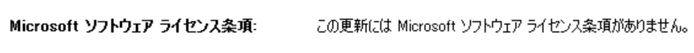
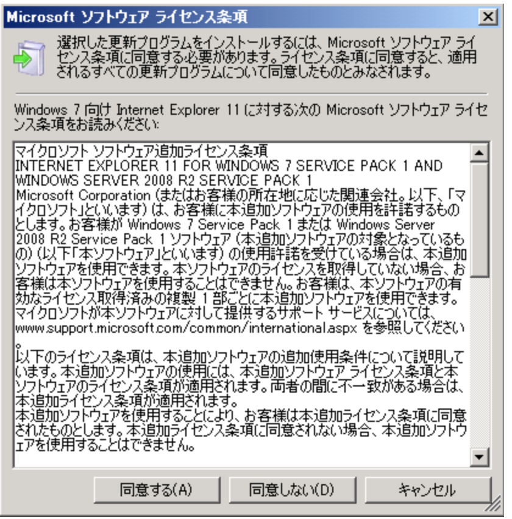

こんにちは。WSUS サポートチームです。  

今回は「WSUS 自動承認規則が反映されない事象」についてご紹介します。  

「自動承認を有効としているにも関わらず、自動でインストール承認が行われない更新プログラムが存在する」というお問い合わせをいただくことがあります。自動承認規則にて作成された規則が反映されない更新プログラムは、**End User License Agreement (EULA)** が付与された更新プログラムであることが主な理由です。このような更新プログラムは、WSUS 管理者の手動での明示的なインストール承認処理を必要とし、自動承認処理を行うことはできません。    

EULA が付与された更新プログラムであるかどうかは、WSUS 管理コンソールの追加情報 (赤枠) から確認することができます。  

＜EULA**あり**の更新プログラム＞  
  

＜EULA**なし**の更新プログラム＞  
　

また、更新プログラムのインストール承認時に以下のようなダイアログボックスが表示された場合には、EULA の同意操作を必要とする更新プログラムであることがわかります。  
  

もし、自動承認規則が有効になっているにもかかわらず、インストール承認が行われない更新プログラムが存在する場合は、上記の内容をもとに、EULA の有無を確認し、手動による更新プログラムのインストール承認処理を行ってください。  
 
＊参考情報＊  
WSUS 3.0 SP 2 の配信について  
https://blogs.technet.com/b/jpwsus/archive/2009/08/25/wsus-3-0-sp-2.aspx  
B. End User License Agreement (EULA) について  

 

