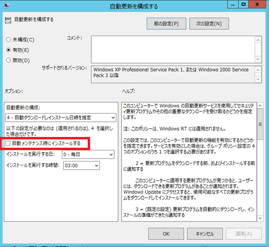

こんにちは。 WSUS サポートチームです。

前回の投稿では、WSUS をご利用いただく環境において、クライアントに対し必須構成となるポリシーのご紹介をしました。本ブログでは、Windows 8 / Windows Server 2012 以降の OS にて、Windows Update に関する構成可能なポリシーや注意点をご紹介します。  

**【Windows 8 / Windows Server 2012 以降の環境での注意点】**  
Windows 8 / Windows Server 2012 以降の環境では、Windows 7 / Windows Server 2008 R2 以前の環境と、自動更新の動作が一部異なりますので、両方共に環境を管理している場合には、特に注意が必要です。  
Windows 8 / Windows Server 2012 以降の環境では、Windows 7 / Windows Server 2008 R2 以前と同様の動作を実現するためには、新たに追加された、下記の 3 つのグループ ポリシーを併せて設定することをご検討ください。  

**Windows Update に関する ポリシー** 
1. [自動更新を構成する] – [自動メンテナンス時にインストールする] ※1
2. [スケジュールされた時刻に常に自動的に再起動する] ※1
3. [インターネット上の Windows Update に接続しない] ※2

※1 Windows 8 / Windows Server 2012 の環境で、このグループ ポリシーを設定するには [KB2883201](https://support.microsoft.com/ja-jp/topic/windows-rt-%E3%81%A8-windows-8-%E3%81%AE-windows-server-2012-%E3%81%AE%E6%9B%B4%E6%96%B0%E3%83%97%E3%83%AD%E3%82%B0%E3%83%A9%E3%83%A0%E3%81%AE%E3%83%AD%E3%83%BC%E3%83%AB%E3%82%A2%E3%83%83%E3%83%97-2013-%E5%B9%B4-10-%E6%9C%88-33ab7811-c101-562c-7a32-4a7a75dcd0ed) もしくは [KB3013767](https://support.microsoft.com/ja-jp/topic/windows-rt-windows-8-%E3%81%8A%E3%82%88%E3%81%B3-windows-server-2012-%E3%81%AE-2014-%E5%B9%B4-12-%E6%9C%88%E4%BB%98%E3%81%91%E6%9B%B4%E6%96%B0%E3%83%97%E3%83%AD%E3%82%B0%E3%83%A9%E3%83%A0%E3%81%AE%E3%83%AD%E3%83%BC%E3%83%AB%E3%82%A2%E3%83%83%E3%83%97-f379ce82-ae16-83e9-601f-867c9aa95264) を適用する必要があります。Windows 8.1 / Windows Server 2012 R2 以降の環境では、本更新プログラムの適用は必要ありません。  
※2 Windows 8 / Windows Server 2012 の環境で、このグループ ポリシーを設定するには [KB3013767](https://support.microsoft.com/ja-jp/topic/windows-rt-windows-8-%E3%81%8A%E3%82%88%E3%81%B3-windows-server-2012-%E3%81%AE-2014-%E5%B9%B4-12-%E6%9C%88%E4%BB%98%E3%81%91%E6%9B%B4%E6%96%B0%E3%83%97%E3%83%AD%E3%82%B0%E3%83%A9%E3%83%A0%E3%81%AE%E3%83%AD%E3%83%BC%E3%83%AB%E3%82%A2%E3%83%83%E3%83%97-f379ce82-ae16-83e9-601f-867c9aa95264) を適用する必要があります。Windows 8.1 / Windows Server 2012 R2 以降の環境では、更新プログラムの適用は必要ありません。  

各グループ ポリシーの詳細について、以下にご案内いたします。  

## <1. [自動更新を構成する] – [自動メンテナンス時にインストールする]>  
  

設定例 : Windows 7 / Windows Server 2008 R2 以前の環境と同様の動作をさせる場合  
- 設定値 : [有効]  
- オプション :  
　- 自動メンテナンス時にインストールする : [無効]  

[ポリシーの説明]  
※ Windows 8 / Windows Server 2012 の環境で、このグループ ポリシーを設定するには [KB2883201](https://support.microsoft.com/ja-jp/topic/windows-rt-%E3%81%A8-windows-8-%E3%81%AE-windows-server-2012-%E3%81%AE%E6%9B%B4%E6%96%B0%E3%83%97%E3%83%AD%E3%82%B0%E3%83%A9%E3%83%A0%E3%81%AE%E3%83%AD%E3%83%BC%E3%83%AB%E3%82%A2%E3%83%83%E3%83%97-2013-%E5%B9%B4-10-%E6%9C%88-33ab7811-c101-562c-7a32-4a7a75dcd0ed) もしくは [KB3013767](https://support.microsoft.com/ja-jp/topic/windows-rt-windows-8-%E3%81%8A%E3%82%88%E3%81%B3-windows-server-2012-%E3%81%AE-2014-%E5%B9%B4-12-%E6%9C%88%E4%BB%98%E3%81%91%E6%9B%B4%E6%96%B0%E3%83%97%E3%83%AD%E3%82%B0%E3%83%A9%E3%83%A0%E3%81%AE%E3%83%AD%E3%83%BC%E3%83%AB%E3%82%A2%E3%83%83%E3%83%97-f379ce82-ae16-83e9-601f-867c9aa95264) を適用する必要があります。  
以下の記事でもご紹介している通り、Windows 8 / Windows Server 2012 以降の環境からは、自動更新のオプション [4] 番の動作が大きく異なっており、自動インストールの開始タイミングが OS の自動メンテナンス タスクとして制御されるよう、設計が変わっています。  

Title : Windows 8 / Windows Server 2012 では 「自動インストール」 の動作が変更されております  
URL : https://blogs.iis.net/wincat/windows-8-windows-server-2012#:~:text=Windows%208%20%E3%81%A8%20Windows%20Server%202012%20%E3%81%A7%E3%81%AE%E8%87%AA%E5%8B%95%E6%9B%B4%E6%96%B0%E3%81%AE%E6%A7%8B%E6%88%90%E3%82%92%E8%A8%B1%E5%8F%AF%E3%81%97%E3%81%BE%E3%81%99%E3%80%82%20http%3A%2F%2Fsupport.microsoft.com%2Fkb%2F2885694%2Fja,%E6%97%A2%E3%81%AB%E3%81%94%E5%AD%98%E7%9F%A5%E3%81%AE%E6%96%B9%E3%82%82%E5%A4%9A%E3%81%84%E3%81%8B%E3%81%A8%E6%80%9D%E3%81%84%E3%81%BE%E3%81%99%E3%81%8C%E3%80%81Windows%208%20%2F%20Windows%20Server%202012%20%E3%81%8B%E3%82%89%E3%81%AF%E3%80%81%E3%80%8C%E8%87%AA%E5%8B%95%E3%82%A4%E3%83%B3%E3%82%B9%E3%83%88%E3%83%BC%E3%83%AB%E3%80%8D%20%E3%81%AE%E5%8B%95%E4%BD%9C%E3%81%8C%E5%A4%A7%E3%81%8D%E3%81%8F%E5%A4%89%E6%9B%B4%E3%81%95%E3%82%8C%E3%81%A6%E3%81%8A%E3%82%8A%E3%81%BE%E3%81%99%E3%80%82  

このため、自動更新のオプションにて日時を指定している場合でも、自動更新のオプション [4] 番だと、時刻が固定されていない「Idle Maintenance」タスクの一環としてインストール動作が開始されてしまうおそれがあります。
これを、Windows 7 / Windows Server 2008 R2 以前の環境と同様に、指定した日時に必ず更新プログラムのインストールを行うようにするには、**上述のオプション “自動メンテナンス時にインストールする” を [無効] に設定してください。**  

## <2. [スケジュールされた時刻に常に自動的に再起動する]>
  

設定例 : Windows 7 / Windows Server 2008 R2 以前の環境と同様の動作をさせる場合
- 設定値 : [有効]
- オプション :
　- 作業内容の保存にかかる時間（分） : [15]

[ポリシーの説明]  
※ Windows 8 / Windows Server 2012 の環境で、このグループ ポリシーを設定するには [KB2883201](https://support.microsoft.com/ja-jp/topic/windows-rt-%E3%81%A8-windows-8-%E3%81%AE-windows-server-2012-%E3%81%AE%E6%9B%B4%E6%96%B0%E3%83%97%E3%83%AD%E3%82%B0%E3%83%A9%E3%83%A0%E3%81%AE%E3%83%AD%E3%83%BC%E3%83%AB%E3%82%A2%E3%83%83%E3%83%97-2013-%E5%B9%B4-10-%E6%9C%88-33ab7811-c101-562c-7a32-4a7a75dcd0ed) もしくは [KB3013767](https://support.microsoft.com/ja-jp/topic/windows-rt-windows-8-%E3%81%8A%E3%82%88%E3%81%B3-windows-server-2012-%E3%81%AE-2014-%E5%B9%B4-12-%E6%9C%88%E4%BB%98%E3%81%91%E6%9B%B4%E6%96%B0%E3%83%97%E3%83%AD%E3%82%B0%E3%83%A9%E3%83%A0%E3%81%AE%E3%83%AD%E3%83%BC%E3%83%AB%E3%82%A2%E3%83%83%E3%83%97-f379ce82-ae16-83e9-601f-867c9aa95264) を適用する必要があります。  
Windows 8 / Windows Server 2012 以降の環境からは、自動更新のオプション [4] 番にて、自動インストールが実行された後の、再起動が実行されるタイミングにも変更が加えられています。  
Windows 8 / Windows Server 2012 以降の環境では、ユーザーがログオンしている際に更新プログラムの自動インストールが行われると、すぐに再起動は実施されず 3 日間の猶予期間が設けられるよう変更されています。
このため、Windows 7 / Windows Server 2008 R2 以前の環境と同様に、自動インストールが実行された後に、即時に再起動を実行するには、**このグループ ポリシー [有効] に設定してください。**  
このグループ ポリシーを [有効] に設定すると、自動インストールが完了した後、オプションにて指定した時間が経過すると、必ず再起動が実施されます。  

## <3. [インターネット上の Windows Update に接続しない]>
  

設定例 : Windows 7 / Windows Server 2008 R2 以前の環境と同様の動作をさせる場合  
- 設定値 : [有効]  

[ポリシーの説明]  
※ Windows 8 / Windows Server 2012 の環境で、このグループ ポリシーを設定するには、[KB3013767](https://support.microsoft.com/ja-jp/topic/windows-rt-windows-8-%E3%81%8A%E3%82%88%E3%81%B3-windows-server-2012-%E3%81%AE-2014-%E5%B9%B4-12-%E6%9C%88%E4%BB%98%E3%81%91%E6%9B%B4%E6%96%B0%E3%83%97%E3%83%AD%E3%82%B0%E3%83%A9%E3%83%A0%E3%81%AE%E3%83%AD%E3%83%BC%E3%83%AB%E3%82%A2%E3%83%83%E3%83%97-f379ce82-ae16-83e9-601f-867c9aa95264) を適用する必要があります。Windows 8.1 / Windows Server 2012 R2 以降の環境では、更新プログラムの適用は必要ありません。Windows 8 / Windows Server 2012 以降の環境からは、、WSUS サーバーに対して更新プログラムをチェックするように構成していても、WUA（Windows Update Agent） 自身の更新のために、弊社サイトにアクセスするよう動作が変更されています。これは Windows 8 / Windows Server 2012 以降の環境では Windows ストア アプリのサポートが追加されているためです。WSUS サーバーに対して更新プログラムをチェックするように構成していても、ストア アプリの更新は WUA の機能を使用するため、弊社サイトに自己更新のためにアクセスする動作が発生するよう変更が加えられています。  
上記の動作を無効にし、Windows 7 / Windows Server 2008 R2 以前の環境と同様の動作をさせる場合には、**このグループ ポリシーを [有効] に設定してください。**  