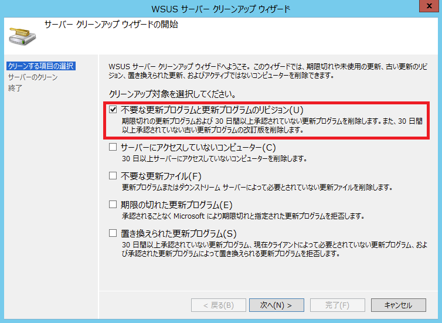

# クリーンアップ ウィザードにより IIS のプロセスがクラッシュする
こんにちは。WSUS サポート チームです。

Windows Server 2012 もしくは Windows Server 2012 R2 上の WSUS サーバーにおいてクリーンアップ ウィザードを実行した際に、以下のイベントが記録されて IIS のプロセスがクラッシュするという事象が報告されています。

---

```
ログの名前: システム
ソース: Microsoft-Windows-WAS
イベント ID: 5011
レベル: 警告
説明: アプリケーション プール 'WsusPool' に使われているプロセスでWindows プロセス アクティブ化サービスとの通信に重大なエラーが発生しました。プロセス ID は 'xxxx' でした。
```

---

```
ログの名前: アプリケーション
ソース: ASP.NET 4.0.30319.0
イベント ID: 1325
レベル: エラー
説明: ハンドルされていない例外が発生し、処理が中止されました。
Application ID: /LM/W3SVC/xxxxx/ROOT/ServerSyncWebService
Process ID: xxxx
Exception: System.NullReferenceException
Message: オブジェクト参照がオブジェクト インスタンスに設定されていません。
```

---

```
ログの名前: アプリケーション
ソース: .NET Runtime
イベント ID: 1026
レベル: エラー
説明: アプリケーション:w3wp.exe フレームワークのバージョン: v4.0.30319
説明: ハンドルされない例外のため、プロセスが中止されました。
例外情報: System.NullReferenceException
```

---

```
ログの名前: アプリケーション
ソース: Application Error
イベント ID: 1000
レベル: エラー
説明: 障害が発生しているアプリケーション名: w3wp.exe
障害が発生しているモジュール名: KERNELBASE.dl
例外コード: 0xe0434352
```

---

本現象は Windows Server 2012 / 2012 R2 の不具合により発生することが確認されております。

具体的には、Windows Server 2012 / 2012 R2 上で実行されている WSUS サーバーにて、\[不要な更新プログラムと更新プログラムのリビジョン\] のクリーンアップを実行した際に本現象が発生することがあります。



この状況に合致する場合には、以下の対処をご検討ください。

## 対処方法
### Windows Server 2012 R2 の場合
Windows Server 2012 R2 においては、更新プログラム [KB3000850](https://support.microsoft.com/en-us/kb/3000850) に本問題に対する修正が含まれております。本更新プログラムの適用をご検討ください。詳細は以下の技術情報で公開しております。

[WSUS database is not cleared correctly after you run Server Cleanup Wizard on a Windows Server 2012 R2-based WSUS server](https://support.microsoft.com/en-us/kb/3000481)

### Windows Server 2012 の場合
Windows Server 2012 において、残念ながら現時点では問題に対する修正が行われておりません。この場合、\[不要な更新プログラムと更新プログラムのリビジョン\] のクリーンアップを分割して実行することで現象を回避できる場合があります。

WSUS コンソールのクリーンアップ ウィザードで実行する場合、\[不要な更新プログラムと更新プログラムのリビジョン\] はすべてまとめて処理が行われますが、これを PowerShell のスクリプトで実行することにより、不要な \[更新プログラム\] と \[更新プログラムのリビジョン\] に分割して実行することが可能です。

ベースとなる PowerShell スクリプトは以下のスクリプト センターにて公開しております。

[WSUS Cleanup](https://gallery.technet.microsoft.com/ScriptCenter/fd39c7d4-05bb-4c2d-8a99-f92ca8d08218/)

このスクリプトにおいて、CompressUpdates が期限切れの \[更新プログラムのリビジョン\] を削除する処理、CleanupObsoleteUpdates が期限切れの \[更新プログラム\] を削除する処理にあたります。

該当する処理以外をコメント アウトすることで、各処理を個別に分割して実行可能です。

以下は、CompressUpdates のみを実行する例です。

```
[reflection.assembly]::LoadWithPartialName("Microsoft.UpdateServices.Administration")`
| out-null
$wsus = [Microsoft.UpdateServices.Administration.AdminProxy]::GetUpdateServer();
$cleanupScope = new-object Microsoft.UpdateServices.Administration.CleanupScope;
#$cleanupScope.DeclineSupersededUpdates = $true      
#$cleanupScope.DeclineExpiredUpdates         = $true
#$cleanupScope.CleanupObsoleteUpdates     = $true
$cleanupScope.CompressUpdates                  = $true
#$cleanupScope.CleanupObsoleteComputers = $true
#$cleanupScope.CleanupUnneededContentFiles = $true
$cleanupManager = $wsus.GetCleanupManager();
$cleanupManager.PerformCleanup($cleanupScope);
```

以下は、CleanupObsoleteUpdates のみを実行する例です。

```
[reflection.assembly]::LoadWithPartialName("Microsoft.UpdateServices.Administration")`
| out-null
$wsus = [Microsoft.UpdateServices.Administration.AdminProxy]::GetUpdateServer();
$cleanupScope = new-object Microsoft.UpdateServices.Administration.CleanupScope;
#$cleanupScope.DeclineSupersededUpdates = $true      
#$cleanupScope.DeclineExpiredUpdates         = $true
#$cleanupScope.CleanupObsoleteUpdates     = $true
#$cleanupScope.CompressUpdates                  = $true
$cleanupScope.CleanupObsoleteComputers = $true
#$cleanupScope.CleanupUnneededContentFiles = $true
$cleanupManager = $wsus.GetCleanupManager();
$cleanupManager.PerformCleanup($cleanupScope);
```

#### 参考情報
なお、デジタル署名のない PowerShell スクリプトをご利用になる場合には、あらかじめ実行環境を設定する必要があります。

以下の方法でスクリプトを実行する WSUS サーバーで Powershell コンソールを起動し、以下のコマンドを実行して、Powershell スクリプトの実行を許可することができます。

```
Set-ExecutionPolicy RemoteSigned
```

※ "Set-ExecutionPolicy" の詳細につきましては、コンソール上で `get-help Set-ExecutionPolicy -detailed` から参照可能です。

本事象が発生するという報告は非常に稀ですが、発生した際にはこれらの対処をお試しください。