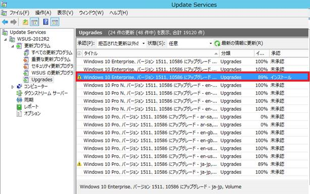

# WSUS サーバーからの Windows 10 のアップグレードの配信

皆さま、こんにちは。WSUS サポートチームです。

今回は WSUS サーバーからの Windows 10 へのアップグレードの配信についてご紹介します。以前の記事でも紹介した通り、WSUS からも Windows 7、Windows 8.1 の環境に対して Windows 10 にアップグレードする更新プログラムを配信することや Windows 10 の環境に対して機能アップグレードを配信することが出来ます。

**ただし、WSUS 管理者が WSUS 管理コンソールで配信準備をしない限り、Windows 10 のアップグレードが自動的に配信されることはありません**ので、ご安心ください。WSUS サーバーから Windows 10 のアップグレードを配信するためには、今回ご紹介する条件を満たすよう事前に WSUS サーバーの準備をしていただく必要があります。Windows 7 や Windows 8.1 の環境を、そのまま利用したい場合や Windows 10 の環境に機能アップグレードを配信したくない場合には、特に WSUS サーバーに追加の設定は必要ありません。

なお、Windows 7、Windows 8.1 の環境に対して WSUS サーバーから Windows 10 へのアップグレードが自動的に配信されないことについては、下記の公開情報でもご紹介しております。

- How to manage Windows 10 notification and upgrade options
< https://support.microsoft.com/en-us/kb/3080351 >

---------- 一部抜粋 ----------

The Windows 10 upgrade is automatically blocked (that is, no further action is required) on computers or other devices in the following scenarios:

 •The computer or device is serviced through WSUS and has not had update 3035583 applied.

---------- 一部抜粋 ----------

また、Windows 7、Windows 8.1 の Windows Update を利用している環境にて、Windows 10 へのアップグレードの配信を抑止する方法については下記のブログをご参照ください。WSUS を利用している環境でも下記の方法を実施いただくと、ユーザーが誤って Windows Update に接続してしまった場合に Windows 10 へアップグレードされることを抑止可能であるため、より確実にアップグレードを阻止することが出来ます。

- [企業ユーザー向け] Windows Update からの Windows 10 への無償アップグレードを管理する方法
< https://blogs.technet.com/b/askcorejp/archive/2015/07/23/windows-update-windows-10-1.aspx >
 

## WSUS サーバーから Windows 10 のアップグレードを配信するために必要な条件

WSUS サーバーから Windows 10 のアップグレードを配信するためには、下記の 5 つの条件をすべてを満たしている必要があります。

 

### 条件1. Windows Server 2012 以降の WSUS サーバーを利用していること

 

### 条件2. 最新のマンスリー品質ロールアップが WSUS サーバーに適用済みであること

**（※ Windows Server 2012 / 2012 R2のみ。Windows Server 2016 WSUS は適用不要）**
※  最新のロールアップ適用後に **更新内容を反映させるためには、適用後に手動手順が必要となります。** 詳しくはこちらの記事 < https://learn.microsoft.com/en-us/archive/blogs/jpwsus/kb3159706 > をご参照ください。

機能アップグレードを配信する場合には、WSUS の修正を含む最新のロールアップを適用していただくことをおすすめしております。WSUS サーバーのバージョンについては、こちらの記事 < https://learn.microsoft.com/en-us/archive/blogs/jpwsus/wsus-18 > をご覧ください。
 

### 条件3.WSUSのオプション「製品と分類」にて、製品として「Windows 10」、分類として「Upgrades」が同期対象として選択されていること

**※ 「Upgrades」の分類を選択する前に、必ず条件 2.を満たしてください。 （Windows Server 2012 / 2012 R2 のみ）
パッチ適用前にUpgradesの更新プログラムをWSUSに同期してしまいますと、補足３（ページ下部記載）の事象が発生いたします。**

 

### 条件４．WSUS が動作する IIS の Web サイト配下の「Content」にて、 Windows 10 へのアップグレードに用いられる「.esd」形式のファイルの配信を許可する設定を追加していること

**（※ Windows Server 2012 / 2012 R2のみ。Windows Server 2016 WSUS は既定で追加済み。）**

 

### 条件5. 「Upgrades」に分類されている Windows 10 のアップグレード用の更新プログラムが WSUS でインストール承認されていること

 

 

**( 補足 1  : 2016 年 5 月以降に WSUS へ公開された機能アップグレードを配信する場合 )**
2016 年 5 月以降に WSUS へ公開された機能アップグレードを配信する場合には、WSUS の様々な修正を含む最新のロールアップを適用することをおすすめしております。また、適用を完了させるためには、**更新プログラムの適用後に、手動で手順を実施する必要がある**ので、適用される前に下記ブログにて紹介している内容や手順をご確認ください。
 

- Windows Server 2012 / 2012 R2 WSUS 用の更新プログラム KB3159706 について

https://blogs.technet.microsoft.com/jpwsus/2016/05/26/kb3159706/
 

**( 補足 2  : アップグレードの配信を受けるために WSUS クライアント Windows 7 / Windows 8.1 にて必要な条件 )**
WSUS サーバーから配信される Windows 10 へのアップグレードを受けるためには、Windows 7 / Windows 8.1 の WSUS クライアントでは下記の 2 つの条件を満たしている必要があります。
 

1. 下記レジストリ値が追加されていること
 

レジストリキー： HKEY_LOCAL_MACHINE\SOFTWARE\\Microsoft\Windows\CurrentVersion\WindowsUpdate\OSUpgrade

値 : AllowOSUpgrade（DWORD）1
 

2. 最新の WUA (Windows Update Agent) の更新プログラムがインストールされていること

※ 「最新の WUA (Windows Update Agent) の更新プログラム」については、下記ブログにて紹介しております。
 

- 「Windows Update がなかなか終わらないな…」と思ったら

https://blogs.technet.microsoft.com/jpwsus/2016/04/26/never-end-wu/
 

**( 補足 3  : アップグレード時に 0xc1800118 もしくは 0x8000FFFF が発生する)**
WSUS へ更新プログラムを適用する前に、機能アップグレードを同期してしまうと、クライアントへの配信時に 0xc1800118 もしくは 0x8000FFFF が発生する事象が報告されています。

本事象が発生した場合には、下記の公開情報に記載の手順を実施することで対処出来ます。
 

- WSUS を使用して Windows 10 バージョン 1607 をプッシュするときに"0xc1800118"エラー

https://support.microsoft.com/ja-jp/help/3194588/-0xc1800118-error-when-you-push-windows-10-version-1607-by-using-wsus
 

また、上記の対処を実施すためには SQL Server Management Studio のインストールが必要です。インストールされていない場合には、このブログ < https://learn.microsoft.com/en-us/archive/blogs/jpwsus/wsus-windows-server-2012 > を参照してください。
 

**( 補足 4  : 機能更新プログラムのバージョン飛ばしでの適用について )**
機能更新プログラムについては、1 つずつバージョンを適用していただく必要はありませんので、バージョン飛ばしで適用 (バージョン 1607 の環境にバージョン 1803 の機能更新プログラムを適用しアップグレード等) をしていただいても問題ございません。
