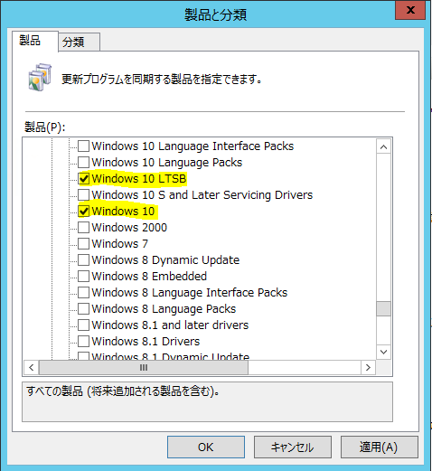

# Windows 10 LTSB の 更新プログラムを WSUS で同期する際の注意事項について
**2018/5/17 更新：2018 年 4 月にリリースされた KB4093119 (OS ビルド 14393.2189) より Windows 10 version 1607 の累積更新プログラムに [Windows 10 LTSB] が追加されております。  
そのため、現在は [製品] で [Windows 10 LTSB] にチェックが入っていれば 2018 年 4 月 以降の Windows 10 version 1607 の累積更新プログラムを同期することが可能です。**

みなさま、こんにちは。WSUS サポート チームです。

Windows 10 Enterprise LTSB 2016 以降をご利用のお客様より、弊社へ時おりお問い合わせいただく内容として、WSUS 管理コンソールから [オプション] – [製品と分類] – [製品] タブで「Windows 10 LTSB」にチェックを入れても、配信出来る更新プログラムが同期されないというものがございます。

「Windows 10 LTSB」にチェックを入れた場合、同期の対象は Windows 10 Enterprise LTSB 2015 の更新プログラムのみとなります。従いまして、Windows 10 Enterprise LTSB 2016 以降をご利用の場合は、併せて「Windows 10」にもチェックを入れる必要があるのでご注意ください。

