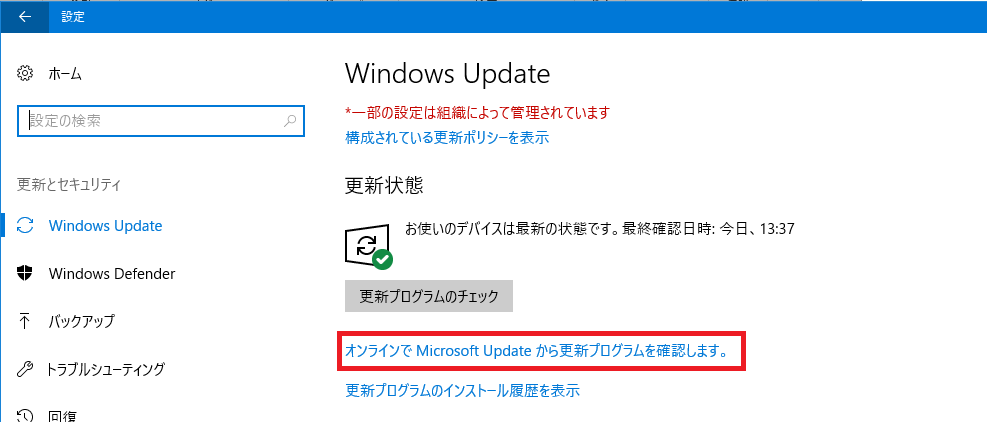
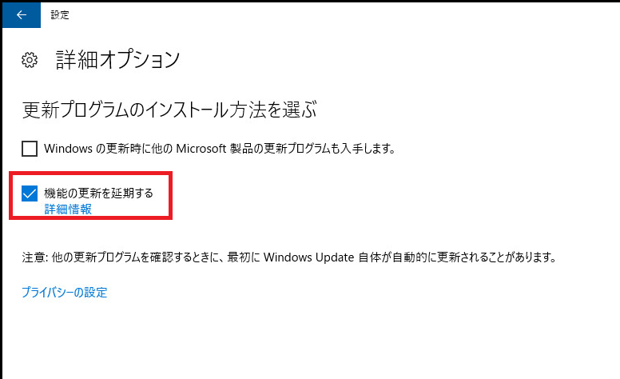
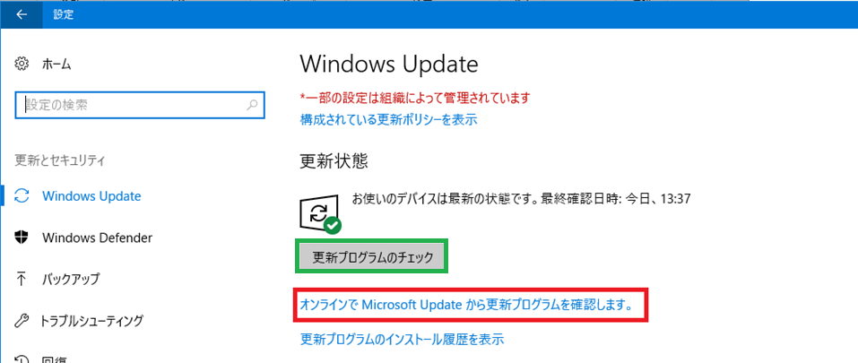

こんにちは。WSUS サポートチームです。  

今回は、Windows 10 を WSUS クライアントとして管理する場合のオススメのグループ ポリシーの設定や設定時の注意点を、下記のシナリオ毎に紹介します。Windows 10 の導入を検討されている方や既に導入されている方は是非ご一読ください！  

**A. 更新プログラムを WSUS サーバーのみから取得するようにしたい場合**  
**B. 更新プログラムの自動適用は WSUS サーバーから行なうが、外部へ端末を持ち出した際等に手動で Windows Update / Microsoft Update サイトより更新プログラムの取得を行えるようにしたい場合**  

## A. 更新プログラムを WSUS サーバーのみから取得するようにしたい場合  
Windows 10 のクライアントにて、WSUS サーバーからのみ更新プログラムを取得させたい場合には、下記の 3 種類のグループ ポリシーを有効に設定してください。  

1. [コンピューターの構成] -> [管理用テンプレート] -> [Windows コンポーネント] -> [Windows Update]  
-> **[イントラネットの Microsoft 更新サービスの場所を指定する]**  
2. [コンピューターの構成] -> [管理用テンプレート] -> [Windows コンポーネント] -> [Windows Update]  
-> **[自動更新を構成する]**  
3. -1 [コンピューターの構成] -> [管理用テンプレート] -> [Windows コンポーネント] -> [Windows Update]  
-> **[インターネット上の Windows Update に接続しない]**  

**もしくは** 

3. -2 [コンピューターの構成] -> [管理用テンプレート] -> [システム] -> [インターネット通信の管理] -> [インターネット通信の設定]  
-> **[Windows Update のすべての機能へのアクセスをオフにする]**  

また、Window 10 バージョン 1607 の環境では、上記の設定に加え、下記の設定を有効にすることをご検討ください。  

**デュアル スキャン対策のため [KB4025334  (OS Build 14393.1532)](https://support.microsoft.com/ja-jp/topic/2017-%E5%B9%B4-7-%E6%9C%88-19-%E6%97%A5-kb4025334-os-%E3%83%93%E3%83%AB%E3%83%89-14393-1532-7f132a87-50ca-ace3-633f-9165971007d6) 以降の更新プログラムを適用後**  

4. -1 [コンピューターの構成] -> [管理用テンプレート] -> [Windows コンポーネント] -> [Windows Update]  
-> **[Windows Update に対するスキャンを発生させる更新遅延ポリシーを許可しない]**  

**および**  

4. -2 [コンピューターの構成] -> [管理用テンプレート] -> [Windows コンポーネント] -> [Windows Update] -> [Windows Update の 延期]  
-> **[機能更新プログラムをいつ受信するかを選択してください]**  
**※ブランチ準備レベルや延期日数については任意の値で構いません。**  

1、2 のグループ ポリシーについては、[こちらの記事](https://jpmem.github.io/blog/wsus/2019-04-16_01/)で詳細を紹介しているため、本記事では 3、4 について詳細を紹介していきます。  

## 3. [インターネット上の Windows Update に接続しない] もしくは[Windows Update のすべての機能へのアクセスをオフにする]
**このいずれかのグループ ポリシー設定しないと、設定画面上にてユーザーが以下の [オンラインで Microsoft Update から更新プログラムを確認します。]ボタンを押した場合には、WSUS サーバーではなく Windows Update / Microsoft Update サイトより更新プログラムを取得してしまいます。**  
このため、WSUS サーバーのみから更新プログラムを取得させたい場合には、必ずいずれかの設定をしていただく必要があります。  

また、[インターネット上の Windows Update に接続しない] を有効にした場合は、ストアアプリのインストールや更新ができません。ストアアプリのインストールや更新を許可したい場合は、[Windows Update のすべての機能へのアクセスをオフにする] の方を有効にしてください。  

## 4. デュアル スキャン対策の設定  
Windows 10 バージョン 1607 の環境においては、上記の 3 種類の設定を行っても、**ユーザーが下記のチェックボックスにチェックを入れた場合には、WSUS からではなく Windows Update / Microsoft Update サイトより更新プログラムを取得してしまいます。**  

上述の 4 の設定を行うことで、上記のチェック ボックスがグレー アウトするため、ユーザー操作によってデュアル スキャンが動作することを防ぐことが出来ます。  
なお、Windows 10 バージョン 1703 以降の環境では、1 の設定を行うと上記の設定に対応する項目は非表示となるため、本設定をしていただく必要はありません。  

## B. 更新プログラムの自動適用は WSUS サーバーから行なうが、外部へ端末を持ち出した際等に手動で Windows Update / Microsoft Updateサイトより更新プログラムの取得を行えるようにしたい場合  
基本的には WSUS サーバーから更新プログラムの自動配信が行われるようにしつつも、外部へ端末を持ち出したタイミング等で WSUS サーバーと通信が行えない環境では、ユーザー操作によって Windows Update / Microsoft Update サイトより更新プログラムを取得出来るようにしたいという場合には、以下の設定を行ないます。  

1. [コンピューターの構成] -> [管理用テンプレート] -> [Windows コンポーネント] -> [Windows Update]  
-> **[イントラネットの Microsoft 更新サービスの場所を指定する]**  
2. [コンピューターの構成] -> [管理用テンプレート] -> [Windows コンポーネント] -> [Windows Update]  
-> **[自動更新を構成する]**  
3. **デュアル スキャン対策のため Windows 10 1607 の場合、 [KB4025334  (OS Build 14393.1532)](https://support.microsoft.com/ja-jp/topic/2017-%E5%B9%B4-7-%E6%9C%88-19-%E6%97%A5-kb4025334-os-%E3%83%93%E3%83%AB%E3%83%89-14393-1532-7f132a87-50ca-ace3-633f-9165971007d6)  以降の更新プログラム、Windows 10 1703 の場合、 [KB4041676 (OS Build 15063.674)](https://support.microsoft.com/ja-jp/topic/2017-%E5%B9%B4-10-%E6%9C%88-11-%E6%97%A5-kb4041676-os-%E3%83%93%E3%83%AB%E3%83%89-15063-674-433a7449-6c5e-0587-0eb3-2cbaf7e3b2e1) 以降の更新プログラムを適用後**  
3. -1 [コンピューターの構成] -> [管理用テンプレート] -> [Windows コンポーネント] -> [Windows Update]  
-> **[Windows Update に対するスキャンを発生させる更新遅延ポリシーを許可しない]**  

および  

3. -2 [コンピューターの構成] -> [管理用テンプレート] -> [Windows コンポーネント] -> [Windows Update] -> [Windows Update の 延期 / Windows Update for Business]  
-> **[機能更新プログラムをいつ受信するかを選択してください / プレビュー ビルドや機能更新プログラムをいつ受信するか選択してください]**  

こちらについても 1、2 のグループ ポリシーについては、[こちらの記事](https://jpmem.github.io/blog/wsus/2019-04-16_01/)で詳細を紹介しているため、本記事では 3 について詳細を紹介していきます。  

## 3. デュアル スキャン対策の設定  
本シナリオの場合、WSUS サーバーからだけではなく Windows Update / Microsoft Update サイトからも更新プログラムを受信するため、下記のグループ ポリシーの設定を検討していただく必要があります。Windows Update / Microsoft Update サイトでは常に最新の更新プログラムが配信されているため、**下記の設定をしないと、WSUS 上で配信の制限を掛けている更新プログラムやアップグレードが、ユーザーが [オンラインで Microsoft Update から更新プログラムを確認します。] をクリックしたタイミングで配信されてしまうことがあります。**  

3. -2 [コンピューターの構成] -> [管理用テンプレート] -> [Windows コンポーネント] -> [Windows Update] -> [Windows Update の  延期 / Windows Update for Business]  
-> **[ 機能更新プログラムをいつ受信するかを選択してください / プレビュー ビルドや機能更新プログラムをいつ受信するか選択してください]※ 本設定についてはこの記事でも詳細を紹介しております。**  

また、上記の設定に加え下記の設定を行わないと、Windows Update for Business が有効化され、デュアル スキャンの動作が発生してしまいます。  

3. -1 [コンピューターの構成] -> [管理用テンプレート] -> [Windows コンポーネント] -> [Windows Update]  
-> **[Windows Update に対するスキャンを発生させる更新遅延ポリシーを許可しない]**  

上記の設定を全て行うことで、自動更新や下記の設定画面の [更新プログラムのチェック] を押したタイミングでは、WSUS 上で承認している更新プログラムが全て配信され、[オンラインで Microsoft Update から更新プログラムを確認します。] をクリックした場合には、3-2 で指定した延期日数やブランチの設定に合わせて機能更新プログラムの配信が行われます。  

### 補足 : デュアル スキャンに関する注意事項  
下記の 3 つのグループ ポリシーは上述のデュアル スキャン対策と合わせて設定しないと、WSUS サーバーからではなく、Windows Update / Microsoft Update サイトから更新プログラムを取得する動作が発生してしまいますのでご注意ください。  

・ [コンピューターの構成] -> [管理用テンプレート] -> [Windows コンポーネント] -> [Windows Update] -> [Windows Update の延期]  
-> **[機能更新プログラムをいつ受信するかを選択してください / プレビュー ビルドや機能更新プログラムをいつ受信するか選択してください]**  
-> **[品質更新プログラムをいつ受信するかを選択してください]**  
・ [コンピューターの構成] -> [管理用テンプレート] -> [Windows コンポーネント] -> [Windows Update]  
-> **[Windows Update からドライバーを除外する]**  