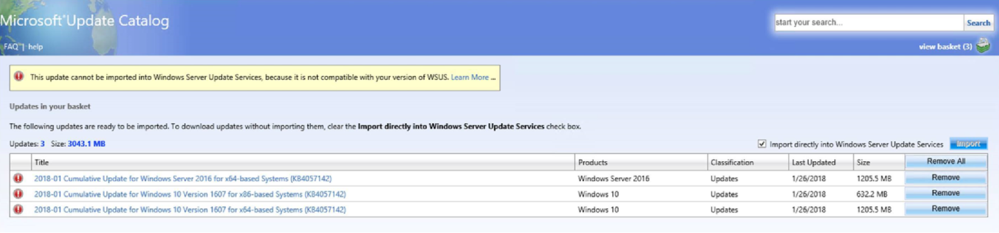

# Windows Server 2016 の WSUS で更新プログラムのインポート時に互換性の問題が発生する事象

みなさま、こんにちは、WSUS サポート チームです。

本日は Windows Server 2016 の WSUS をご利用の場合に Microsoft Update カタログからの更新プログラムのインポート時に、以下のエラーが発生する事象についてご紹介をいたします。



※ 日本語では`この更新プログラムは Windows Server Update Services にインポートできません (理由: お使いのバージョンの WSUS と互換性がありません) `と表示されます。

このエラーは、Microsoft Update カタログ サイトの問題に起因して発生するものであり、今後修正を予定しております。お手数お掛けいたしますが、現時点では以下の対処方法にてエラーの回避が可能ですので、エラーが発生した場合には以下の手順の実施お願いいたします。

また、本問題については進展があり次第、このブログにて情報をお伝えして参ります。

## 対処方法
1. WSUS 管理コンソールを開き、左ペインにて WSUS サーバー名を選択して右クリックし「更新のインポート...」をクリックします。
2. Microsoft Update カタログ サイトが開きます。※ 初回アクセス時のみ、Microsoft Update カタログ アドオンのインストールが必要です。
3. カタログの互換性の問題を回避するため、URL の最後の部分を以下の通り「Protocol=」以降の指定を変更し、 URL をクリックしてカタログサイトを開きなおします。

変更前
```
https://catalog.update.microsoft.com/v7/site/< 中略 >&Protocol=1.20
```

変更後
```
https://catalog.update.microsoft.com/v7/site/< 中略 >&Protocol=1.8
```

4. インポートを行いたい更新プログラムのインポートを実施し、正常にインポートを出来ることを確認します。
