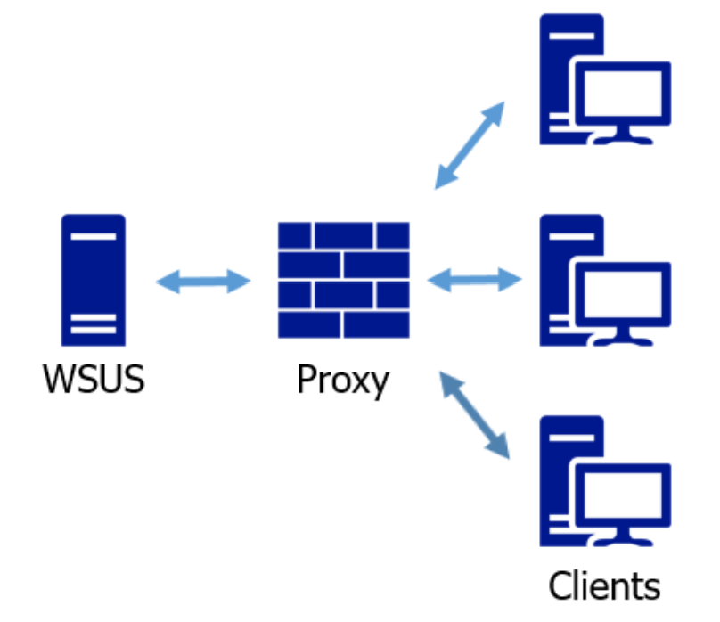

みなさま、こんにちは。WSUS サポート チームです。

今回は Windows Update を実行する際のプロキシ設定について、2 回に渡ってご案内をいたします。第 1 回は「考え方篇」、第 2 回は「設定篇」となります。

プロキシの設定が正しく行われていないと、Windows Update が上手くいく環境もあれば、失敗する環境もある等、複雑な状況に陥りがちです。このような場合には、「なぜ上手くいく環境と失敗する環境があるのか？」「バージョン毎に微妙にエラーが異なるのはなぜか？」といった目の前に起きている事象に焦点を当てるよりも、まずは「そもそも正しくプロキシが参照出来るよう設定されているか？ 」といった観点で確認を進めていく必要があります。

クライアントの導入時に、ネットワーク環境に合わせて適切にプロキシ設定が行われていれば、特に改めて考慮する必要はないのですが、本記事では改めて順を追って説明していきます。

## Windows Update するためにプロキシ設定は必要か？  

これはよくお問い合わせいただく質問ですが、ご利用のネットワーク構成や運用に合わせて設定を考慮していただく必要があるため、弊社から一概に申し上げられる情報はありません。  

「プロキシ設定が必要か判らない！」という場合は、まず自社内でネットワークの担当等に、Windows Update の通信がプロキシ サーバーを経由する必要があるのか確認をしてみましょう。  

例えば、以下のようにクライアント - WSUS サーバー間の通信で、プロキシ サーバーを経由する必要がないネットワーク構成の場合には、WSUS サーバーに対する Windows Update を成功させるためにプロキシの設定をする必要はありません。  
  
**[ 例 1 ]**  

  

対して例えば以下のようなネットワーク構成の場合には、WSUS サーバーへの接続にプロキシ サーバーを経由する必要があるため、Windows Update を成功させるためには、プロキシ設定が必要となります。  

**[例 2]**  
  

ただし、例えば例 1 の構成でも、WSUS サーバー以外への通信は、プロキシ サーバーを経由させたい場合には、クライアントへプロキシの設定を行った上で WSUS サーバーへの通信はプロキシを経由しないように、バイパスの指定に WSUS サーバーの URL を加える必要があります。

このように、プロキシ設定は Windows Update の観点でだけでなく、ネットワーク環境に合わせて考慮が必要となります。

さて以上を踏まえて、ご利用の環境でプロキシを経由する通信が必要かどうか確認がとれたら、今度は具体的な設定方法について「[設定篇](https://docs.microsoft.com/ja-jp/archive/blogs/jpwsus/wu-proxy2)」で紹介していますので、こちらをご参考としてください。  
