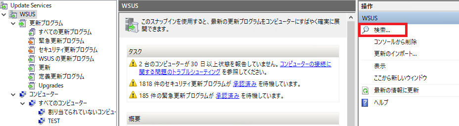
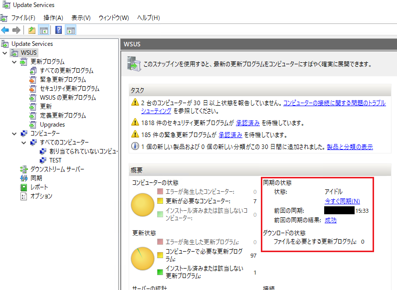

# WSUS 上に配信が必要な更新プログラムが同期されてこない！と思ったら

みなさま、こんにちは。WSUS サポート チームです。

今回は「配信したい更新プログラムが WSUS 上に同期されてこない！」という場合に、実施すべき対応や一般的に考えられる要因について紹介をしてまいります。  

#### 対応方法  

まずは WSUS 上に本当に更新プログラムが存在しないか、念のため検索して確認を行います。  

WSUS 管理コンソール上の以下の箇所より、同期されている更新プログラムの検索が可能ですので、KB 番号やタイトル等から対象の更新プログラムが同期されていないか確認を行います。  

  

もし検索結果に対象の更新プログラムが存在しない場合には、個別に Microsoft Update カタログから対象の更新プログラムをインポートする方法がオススメです。インポートの手順については、以下のブログにて紹介しているので、こちらをご参考にしてください。  
  
##### Microsoft Update カタログの活用法について - A. 特定の更新プログラムのみ WSUS へインポートしたい  
https://docs.microsoft.com/en-us/archive/blogs/jpwsus/microsoft-update#a  
  

#### 考えられる原因  
ではなぜこのような事が発生してしまうのでしょうか。よくあるパターンとして以下のような要因が考えられます。  

- 「製品と分類」の設定にて、対象の更新プログラム・製品や分類が選択されていない  
- 対象の更新プログラムが WSUS へ公開されていない  
- 弊社サイトと WSUS の同期に失敗している  
  

#### 「製品と分類」の設定にて、対象の更新プログラムの製品や分類が選択されていない  

対象の更新プログラムが、リリースされている製品や分類にチェックが入っていない場合には、WSUS 上に対象の更新プログラムは同期されてきません。対象の更新プログラムの製品や分類については、[Microsoft Update カタログ](https://www.catalog.update.microsoft.com/Home.aspx)から確認が出来ます。  

例えば、[Microsoft Update カタログ](https://www.catalog.update.microsoft.com/Home.aspx)上で検索して、以下のように表示される更新プログラムは、製品は「Windows 10 Anniversary Update and Later Servicing Drivers」、分類は「ドライバ」としてリリースされています。このため、以下の更新プログラムについてはオプションの「製品と分類」にて、この両方にチェックが入っていないと同期されてきません。  

  

「製品と分類」の設定を変更し、今回必要な製品や分類にチェックを入れてしまう方法も対処の 1 つではあるのですが、必要な更新プログラム以外も同期されて来てしまうため、対処方法としてはあまりオススメできません。上述の通り、カタログからインポートする方法であれば、必要な更新プログラムだけを同期出来るため、こちらについて実施をご検討ください。  
  

#### 対象の更新プログラムが WSUS へ公開されていない  

更新プログラムの中には、そもそも WSUS で自動的に承認・配信されないように、敢えて更新プログラムの開発したチームが WSUS へ直接公開していないものもあります。

こういった更新プログラムでも、[Microsoft Update カタログ](https://www.catalog.update.microsoft.com/Home.aspx)上に存在する更新プログラムであれば、インポートし WSUS から配信することが可能なので、上述の対応方法を実施いただけます。  
  

#### 弊社サイトと WSUS の同期に失敗している  

弊社サイトと WSUS の同期に失敗している場合には、新しい更新プログラムについて WSUS 上に着信出来ません。

なぜ失敗しているかは個別にトラブル シューティングが必要ですが、WSUS 上でいつ同期が行われたか、また同期の結果については管理コンソール上の以下の箇所より確認が可能です。  

