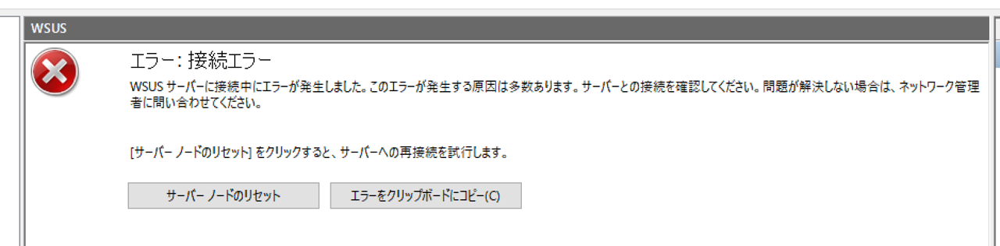
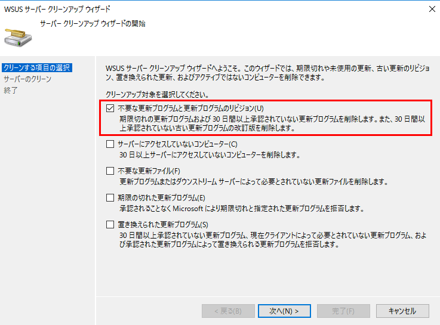
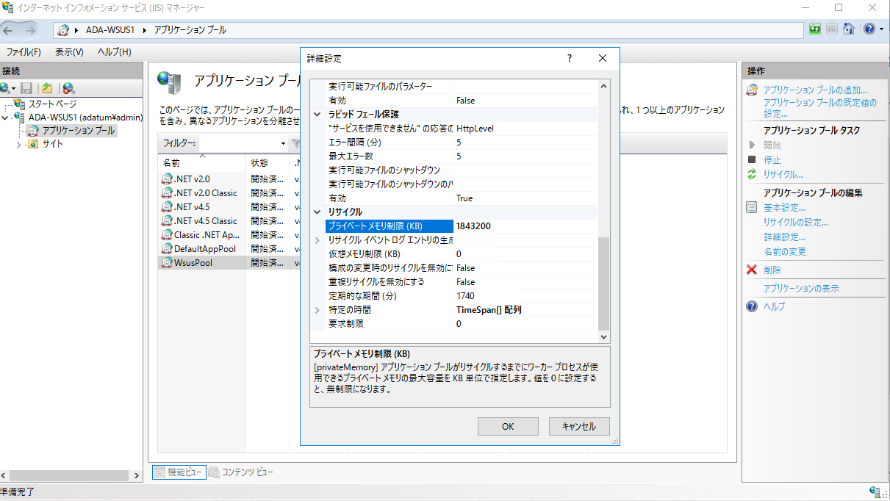
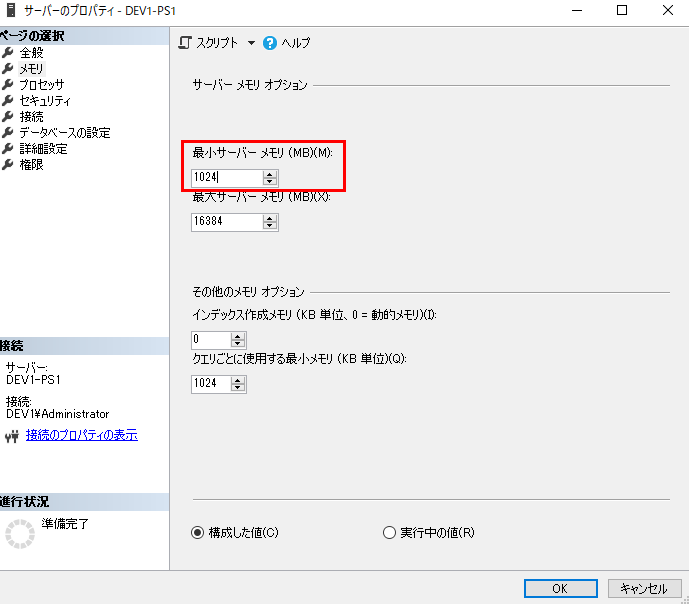

2019/03/28 初版公開  
2024/03/13 レプリカ構成における注意事項を追記しました。  

# 「WSUS 管理コンソールにつながらない！」を解消するための 7 つのワザ
(この記事は、弊社サポートメンバーがフォーラムへ投稿した内容をブログ向けに編集したものです)

みなさま、こんにちは。WSUS サポート チームです。

今回は WSUS に関するエラーの中で最もお問い合わせが多いもの(2019年3月時点)をご紹介させていただきます。

それは、このエラーです！



「みたことある！」という方も非常に多いのではないでしょうか。
特に長期間運用している環境においては、起動するたびに発生するといったことも少なくないかと思います。
このエラーは単純に「接続エラー」を示すものですので、以下のように発生パターンによって、異なる対処方法を検討する必要があります。

パターン1. WSUS 管理コンソールを起動すると、必ずエラーが発生する。<br>
パターン2. 毎回ではないが、WSUS 管理コンソール起動時や「すべての更新プログラム」ビューを開く際にエラーが発生しやすい。

パターン 1. の場合は、WSUS 管理コンソールが永続的にデータを参照できない状況に陥っています。
WSUS 管理コンソールは WSUS に対して、HTTP/HTTPS で通信しますので、ネットワーク障害が要因である可能性も考えられますが、多くの場合は以下の状況に起因しています。

1. WSUS が使用する IIS アプリケーション プール WsusPool が停止している。
2. WSUS データベース (SUSDB) をホストする SQL のサービス (Windows Internal Database、もしくは SQL Server) が停止している。

そのため、永続的に接続エラーが発生する場合は、まず IIS のサービス (World Wide Web Publishing Service) や SQL のサービスの再起動を試してください。また、WsusPool の停止に起因する場合は「[WSUS コンソールが全く開かなくなってしまった！ WsusPool の停止とは](https://jpmem.github.io/blog/wsus/2022-05-23_01/)」の記事でご案内していますので、併せてご確認ください。

さて、最も多いのがパターン 2. ですが、これは障害というより「パフォーマンス不足」に起因しております。
WSUS 管理コンソールは、WSUS の Web サービスを通して、SUSDB より情報を取得し、管理コンソール上に表示しておりますが、その情報の取得に時間がかかる場合に、接続エラーとなってしまい表示できないことがあります。
この場合、何度か試みることで表示されるようになることもありますが、パフォーマンスを改善しない限り、表示が不安定な状況が続きます。

「パフォーマンス不足」に起因するこの状況に対して残念ながら根本的な対処策はありませんが、パフォーマンスを改善するための手段はいくつかあります！ここでは、「WSUS 管理コンソールにつながらない！」を解消するための 6 つのワザと題して、当サポート部門が蓄積しているワザをご紹介しちゃいます。

まずは基本ワザから・・・

## 1. 「インデックスの再構築」を実施する
本ブログの読者の皆様やサポートに問い合わせていただいたことがある方は、ご存知の方も多いと思いますが、WSUS を運用する上で、このメンテナンスは必要不可欠です！

WSUS は残念ながら、独自に SUSDB をメンテナンスする機能を有していないので、長期運用を続けることで SUSDB にデータの登録や削除が繰り返されると、インデックスの断片化が進みます。インデックスが断片化した状態においては、構築当初と比較してクエリ パフォーマンスが劣化し、動作遅延や接続エラーの多発につながります。

そのため、弊社では月に 1 回は定期的に「インデックスの再構築」を実施いただくことをお勧めしております。
詳しい手順は、[こちらの記事](https://jpmem.github.io/blog/wsus/2014-03-05_01/)にて紹介しておりますので、ご確認ください。(スクリプト内では、インデックスの断片化比率に応じて、インデックスの再構築や統計情報の更新を行っています。)

## 2. 「WSUS サーバー クリーンアップ ウィザード」を実施する
こちらも「インデックスの再構築」と同じく定期的な実施をお勧めしています。

WSUS は同期した更新プログラムの情報を蓄積し続けるシステムです。そのため、一度データベースに格納された更新プログラムの情報は、基本的に削除できません。但し、唯一削除可能な方法として「WSUS サーバー クリーンアップ ウィザード」があります。
「WSUS サーバー クリーンアップ ウィザード」は、左ペインのオプションを選択すると、中央ペインに表示される一覧より選択できます。

ウィザードでは 5 つのオプションを選択可能ですが、データベースから更新プログラムの情報を削除するオプションは、一番上の「不要な更新プログラムと更新プログラムのリビジョン」です。そのため、データベースからできる限り不要な更新プログラムの情報を減らしたい場合は、「不要な更新プログラムと更新プログラムのリビジョン」を選択して、ウィザードを実行してください。



その他のオプションも不要な情報を減らすという観点では有効ですが、たまに発生する接続エラーの改善という観点では大きな効果を得られないことが多いです。そのため、ここでは言及いたしません。

ちなみに、「WSUS サーバー クリーンアップ ウィザード」を実施する前には、上述の「インデックスの再構築」を実施することをお勧めします。これもインデックスが断片化しており、クエリ パフォーマンスが劣化している状態では、クリーンアップ ウィザードもタイムアウトで失敗することが多いため、事前にタイムアウトによる失敗を緩和することが目的です。それでもウィザードが最後まで終わらない場合は、「インデックスの再構築」->「クリーンアップ ウィザードの実行」の繰り返しです。

**注意**  
階層構成（レプリカ）の WSUS をご利用の場合、「不要な更新プログラムと更新プログラムのリビジョン」の項目は必ず下位側のサーバー (レプリカ サーバー) で先に実行し、上位側 (マスター サーバー) はその後で実行するよう注意してください。詳細は、以下のブログをご参照ください。  
[レプリカ構成では サーバー クリーンアップ ウィザード にご注意ください](https://jpmem.github.io/blog/wsus/2012-06-07_01/)


## 3. WSUS 管理コンソールのキャッシュを削除する
WSUS 管理コンソールは MMC の上で動作していますが、以下にキャッシュ ファイルが存在しています。

`%appdata%\Microsoft\MMC\wsus`

このキャッシュ ファイルを削除すると、これまで作成した更新ビューも削除されますが、”気持ち” 早くなります。なので、あまり大きな効果は得られませんが、できる限り早くしたい！というときにお使いください。。。

続いて応用ワザ！ここからは、パフォーマンス チューニングを含みます。

## 4. 不要な更新プログラムをできる限り「拒否済み」にする
上述の通り、WSUS は更新プログラムのデータを蓄積し続けるシステムですので、過去に同期対象としてチェックした後、現在はチェックを外した製品であっても、SUSDB に格納された更新プログラムは残存します。(クリーンアップ ウィザードで削除されるものもあります。)

このような配信が不要な更新プログラムが「未承認」や「インストール承認」の状態であった場合、WSUS クライアントが「更新プログラムの確認」を行う処理において検出対象となり、スペックが低い PC の場合は確認処理の完了までに時間がかかるといった事象が発生することがあります。また、サーバー側においても、クライアントから「更新プログラムの確認」の要求を受けて、クライアント側に返す更新プログラムの情報量が多くなるため、処理負荷がかかります。

そのため、配信が不要となった更新プログラムが「未承認」や「インストール承認」の状態のままである場合は、「拒否済み」のステータスに変更することで、WSUS クライアントの検出対象から外して、処理負荷を軽減することができます。

不要な更新プログラムの判断方法としては、下記のような例があります。
1. 現在は使用していない製品に該当する更新プログラム (Windows XP、Office XP など)
2. Itanium ベース システム用の更新プログラム (WSUS の管理対象に Itanium ベースの CPU を搭載したサーバーが含まれていない場合)
3. 置き換えられた更新プログラム

拒否済みに設定できる更新プログラムの確認方法など、設定手順の詳細については[こちらの記事](https://jpmem.github.io/blog/wsus/2017-12-11_01/)をご覧ください。

## 5. WsusPool の「プライベート メモリ制限」を引き上げる
リリースされた更新プログラムの数も多くなったからか、Windows Server 2012 WSUS 以降、この方法をご案内することも多くなりました。上述の通り、WSUSは IIS のアプリケーション プールとして WsusPool という独自のものを使用していますが、このアプリケーション プールがリサイクルするまでにワーカー プロセスが使用できるプライベート メモリの最大容量が、既定では 1843200 KB (約 1.8 GB) に設定されています。そのため、WSUS における同期や承認の設定、多数のクライアントからの更新プログラムの取得処理などが重なって、WsusPool が使用するメモリが多くなると、繰り返しリサイクルが発生し、動作が重くなることがあります。(場合によっては、WsusPool が停止することもあります。) 空きメモリに余裕があれば、この「プライベート メモリ制限」を引き上げることで、リサイクルが発生するまでの間隔が長くなり、動作が安定します。
設定箇所は、
1. IIS マネージャーを起動して、左ペインから [アプリケーション プール] を選択してください。
2. 中央ペインの一覧から [WsusPool] を右クリックして [詳細設定...] をクリックすると、下図の箇所で設定を変更できます。
当サポート部門の実績では 4000000 (4 GB) に設定いただくことで安定することが多く、それでも安定しない場合は 8000000 (8 GB) に設定いただくことも稀にあります。



## 6. SUSDB をホストする SQL インスタンスの最小サーバー メモリ、最大サーバー メモリを設定する。

SUSDB をホストする SQL も使用するメモリの最小値と最大値を設定することができますので、ここもパフォーマンス チューニングのポイントの 1 つです。最大サーバー メモリは空きメモリの状況に応じて設定していただきますが、最小サーバー メモリについては 1024 MB (1GB) に設定していただくことで安定したという実績があります。
設定箇所は、
1. SQL Server Management Studio で SUSDB をホストする SQL インスタンスに接続します。
2. 左ペインから一番上のサーバー名を右クリックして [プロパティ] をクリックし、左ペインから[メモリ]を選択すると、下図の箇所で設定を変更できます。
3. 設定変更後は [OK] をクリックしてください。




### Windows Internal Database (WID) を使用している場合
Windows Internal Database (WID) を使用している場合は、SQL Server Management Studio でプロパティを開こうとすると「要求されたダイアログを表示できません」というエラーが発生します。その場合は、以下の手順で設定してください。なお、SQL Server Management Studio がインストールされている場合は、事前準備の手順は不要です。

#### 事前準備
1. Microsoft SQL Server 2012 Feature Pack ( https://www.microsoft.com/ja-jp/download/details.aspx?id=29065 )にアクセスします。
2. [＋インストール方法] をクリックして、Microsoft SQL Server 2012 Native Client より「sqlncli.msi」 をダウンロードし、対象の WSUS サーバーにインストールします。
3. [＋インストール方法] をクリックして、Microsoft SQL Server 2012 コマンド ライン ユーティリティより「SqlCmdLnUtils.msi」をダウンロードし、インストールします。
※ SQL Server コマンド ユーティリティーのインストールの前提条件として、SQL Server Native Client がインストールされている必要があります。WID を利用する WSUS 環境においては、SQL Server Native Client はインストールされませんので、必ず SQL Server Native Clientを対象の WSUS サーバーにインストールしてください。

#### 手順
例として最小サーバー メモリを 1024 MB に設定する手順を紹介します。

1. コマンドプロンプト を “管理者として実行” にて起動します。
2. sqlcmd で WID に接続します。

（WSUS 3.0 SP2 の場合）
`sqlcmd -E -S \\.\pipe\mssql$microsoft##ssee\sql\query`

（Windows Server 2012 / 2012 R2 WSUS の場合）
`sqlcmd -E -S \\.\pipe\MICROSOFT##WID\tsql\query`

3. 以下のコマンドを実行します。
※注意※ コマンドをコピー＆ペーストした場合、シングルクォーテーション「'」が全角で貼り付け
られてしまう場合があります。その場合は、半角に打ち直したうえでコマンドを実行してください。
```
EXEC sp_configure 'show advanced options',1
GO
Reconfigure
GO
EXEC sp_configure 'min server memory',1024
GO
Reconfigure
GO
```

4. 以下のコマンドを実行し、run_value が設定された値になっていることを確認します
```
EXEC sp_configure 'min server memory'
GO

出力例)
name                                minimum     maximum     config_value run_value
----------------------------------- ----------- ----------- ------------ -----------
min server memory (MB)                        0  2147483647         1024        1024
```
5. exit を入力し、sqlcmd を終了します。

※ 最大サーバー メモリを設定する場合は min server memory を max server memory に置き換えてください。
## 7. 最新のマンスリー品質ロールアップ / 累積更新プログラムを適用する
Windows Server 2012 / 2012 R2 WSUS 向けにはマンスリー品質ロールアップ、Windows Server 2016 WSUS 向けには累積更新プログラムに、WSUS の修正も含まれるようになりました。例えば 2017 年 10 月のマンスリー品質ロールアップ / 累積更新プログラムには、Windows 10 1607 端末を管理する場合に CPU / メモリ 負荷が高騰する問題の修正が含まれておりますので、最新のマンスリー品質ロールアップ / 累積更新プログラムを適用することで、WSUS 自体の安定運用にもつながります。

## おわりに
いかがだったでしょうか。このようなワザは TechNet などの公開情報では紹介されておりませんが、運用中のお客様に対して我々サポート部門からご提案することが非常に多いものばかりですので、是非とも WSUS の安定運用を図るためにも取り入れることをご検討ください！