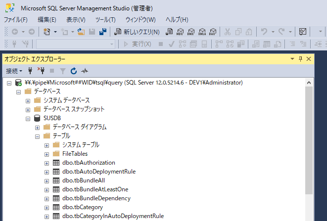

# WSUS データベースを簡単に操作するには (Windows Server 2012 編)
(この記事は、弊社サポートメンバーがフォーラムへ投稿した内容をブログ向けに編集したものです)

みなさま、こんにちは。WSUS サポート チームです。

本日は、Windows Internal Database (WID) に接続する Tips をご紹介します。

Windows Server Update Services (WSUS) では、カタログ情報を保存するデータベースとして、Windows Internal Database (WID) または Microsoft SQL Server のいずれかを使用することができます。
WID は、Windows に組み込まれているミニマムなデータベースです。

通常の WSUS 運用においては、データベースを外部ツールから操作する必要はありませんが、データベースのメンテナンスやバックアップの実行などでデータベースに接続して操作する局面が生じることがあります。
Microsoft SQL Server を使用している場合には、グラフィカルなツールを使用してデータベースに接続することが可能であるため、あまり頭を悩ませることはありません。しかし、WID には、管理ツールが付属しないため、こういったメンテナンスを実行する際には管理用のツールをインストールする必要があります。

今回は、Windows Server 2012 / Windows Server 2012 R2 の WSUS が使用する WID に接続する方法をご紹介します。

## 事前準備 – SQL Server Management Studio をインストールしよう！
まず最初に事前準備として、データベースに接続する管理ツールである SQL Server Management Studio をインストールします。
Windows Server 2012 / Windows Server 2012 R2 に同梱される WID は Microsoft SQL Server 2012 相当であるため、管理ツールも対応したバージョンを使用します。なお、インストール後のサーバー再起動は不要です。

以下の Web サイトから、Microsoft SQL Server 2012 Service Pack 2 用の SQL Server Management Studio のインストーラーをダウンロードしてください。
ファイル名は、**SQLManagementStudio_x64_JPN.exe** です。Windows Server 2012 / Windows Server 2012 R2 は、64 ビット版 (x64) のリリースとなりますので間違えないようにご注意ください。

MicrosoftR SQL ServerR 2012 Service Pack 2 (SP2) Express  
http://www.microsoft.com/ja-jp/download/details.aspx?id=43351

ダウンロードができたら、SQL Server Management Studio をインストールします。
そのままインストールを開始したいところですが、**実は、SQL Server Management Studio は .NET Framework 3.5 の機能を必要とします。Windows Server 2012 / Windows Server 2012 R2 では、既定で .NET Framework 3.5 の機能が有効となっていないため、あらかじめ機能を有効化しておきます。(インストーラーによって自動的に有効化されますが、有効化に失敗した場合 SSMS のインストールにも失敗するため、できるだけ先に有効化しておくことをお勧めします)**

.NET Framework 3.5 を有効化する方法はいくつかありますが、ここではいちばん標準的なサーバー マネージャーを使用した機能の有効化方法をご説明します。
なお、以下の操作では Microsoft Update を使用してモジュールのインストールが実行されますので、WSUS サーバーはインターネット接続が有効な状態で作業を実施してください。

1. サーバー マネージャーを開き、[管理] – [役割と機能の追加] の順に選択します。
2. ウィザードを進め、機能 ページで **.NET Framework 3.5 (.NET 2.0 および 3.0 を含む)** にチェックを入れます。
3. ウィザードの最後で [インストール] ボタンをクリックしてインストールを開始します。

この後、インターネット経由で .NET Framework 3.5 のモジュールがダウンロードされます。
インストールが完了するまではしばらく時間がかかりますので、終わるまで待ちます。
.NET Framework 3.5 のインストールが完了したら、SQL Server Management Studio をインストールします。

4. ダウンロードしたインストーラーをダブルクリックして起動します。
5. SQL Server インストール センターが表示されたら、**SQL Server の新規スタンドアロン インストールを実行するか、既存のインストールに機能を追加します** をクリックします。
6. ライセンス条項に同意してウィザードを進め、機能の選択 ページで “管理ツール – 完全” にチェックが入っていることを確認します。通常はすでにチェックが入っていますので、既定の状態のままで問題ありません。

この後、ウィザードを完了させ、SQL Server Management Studio のインストールを開始します。
これで SQL Server Management Studio をインストールする手順は完了です。

## Windows Internal Database へ接続してみよう！
いよいよ WID に接続します。

WID は、コンピューターの管理者権限を持つアカウントで接続する必要がありますので、作業を実行するアカウントに適切な権限が付与されていることを確認して操作を実施してください。

1. ローカルの Administrators グループに属するアカウントでコンピューターにサインインします。
2. SQL Server Management Studio を管理者として実行します。
3. サーバー名に以下の文字列を入力して [OK] をクリックします。  
 `\\.\pipe\MICROSOFT##WID\tsql\query`

接続に成功すると、以下のようにデータベースの一覧が参照できます。
WSUS のデータベースである SUSDB が表示されていることが確認できますね。

それでは、ぜひ素敵な WSUS ライフをお過ごしください！
Enjoy WSUS!!!
