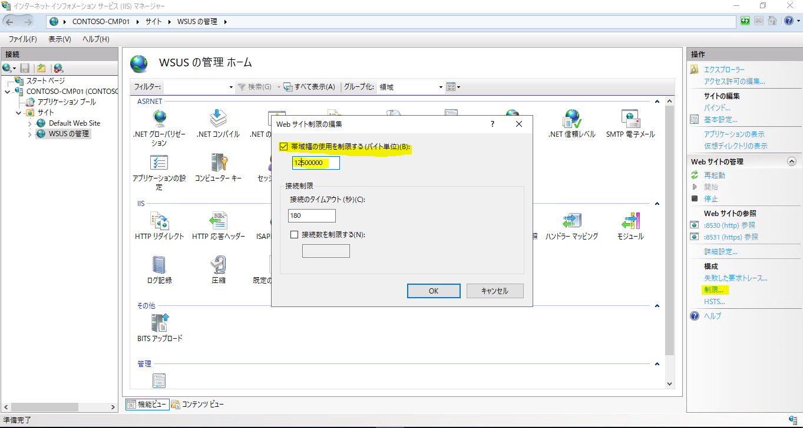

# WSUS 環境のネットワーク帯域制御について

(この記事は、弊社サポートメンバーがフォーラムへ投稿した内容をブログ向けに編集したものです)

こんにちは。SCCM & WSUS サポート チームです。
WSUS をご利用のお客様からネットワーク帯域を絞る設定方法の有無について、お問い合わせいただくことがあります。
OS や Office のサービス パックはインストーラーの容量が特に大きく、インストール承認のタイミングでネットワークが圧迫された、という緊急対応も個人的に経験があります。

取り急ぎ更新プログラムの配布を緊急停止するのであれば、WSUS サーバーの IIS (World Wide Web Publishing Services サービス) を停止させます。
WSUS クライアントは WSUS サーバー上の IIS に対してダウンロード要求を送信するため、IIS を停止させるとダウンロードが止まります。(注 : インストーラーを WSUS サーバー上に持たない設定であれば、この方法は有効ではありません。)

ただこれは一時的な対処のため、根本的に問題を解決する場合には、ネットワーク帯域制御の計画が必要です。
設定方法にはいくつかのパターンがありますので、ご利用の環境に適した設定の導入をご検討ください。

A. インストール承認のタイミングを分散させる  
B. 高速インストール ファイルをダウンロードする  
C. WSUS クライアントの BITS 帯域制御を設定する  
D. WSUS サーバーの IIS 帯域制御を設定する  

## A. インストール承認のタイミングを分散させる
WSUS クライアントをいくつかのグループに分け、インストール承認のタイミングをずらします。
例えば部署ごとにクライアントをグループ分けし、部署 A は今週、部署 B は来週、部署 C は翌月
と、インストール承認を段階的に設定します。

一度にダウンロード要求を送信する WSUS クライアントの台数を減らすことで、ネットワーク圧迫のピークを分散させます。

## B. 高速インストール ファイルをダウンロードする
WSUS 管理コンソールよりオプション [高速インストール ファイルをダウンロードする] を有効にします。

本オプションを有効にすると、Microsoft Update サイトから WSUS サーバーへダウンロードされるファイルの容量が、大幅に増えます。WSUS が同期する更新の種類、量にもよりますが、公開情報 “Design a WSUS Storage Strategy” では 4 倍になるとの紹介もあります。

ただ、WSUS クライアントが WSUS サーバーからダウンロードするファイルの容量は、減らすことが出来ます。
これは WSUS クライアントのファイル状況に応じてインストーラー全体ではなく、必要な差分データのみをダウンロードする形に動作が変わるためです。

クライアントの状況によってどの程度の通信が減らせるかは異なるため、必ず xx% 通信を減らせるとは言えませんが、もし WSUS サーバーのディスク容量に余裕があれば本オプションの利用をご検討下さい。

### 注意
親子構成の WSUS サーバー環境で、子側のオプション [高速インストール ファイルをダウンロードする] を有効にすると、親側のコンテンツ容量も肥大化します。

## C. WSUS クライアントの BITS 帯域制御を設定する
WSUS クライアントが WSUS サーバーからインストーラーをダウンロードする際には、”Background Intelligent Transfer Service” (BITS) サービスが動作します。
BITS には帯域制御のオプションがあり、ローカル ポリシーやグループ ポリシーで設定を行うことが出来ます。

ポリシー [BITS バックグラウンド転送の最大ネットワーク帯域幅を制限する] を適切に構成することで、WSUS クライアントがダウンロードする際の帯域を制御します。
具体的には BITS が使用する帯域の上限値 (kbps) を指定することが出来ます。

### 補足
WSUS サーバーが Microsoft Update サイト、または親 WSUS サーバーからインストーラーをダウンロードする際の通信にも、
BITS が利用されます。
WSUS サーバーが同期を行う通信を帯域制御したい場合には、同じポリシーを利用可能です。

ただし、WSUS サーバーの BITS 転送を既定の “バックグラウンド転送” から “フォアグラウンド転送” に変更した場合には、
帯域制御のポリシーを適用出来ません。
詳細は下記のブログ投稿をご参照ください。

[WSUS サーバーのダウンロード障害について – BITS と Range ヘッダー](https://jpmem.github.io/blog/wsus/2022-06-30_01/)

## D. WSUS サーバーの IIS 帯域制御を設定する
BITS の帯域制御はダウンロード要求側の制御ですが、WSUS サーバー上の IIS 設定を変更することで、ダウンロード応答側での制御も可能です。

※ WSUS のポートを 80 に変更している場合は、Default Web Site のほうの設定を変更します。

これらのオプションを設定することで、ダウンロード応答側の帯域を制御します。
先ほどの BITS は単位 “kbps” でしたが、この IIS 設定は単位が “バイト/秒” または “キロバイト/秒” です。ご注意ください。

### 参考情報
- [Design for Optimized Performance](http://technet.microsoft.com/en-us/library/dd939908.aspx)
